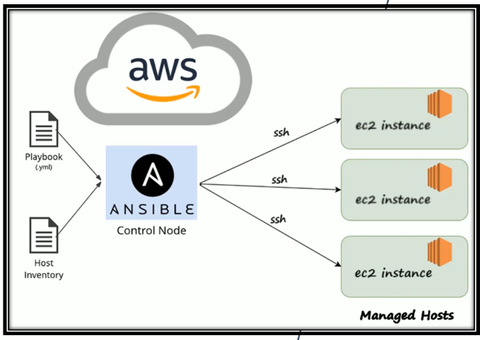
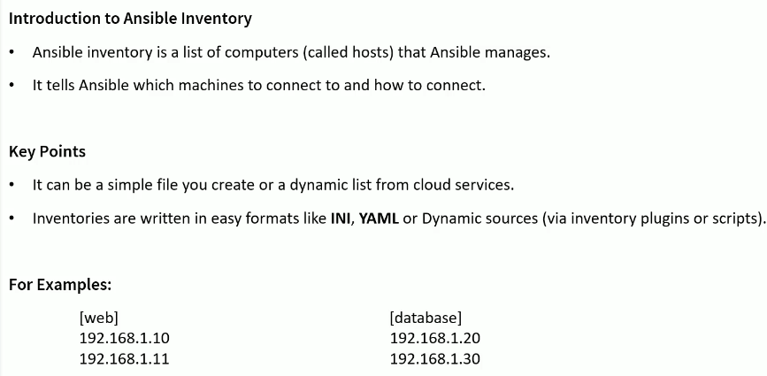
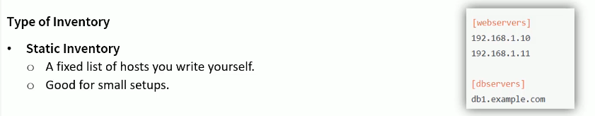
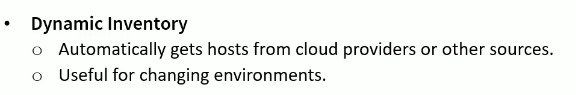
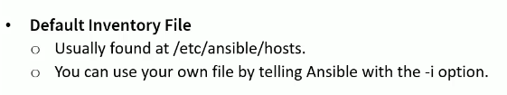

# RedHat_Ansible_Automation
Red Hat Ansible Automation Training – RHEL 8/9 (RH294) 2025 - Enterprise Linux automation using Ansible, including:
- Playbooks, 
- Roles, 
- Variables, 
- Templates, 
- Inventories, 
- and Troubleshooting.

## Set Up an EC2 Instance as an Ansible Control Node
- Use Terraform Code
- ~/OneDrive/Documents/2026/a09_Platform_Engineer/a04_Udemy/RedHat_Ansible_Automation/b01_TF_Platform_Code/r02_Ansible_Controller

## Ansible Setup in AWS Environment####################################################
## Ansible Setup in AWS Environment
## Ansible Setup in AWS Environment####################################################
- On RHEL 9, ansible-core is available via AppStream, but you need the right repo enabled.
    - Make sure AppStream is enabled
        - I should see something like: **rhel-9-for-x86_64-appstream-rpms**

```sh
[ec2-user@ansiblecontroller ~]$ cat /etc/os*
NAME="Red Hat Enterprise Linux"
VERSION="9.7 (Plow)"
ID="rhel"
ID_LIKE="fedora"
VERSION_ID="9.7"
PLATFORM_ID="platform:el9"
PRETTY_NAME="Red Hat Enterprise Linux 9.7 (Plow)"
ANSI_COLOR="0;31"
LOGO="fedora-logo-icon"
CPE_NAME="cpe:/o:redhat:enterprise_linux:9::baseos"
HOME_URL="https://www.redhat.com/"
DOCUMENTATION_URL="https://access.redhat.com/documentation/en-us/red_hat_enterprise_linux/9"
BUG_REPORT_URL="https://issues.redhat.com/"

REDHAT_BUGZILLA_PRODUCT="Red Hat Enterprise Linux 9"
REDHAT_BUGZILLA_PRODUCT_VERSION=9.7
REDHAT_SUPPORT_PRODUCT="Red Hat Enterprise Linux"
REDHAT_SUPPORT_PRODUCT_VERSION="9.7"

````
- To Lists all enabled repositories
  - shows me which software repositories are currently enabled on my  system.
    - “Where am I allowed to download and update packages from?”
```sh
# Make sure AppStream is enabled
>Tchatua$sudo dnf repolist
Updating Subscription Management repositories.
Unable to read consumer identity

This system is not registered with an entitlement server. You can use "rhc" or "subscription-manager" to register.

repo id                                         repo name
rhel-9-appstream-rhui-rpms                      Red Hat Enterprise Linux 9 for x86_64 - AppStream from RHUI (RPMs)
rhel-9-baseos-rhui-rpms                         Red Hat Enterprise Linux 9 for x86_64 - BaseOS from RHUI (RPMs)
rhui-client-config-server-9                     Red Hat Enterprise Linux 9 Client Configuration
>Tchatua$
```

```css
I'm actually fine — this is a very common (and confusing) message on cloud-based RHEL 9 systems.
Let’s break it down clearly.
This does NOT mean my repos are broken.
I'm using RHUI (Red Hat Update Infrastructure), which is how RHEL works on cloud providers (AWS, Azure, GCP, etc.).
```


```sh
PS1=">Ansible_Controller$"
>Ansible_Controller$

>Ansible_Controller$ansible --version
ansible [core 2.14.18]
  config file = /etc/ansible/ansible.cfg
  configured module search path = ['/home/ec2-user/.ansible/plugins/modules', '/usr/share/ansible/plugins/modules']
  ansible python module location = /usr/lib/python3.9/site-packages/ansible
  ansible collection location = /home/ec2-user/.ansible/collections:/usr/share/ansible/collections
  executable location = /usr/bin/ansible
  python version = 3.9.21 (main, Aug 19 2025, 00:00:00) [GCC 11.5.0 20240719 (Red Hat 11.5.0-5)] (/usr/bin/python3)
  jinja version = 3.1.2
  libyaml = True
```

## Set Up Two Client Machines as Managed Nodes
- Use Terraform Code

## Enable Password-Less SSH communication on the Ansible Controller and Ansible Client EC2 Instances

```sh
>Ansible_Controller$sudo su -

[root@ansiblecontroller ~]# yum install vim -y

[root@ansiblecontroller ~]# vi /etc/ssh/sshd_config

# Enable PasswordAuthentication and the PubkeyAuthentication on the sshd_config file
PasswordAuthentication yes
PubkeyAuthentication yes

# Enable the PasswordAuthentication on the 50-cloud-init.conf file
[root@ansiblecontroller ~]# cd /etc/ssh/sshd_config.d/
[root@ansiblecontroller sshd_config.d]# ll
-rw-------. 1 root root  26 Feb  7 15:19 50-cloud-init.conf
-rw-------. 1 root root 719 Dec 18 07:07 50-redhat.conf

[root@ansiblecontroller sshd_config.d]# vim 50-cloud-init.conf
PasswordAuthentication yes

# Restard the sshd daemon
[root@ansiblecontroller sshd_config.d]# systemctl restart sshd
```
## Add Same User to All Machines (Ansible User) Environment####################################################
## Add Same User to All Machines (Ansible User)
## Add Same User to All Machines (Ansible User) Environment####################################################

- On all EC2 Instances
```sh
>Ansible_Controller$sudo useradd ansadmin
>Ansible_Controller$sudo passwd ansadmin

[root@ansiblecontroller sshd_config.d]# cat /etc/passwd
root:x:0:0:root:/root:/bin/bash
bin:x:1:1:bin:/bin:/sbin/nologin
daemon:x:2:2:daemon:/sbin:/sbin/nologin
adm:x:3:4:adm:/var/adm:/sbin/nologin
lp:x:4:7:lp:/var/spool/lpd:/sbin/nologin
sync:x:5:0:sync:/sbin:/bin/sync
shutdown:x:6:0:shutdown:/sbin:/sbin/shutdown
halt:x:7:0:halt:/sbin:/sbin/halt
mail:x:8:12:mail:/var/spool/mail:/sbin/nologin
operator:x:11:0:operator:/root:/sbin/nologin
games:x:12:100:games:/usr/games:/sbin/nologin
ftp:x:14:50:FTP User:/var/ftp:/sbin/nologin
nobody:x:65534:65534:Kernel Overflow User:/:/sbin/nologin
systemd-coredump:x:999:999:systemd Core Dumper:/:/sbin/nologin
dbus:x:81:81:System message bus:/:/sbin/nologin
polkitd:x:998:998:User for polkitd:/:/sbin/nologin
tss:x:59:59:Account used for TPM access:/:/usr/sbin/nologin
sssd:x:997:997:User for sssd:/:/sbin/nologin
sshd:x:74:74:Privilege-separated SSH:/usr/share/empty.sshd:/usr/sbin/nologin
chrony:x:996:996:chrony system user:/var/lib/chrony:/sbin/nologin
ec2-user:x:1000:1000:Cloud User:/home/ec2-user:/bin/bash
ansadmin:x:1001:1001::/home/ansadmin:/bin/bash

[ec2-user@ansiblecontroller ~]$ pwd
/home/ec2-user
[ec2-user@ansiblecontroller ~]$ vim terraform_key_pem.pem
# Copy and paste the key content as required

[ec2-user@ansiblecontroller ~]$ ls -al terraform_key_pem.pem
-rw-r--r--. 1 ec2-user ec2-user 1679 Apr 12 23:48 terraform_key_pem.pem

[ec2-user@ansiblecontroller ~]$ chmod 400 terraform_key_pem.pem

[ec2-user@ansiblecontroller ~]$ ll
-r--------. 1 ec2-user ec2-user 1679 Apr 12 23:48 terraform_key_pem.pem
```

## Create Host Group in Inventory File
- Accessing ansible clients from ansible controller throught the ssh and password authentication

```sh
>Ansible_Controller$sudo vim /etc/hosts

127.0.0.1   localhost localhost.localdomain localhost4 localhost4.localdomain4
::1         localhost localhost.localdomain localhost6 localhost6.localdomain6
18.226.93.138       ansiblecontroller
3.135.213.47        ansibleclient01
18.220.170.102      ansibleclient02
# ----------------------------------------------------------------------------
3.133.158.202           ansiblecontroller
10.0.11.241             appserver01
10.0.12.113             appserver02

# Inventory file
/home/ec2-user/a01_Ansible_Lab/terraform_key_pem.pem

[ec2-user@ansiblecontroller a01_Ansible_Lab]$ cat a02_Inventory.ini
[appservers]
ansibleclient01 ansible_host=10.0.11.241 ansible_user=ec2-user ansible_ssh_private_key_file=/home/ec2-user/a01_Ansible_Lab/terraform_key_pem.pem 
ansibleclient02 ansible_host=10.0.12.113 ansible_user=ec2-user ansible_ssh_private_key_file=/home/ec2-user/a01_Ansible_Lab/terraform_key_pem.pem 

#client1 ansible_host=10.0.1.10 ansible_user=ec2-user ansible_ssh_private_key_file=~/terraform_key_pem.pem
#client2 ansible_host=10.0.2.11 ansible_user=ec2-user ansible_ssh_private_key_file=~/terraform_key_pem.pem


ansible all -m ping -i a02_Inventory.ini
[WARNING]: Platform linux on host ansibleclient01 is using the discovered Python interpreter at
/usr/bin/python3.9, but future installation of another Python interpreter could change the meaning of that
path. See https://docs.ansible.com/ansible-core/2.14/reference_appendices/interpreter_discovery.html for more
information.
ansibleclient01 | SUCCESS => {
    "ansible_facts": {
        "discovered_interpreter_python": "/usr/bin/python3.9"
    },
    "changed": false,
    "ping": "pong"
}
[WARNING]: Platform linux on host ansibleclient02 is using the discovered Python interpreter at
/usr/bin/python3.9, but future installation of another Python interpreter could change the meaning of that
path. See https://docs.ansible.com/ansible-core/2.14/reference_appendices/interpreter_discovery.html for more
information.
ansibleclient02 | SUCCESS => {
    "ansible_facts": {
        "discovered_interpreter_python": "/usr/bin/python3.9"
    },
    "changed": false,
    "ping": "pong"
}


[clients]
ansibleclient01 ansible_host=10.0.1.10 ansible_user=ec2-user ansible_python_interpreter=/usr/bin/python3
ansibleclient02 ansible_host=10.0.2.11 ansible_user=ec2-user ansible_python_interpreter=/usr/bin/python3

[ec2-user@ansiblecontroller a01_Ansible_Lab]$ ansible all -m ping -i a02_Inventory.ini
ansibleclient02 | SUCCESS => {
    "changed": false,
    "ping": "pong"
}
ansibleclient01 | SUCCESS => {
    "changed": false,
    "ping": "pong"
}


[ec2-user@ansiblecontroller a01_Ansible_Lab]$ vim a02_Inventory.ini
ansadmin@ansibleClient01:~$ id
uid=1001(ansadmin) gid=1001(ansadmin) groups=1001(ansadmin)

[ansadmin@ansiblecontroller ~]$ ssh ansibleclient01
ansadmin@ansibleclient01's password:
Welcome to Ubuntu 22.04.5 LTS (GNU/Linux 6.8.0-1044-aws x86_64)

 * Documentation:  https://help.ubuntu.com
 * Management:     https://landscape.canonical.com
 * Support:        https://ubuntu.com/pro

 System information as of Sat Feb  7 18:06:02 UTC 2026

  System load:  0.0               Processes:             107
  Usage of /:   29.1% of 7.57GB   Users logged in:       0
  Memory usage: 26%               IPv4 address for ens5: 10.0.1.214
  Swap usage:   0%


Expanded Security Maintenance for Applications is not enabled.

41 updates can be applied immediately.
35 of these updates are standard security updates.
To see these additional updates run: apt list --upgradable

Enable ESM Apps to receive additional future security updates.
See https://ubuntu.com/esm or run: sudo pro status

New release '24.04.3 LTS' available.
Run 'do-release-upgrade' to upgrade to it.


Last login: Sat Feb  7 18:06:03 2026 from 18.226.93.138
ansadmin@ansibleClient01:~$

[ansadmin@ansiblecontroller ~]$ ssh ansadmin@ansibleclient01
ansadmin@ansibleclient01's password:
Welcome to Ubuntu 22.04.5 LTS (GNU/Linux 6.8.0-1044-aws x86_64)

 * Documentation:  https://help.ubuntu.com
 * Management:     https://landscape.canonical.com
 * Support:        https://ubuntu.com/pro

 System information as of Sat Feb  7 18:08:58 UTC 2026

  System load:  0.0               Processes:             107
  Usage of /:   29.1% of 7.57GB   Users logged in:       0
  Memory usage: 24%               IPv4 address for ens5: 10.0.1.214
  Swap usage:   0%


Expanded Security Maintenance for Applications is not enabled.

41 updates can be applied immediately.
35 of these updates are standard security updates.
To see these additional updates run: apt list --upgradable

Enable ESM Apps to receive additional future security updates.
See https://ubuntu.com/esm or run: sudo pro status

New release '24.04.3 LTS' available.
Run 'do-release-upgrade' to upgrade to it.


Last login: Sat Feb  7 18:06:30 2026 from 18.226.93.138
ansadmin@ansibleClient01:~$
```

## Passwordless authentication
- Generate SSH Key for Password-Free Access
```sh
# ssh-keygen -t rsa -b 2048
# ssh-keygen -t ed25519

[ansadmin@ansiblecontroller ~]$ ssh-keygen -t ed25519
Generating public/private ed25519 key pair.
Enter file in which to save the key (/home/ansadmin/.ssh/id_ed25519):
Enter passphrase (empty for no passphrase):
Enter same passphrase again:
Your identification has been saved in /home/ansadmin/.ssh/id_ed25519
Your public key has been saved in /home/ansadmin/.ssh/id_ed25519.pub
The key fingerprint is:
SHA256:10IBEVEDWp7nFBAZl5CXfK/RxOtxJp03b0FJaPh1Yvw ansadmin@ansiblecontroller
The key's randomart image is:
+--[ED25519 256]--+
|        %/*o.oo..|
|       +oo==.o*+.|
|      . o.+.o=o=o|
|         = ...*+E|
|        S + .+ ==|
|         . .. . o|
|               . |
|                 |
|                 |
+----[SHA256]-----+

[ansadmin@ansiblecontroller ~]$ ls -ltra .ssh/
-rw-------. 1 ansadmin ansadmin  940 Feb  7 18:03 known_hosts.old
-rw-------. 1 ansadmin ansadmin 1686 Feb  7 18:03 known_hosts
-rw-r--r--. 1 ansadmin ansadmin  108 Feb  7 18:17 id_ed25519.pub
-rw-------. 1 ansadmin ansadmin  419 Feb  7 18:17 id_ed25519
```

## Copying Public key to the client machine

```sh
ssh-copy-id ansibleclient01

[ansadmin@ansiblecontroller ~]$ ssh-copy-id ansibleclient01
/usr/bin/ssh-copy-id: INFO: Source of key(s) to be installed: "/home/ansadmin/.ssh/id_ed25519.pub"
/usr/bin/ssh-copy-id: INFO: attempting to log in with the new key(s), to filter out any that are already installed
/usr/bin/ssh-copy-id: INFO: 1 key(s) remain to be installed -- if you are prompted now it is to install the new keys
ansadmin@ansibleclient01's password:

Number of key(s) added: 1

Now try logging into the machine, with:   "ssh 'ansibleclient01'"
and check to make sure that only the key(s) you wanted were added.

[ansadmin@ansiblecontroller ~]$ ssh-copy-id ansibleclient02
/usr/bin/ssh-copy-id: INFO: Source of key(s) to be installed: "/home/ansadmin/.ssh/id_ed25519.pub"
/usr/bin/ssh-copy-id: INFO: attempting to log in with the new key(s), to filter out any that are already installed
/usr/bin/ssh-copy-id: INFO: 1 key(s) remain to be installed -- if you are prompted now it is to install the new keys
ansadmin@ansibleclient02's password:

Number of key(s) added: 1

Now try logging into the machine, with:   "ssh 'ansibleclient02'"
and check to make sure that only the key(s) you wanted were added.
```

## Add Client Machines into Ansible Inventory Files 

```sh
[ec2-user@ansiblecontroller ~]$ id
uid=1000(ec2-user) gid=1000(ec2-user) groups=1000(ec2-user),4(adm),190(systemd-journal) context=unconfined_u:unconfined_r:unconfined_t:s0-s0:c0.c1023

[ec2-user@ansiblecontroller ~]$ sudo vi /etc/ansible/hosts
...
[dev]
ansibleclient01
ansibleclient02

[dev]

ansibleclient01 ansible_host=10.0.11.248 ansible_user=ubuntu ansible_ssh_private_key_file=/home/ec2-user/terraform_key_pem.pem ansible_python_interpreter=/usr/bin/python3
ansibleclient02 ansible_host=10.0.12.199 ansible_user=ubuntu ansible_ssh_private_key_file=/home/ec2-user/terraform_key_pem.pem ansible_python_interpreter=/usr/bin/python3


[ec2-user@ansiblecontroller ~]$ su - ansadmin

# To show me which hosts belong to the dev group
[ansadmin@ansiblecontroller ~]$ ansible --list-host dev
  hosts (2):
    ansibleclient01
    ansibleclient02
```

## Test Connection Using Ad-Hoc Commands
```sh
[ansadmin@ansiblecontroller ~]$ ansible -m ping dev
ansibleclient01 | SUCCESS => {
    "ansible_facts": {
        "discovered_interpreter_python": "/usr/bin/python3"
    },
    "changed": false,
    "ping": "pong"
}
ansibleclient02 | SUCCESS => {
    "ansible_facts": {
        "discovered_interpreter_python": "/usr/bin/python3"
    },
    "changed": false,
    "ping": "pong"
}

[ansadmin@ansiblecontroller ~]$ ansible -m command -a "uptime" dev
ansibleclient01 | CHANGED | rc=0 >>
 21:21:47 up  3:33,  1 user,  load average: 0.00, 0.00, 0.00
ansibleclient02 | CHANGED | rc=0 >>
 21:21:47 up  3:33,  1 user,  load average: 0.00, 0.00, 0.00
```

## Test Connection Using Ad-Hoc Commands with root privileges
- Make ansadmin user sudo user by adding him in the sudoer file in each ansible client machine

```sh
# User privilege specification
root    ALL=(ALL:ALL) ALL
ansadmin ALL=(ALL) NOPASSWD: ALL

# To elevate ansadmin privileage as root user
root@ansibleClient01:~# su - ansadmin
ansadmin@ansibleClient01:~$ sudo -i

[ansadmin@ansiblecontroller ~]$ ansible -m command -a "ufw status" dev --become
ansibleclient01 | CHANGED | rc=0 >>
Status: inactive
ansibleclient02 | CHANGED | rc=0 >>
Status: inactive
```

## Ansible Inventory Files



## Static Inventory Files



## Dynamic Inventory Files



## Default Inventory File



## Adding Host Entry in Inventory File

```sh
[ansadmin@ansiblecontroller ~]$ sudo vi /etc/ansible/hosts

[dev]
ansibleclient01
ansibleclient02

[test]
servertest1
servertes2

[prod]
serverprod1
serverprod2
server3

[webservers]
webserver1
webserver2
```

- List all server available in my default inventory file

```sh
[ansadmin@ansiblecontroller ~]$ ansible --list-hosts all
  hosts (8):
    ansibleclient01
    ansibleclient02
    servertest1
    servertest2
    serverprod1
    serverprod2
    webserver1
    webserver2

[ansadmin@ansiblecontroller ~]$ ansible --list-hosts prod
  hosts (2):
    serverprod1
    serverprod2

[ansadmin@ansiblecontroller ~]$ ansible --list-hosts dev
  hosts (2):
    ansibleclient01
    ansibleclient02

[ansadmin@ansiblecontroller ~]$ ansible --list-hosts test
  hosts (2):
    servertest1
    servertest2
```

## Hosts with custom ports and users

```sh
[ansadmin@ansiblecontroller ~]$ sudo vi /etc/ansible/hosts

[db]
dbserver1:3306  ansible_user=tchatua
```

## Using Host Ranges in Ansible Inventory Files

```sh
[ec2-user@ansiblecontroller a01_Ansible_Lab]$ ansible --list-hosts all -i a02_Inventory.ini
  hosts (2):
    ansibleclient01
    ansibleclient02

[ec2-user@ansiblecontroller a01_Ansible_Lab]$ ansible --list-hosts -i a02_Inventory.ini all
  hosts (2):
    ansibleclient01
    ansibleclient02
[ec2-user@ansiblecontroller a01_Ansible_Lab]$ ansible --list-hosts -i a02_Inventory.ini appservers
  hosts (2):
    ansibleclient01
    ansibleclient02


[ansadmin@ansiblecontroller ~]$ sudo vi /etc/ansible/hosts

[serverip]
192.168.10.[1:20]

[ansadmin@ansiblecontroller ~]$ ansible --list-hosts all
  hosts (29):
    ansibleclient01
    ansibleclient02
    servertest1
    servertest2
    serverprod1
    serverprod2
    webserver1
    webserver2
    dbserver1
    192.168.10.1
    192.168.10.2
    192.168.10.3
    192.168.10.4
    192.168.10.5
    192.168.10.6
    192.168.10.7
    192.168.10.8
    192.168.10.9
    192.168.10.10
    192.168.10.11
    192.168.10.12
    192.168.10.13
    192.168.10.14
    192.168.10.15
    192.168.10.16
    192.168.10.17
    192.168.10.18
    192.168.10.19
    192.168.10.20

[ansadmin@ansiblecontroller ~]$ ansible --list-hosts serverip
  hosts (20):
    192.168.10.1
    192.168.10.2
    192.168.10.3
    192.168.10.4
    192.168.10.5
    192.168.10.6
    192.168.10.7
    192.168.10.8
    192.168.10.9
    192.168.10.10
    192.168.10.11
    192.168.10.12
    192.168.10.13
    192.168.10.14
    192.168.10.15
    192.168.10.16
    192.168.10.17
    192.168.10.18
    192.168.10.19
    192.168.10.20

[ansadmin@ansiblecontroller ~]$ sudo vi /etc/ansible/hosts
[servername]
appserver[01:10].tchatua.com

[ansadmin@ansiblecontroller ~]$ ansible --list-hosts servername
  hosts (10):
    appserver01.tchatua.com
    appserver02.tchatua.com
    appserver03.tchatua.com
    appserver04.tchatua.com
    appserver05.tchatua.com
    appserver06.tchatua.com
    appserver07.tchatua.com
    appserver08.tchatua.com
    appserver09.tchatua.com
    appserver10.tchatua.com
```

- Installing ansible-navigator
```sh
sudo dnf install python3 python3-pip -y
python3 -m pip install --user ansible-navigator
```

## Ansible Navigator


