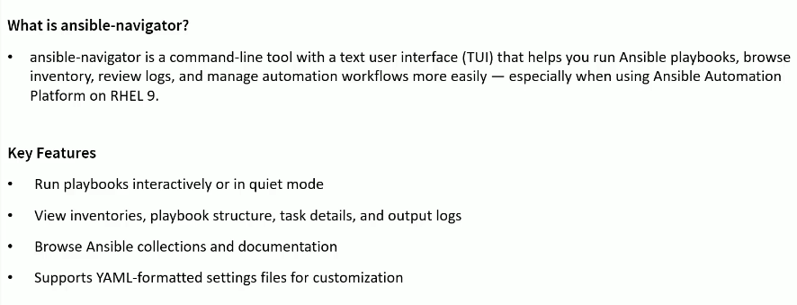
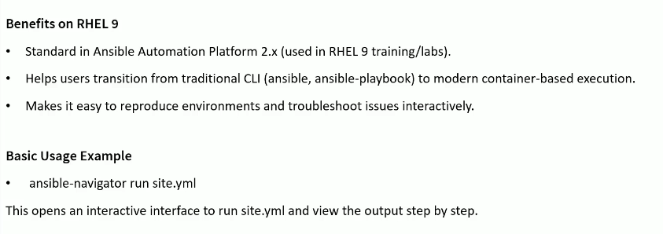
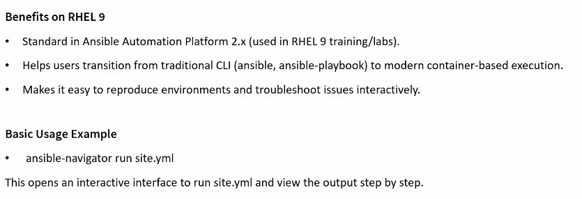
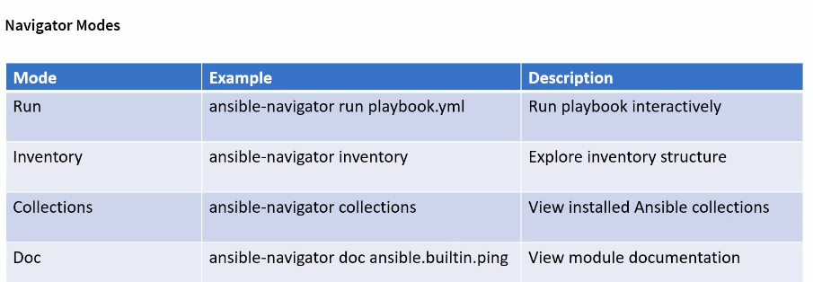
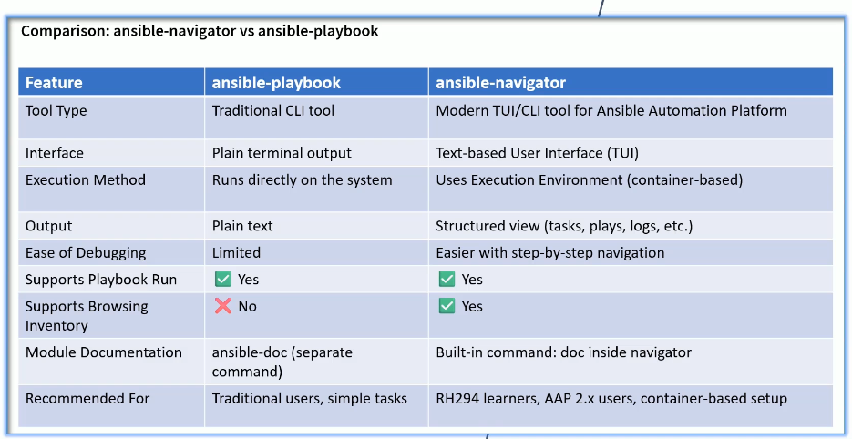
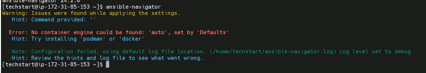

# Ansible Navigator







## Navigator Modes Explaines: Run, Inventory, Collections, and more



## ansible-navigator vs. ansible-playbook: Key Differences



## Install Ansible Navigator

```sh
$ ssh -i private_key/terraform_key_pem.pem ec2-user@18.226.93.138
** WARNING: connection is not using a post-quantum key exchange algorithm.
** This session may be vulnerable to "store now, decrypt later" attacks.
** The server may need to be upgraded. See https://openssh.com/pq.html
Register this system with Red Hat Insights: rhc connect

Example:
# rhc connect --activation-key <key> --organization <org>

The rhc client and Red Hat Insights will enable analytics and additional
management capabilities on your system.
View your connected systems at https://console.redhat.com/insights

You can learn more about how to register your system
using rhc at https://red.ht/registration
Last login: Sat Feb  7 21:56:08 2026 from 173.61.6.206


[ec2-user@ansiblecontroller ~]$ id
uid=1000(ec2-user) gid=1000(ec2-user) groups=1000(ec2-user),4(adm),190(systemd-journal) context=unconfined_u:unconfined_r:unconfined_t:s0-s0:c0.c1023
```

```sh
# sudo dnf install ansible-core -y
[ec2-user@ansiblecontroller ~]$ sudo dnf install ansible-core -y
Updating Subscription Management repositories.
Unable to read consumer identity

This system is not registered with an entitlement server. You can use "rhc" or "subscription-manager" to register.

Last metadata expiration check: 1:47:37 ago on Sat 07 Feb 2026 10:41:24 PM UTC.
Package ansible-core-1:2.14.18-1.el9.x86_64 is already installed.
Dependencies resolved.
Nothing to do.
Complete!

[ec2-user@ansiblecontroller ~]$ sudo dnf install python3-pip -y
Updating Subscription Management repositories.
Unable to read consumer identity

This system is not registered with an entitlement server. You can use "rhc" or "subscription-manager" to register.

Last metadata expiration check: 1:49:02 ago on Sat 07 Feb 2026 10:41:24 PM UTC.
Package python3-pip-21.3.1-1.el9.noarch is already installed.
Dependencies resolved.
Nothing to do.
Complete!
```

```sh
[ec2-user@ansiblecontroller ~]$ su ansadmin
Password:
[ansadmin@ansiblecontroller ec2-user]$

[ansadmin@ansiblecontroller ec2-user]$ pip3 install ansible-navigator --user
Requirement already satisfied: ansible-navigator in /home/ansadmin/.local/lib/python3.9/site-packages (24.2.0)
Requirement already satisfied: ansible-builder>=3.0.0 in /home/ansadmin/.local/lib/python3.9/site-packages (from ansible-navigator) (3.1.1)
Requirement already satisfied: ansible-runner<3,>=2.3.1 in /home/ansadmin/.local/lib/python3.9/site-packages (from ansible-navigator) (2.4.2)
Requirement already satisfied: ansible-lint>=6.19.0 in /home/ansadmin/.local/lib/python3.9/site-packages (from ansible-navigator) (6.22.2)
Requirement already satisfied: pyyaml in /usr/lib64/python3.9/site-packages (from ansible-navigator) (5.4.1)
Requirement already satisfied: tzdata in /home/ansadmin/.local/lib/python3.9/site-packages (from ansible-navigator) (2025.3)
Requirement already satisfied: importlib-metadata in /home/ansadmin/.local/lib/python3.9/site-packages (from ansible-navigator) (6.2.1)
Requirement already satisfied: onigurumacffi<2,>=1.1.0 in /home/ansadmin/.local/lib/python3.9/site-packages (from ansible-navigator) (1.4.1)
Requirement already satisfied: jsonschema in /home/ansadmin/.local/lib/python3.9/site-packages (from ansible-navigator) (4.25.1)
Requirement already satisfied: jinja2 in /usr/lib/python3.9/site-packages (from ansible-navigator) (2.11.3)
Requirement already satisfied: bindep in /home/ansadmin/.local/lib/python3.9/site-packages (from ansible-builder>=3.0.0->ansible-navigator) (2.13.0)
Requirement already satisfied: packaging in /home/ansadmin/.local/lib/python3.9/site-packages (from ansible-builder>=3.0.0->ansible-navigator) (26.0)
Requirement already satisfied: ansible-core>=2.12.0 in /usr/lib/python3.9/site-packages (from ansible-lint>=6.19.0->ansible-navigator) (2.14.18)
Requirement already satisfied: rich>=12.0.0 in /home/ansadmin/.local/lib/python3.9/site-packages (from ansible-lint>=6.19.0->ansible-navigator) (14.3.2)
Requirement already satisfied: yamllint>=1.30.0 in /home/ansadmin/.local/lib/python3.9/site-packages (from ansible-lint>=6.19.0->ansible-navigator) (1.37.1)
Requirement already satisfied: ansible-compat>=4.1.11 in /home/ansadmin/.local/lib/python3.9/site-packages (from ansible-lint>=6.19.0->ansible-navigator) (24.10.0)
Requirement already satisfied: subprocess-tee>=0.4.1 in /home/ansadmin/.local/lib/python3.9/site-packages (from ansible-lint>=6.19.0->ansible-navigator) (0.4.2)
Requirement already satisfied: black>=22.8.0 in /home/ansadmin/.local/lib/python3.9/site-packages (from ansible-lint>=6.19.0->ansible-navigator) (25.11.0)
Requirement already satisfied: wcmatch>=8.1.2 in /home/ansadmin/.local/lib/python3.9/site-packages (from ansible-lint>=6.19.0->ansible-navigator) (10.1)
Requirement already satisfied: ruamel.yaml>=0.18.5 in /home/ansadmin/.local/lib/python3.9/site-packages (from ansible-lint>=6.19.0->ansible-navigator) (0.19.1)
Requirement already satisfied: filelock>=3.3.0 in /home/ansadmin/.local/lib/python3.9/site-packages (from ansible-lint>=6.19.0->ansible-navigator) (3.19.1)
Requirement already satisfied: pathspec>=0.10.3 in /home/ansadmin/.local/lib/python3.9/site-packages (from ansible-lint>=6.19.0->ansible-navigator) (1.0.4)
Requirement already satisfied: python-daemon in /home/ansadmin/.local/lib/python3.9/site-packages (from ansible-runner<3,>=2.3.1->ansible-navigator) (3.1.2)
Requirement already satisfied: pexpect>=4.5 in /home/ansadmin/.local/lib/python3.9/site-packages (from ansible-runner<3,>=2.3.1->ansible-navigator) (4.9.0)
Requirement already satisfied: zipp>=0.5 in /home/ansadmin/.local/lib/python3.9/site-packages (from importlib-metadata->ansible-navigator) (3.23.0)
Requirement already satisfied: rpds-py>=0.7.1 in /home/ansadmin/.local/lib/python3.9/site-packages (from jsonschema->ansible-navigator) (0.27.1)
Requirement already satisfied: attrs>=22.2.0 in /home/ansadmin/.local/lib/python3.9/site-packages (from jsonschema->ansible-navigator) (25.4.0)
Requirement already satisfied: referencing>=0.28.4 in /home/ansadmin/.local/lib/python3.9/site-packages (from jsonschema->ansible-navigator) (0.36.2)
Requirement already satisfied: jsonschema-specifications>=2023.03.6 in /home/ansadmin/.local/lib/python3.9/site-packages (from jsonschema->ansible-navigator) (2025.9.1)
Requirement already satisfied: cffi>=1 in /usr/lib64/python3.9/site-packages (from onigurumacffi<2,>=1.1.0->ansible-navigator) (1.14.5)
Requirement already satisfied: MarkupSafe>=0.23 in /usr/lib64/python3.9/site-packages (from jinja2->ansible-navigator) (1.1.1)
Requirement already satisfied: typing-extensions>=4.5.0 in /home/ansadmin/.local/lib/python3.9/site-packages (from ansible-compat>=4.1.11->ansible-lint>=6.19.0->ansible-navigator) (4.15.0)
Requirement already satisfied: cryptography in /usr/lib64/python3.9/site-packages (from ansible-core>=2.12.0->ansible-lint>=6.19.0->ansible-navigator) (36.0.1)
Requirement already satisfied: resolvelib<0.9.0,>=0.5.3 in /usr/lib/python3.9/site-packages (from ansible-core>=2.12.0->ansible-lint>=6.19.0->ansible-navigator) (0.5.4)
Requirement already satisfied: mypy-extensions>=0.4.3 in /home/ansadmin/.local/lib/python3.9/site-packages (from black>=22.8.0->ansible-lint>=6.19.0->ansible-navigator) (1.1.0)
Requirement already satisfied: click>=8.0.0 in /home/ansadmin/.local/lib/python3.9/site-packages (from black>=22.8.0->ansible-lint>=6.19.0->ansible-navigator) (8.1.8)
Requirement already satisfied: tomli>=1.1.0 in /home/ansadmin/.local/lib/python3.9/site-packages (from black>=22.8.0->ansible-lint>=6.19.0->ansible-navigator) (2.4.0)
Requirement already satisfied: platformdirs>=2 in /home/ansadmin/.local/lib/python3.9/site-packages (from black>=22.8.0->ansible-lint>=6.19.0->ansible-navigator) (4.4.0)
Requirement already satisfied: pytokens>=0.3.0 in /home/ansadmin/.local/lib/python3.9/site-packages (from black>=22.8.0->ansible-lint>=6.19.0->ansible-navigator) (0.4.1)
Requirement already satisfied: pycparser in /usr/lib/python3.9/site-packages (from cffi>=1->onigurumacffi<2,>=1.1.0->ansible-navigator) (2.20)
Requirement already satisfied: ptyprocess>=0.5 in /home/ansadmin/.local/lib/python3.9/site-packages (from pexpect>=4.5->ansible-runner<3,>=2.3.1->ansible-navigator) (0.7.0)
Requirement already satisfied: markdown-it-py>=2.2.0 in /home/ansadmin/.local/lib/python3.9/site-packages (from rich>=12.0.0->ansible-lint>=6.19.0->ansible-navigator) (3.0.0)
Requirement already satisfied: pygments<3.0.0,>=2.13.0 in /home/ansadmin/.local/lib/python3.9/site-packages (from rich>=12.0.0->ansible-lint>=6.19.0->ansible-navigator) (2.19.2)
Requirement already satisfied: bracex>=2.1.1 in /home/ansadmin/.local/lib/python3.9/site-packages (from wcmatch>=8.1.2->ansible-lint>=6.19.0->ansible-navigator) (2.6)
Requirement already satisfied: Parsley in /home/ansadmin/.local/lib/python3.9/site-packages (from bindep->ansible-builder>=3.0.0->ansible-navigator) (1.3)
Requirement already satisfied: distro>=1.7 in /home/ansadmin/.local/lib/python3.9/site-packages (from bindep->ansible-builder>=3.0.0->ansible-navigator) (1.9.0)
Requirement already satisfied: pbr>=2 in /home/ansadmin/.local/lib/python3.9/site-packages (from bindep->ansible-builder>=3.0.0->ansible-navigator) (7.0.3)
Requirement already satisfied: lockfile>=0.10 in /home/ansadmin/.local/lib/python3.9/site-packages (from python-daemon->ansible-runner<3,>=2.3.1->ansible-navigator) (0.12.2)
Requirement already satisfied: mdurl~=0.1 in /home/ansadmin/.local/lib/python3.9/site-packages (from markdown-it-py>=2.2.0->rich>=12.0.0->ansible-lint>=6.19.0->ansible-navigator) (0.1.2)
Requirement already satisfied: setuptools in /usr/lib/python3.9/site-packages (from pbr>=2->bindep->ansible-builder>=3.0.0->ansible-navigator) (53.0.0)
Requirement already satisfied: ply==3.11 in /usr/lib/python3.9/site-packages (from pycparser->cffi>=1->onigurumacffi<2,>=1.1.0->ansible-navigator) (3.11)
[ansadmin@ansiblecontroller ec2-user]$
```

- Installation verification

```sh
[ansadmin@ansiblecontroller ec2-user]$ ansible-navigator --version
ansible-navigator 24.2.0


```

## Setting Up Ansible Navigator



```sh
[ansadmin@ansiblecontroller ~]$ sudo dnf install podman -y
Updating Subscription Management repositories.
Unable to read consumer identity

This system is not registered with an entitlement server. You can use "rhc" or "subscription-manager" to register.

Last metadata expiration check: 1:58:08 ago on Sat 07 Feb 2026 10:41:24 PM UTC.
Package podman-5:5.4.0-15.el9_6.x86_64 is already installed.
Dependencies resolved.
==============================================================================================================================================================
 Package                       Architecture                  Version                                  Repository                                         Size
==============================================================================================================================================================
Upgrading:
 podman                        x86_64                        6:5.6.0-13.el9_7                         rhel-9-appstream-rhui-rpms                         16 M

Transaction Summary
==============================================================================================================================================================
Upgrade  1 Package

Total download size: 16 M
Downloading Packages:
podman-5.6.0-13.el9_7.x86_64.rpm                                                                                              120 MB/s |  16 MB     00:00
--------------------------------------------------------------------------------------------------------------------------------------------------------------
Total                                                                                                                         103 MB/s |  16 MB     00:00
Running transaction check
Transaction check succeeded.
Running transaction test
Transaction test succeeded.
Running transaction
  Preparing        :                                                                                                                                      1/1
  Upgrading        : podman-6:5.6.0-13.el9_7.x86_64                                                                                                       1/2
  Running scriptlet: podman-5:5.4.0-15.el9_6.x86_64                                                                                                       2/2
  Cleanup          : podman-5:5.4.0-15.el9_6.x86_64                                                                                                       2/2
  Running scriptlet: podman-5:5.4.0-15.el9_6.x86_64                                                                                                       2/2
  Verifying        : podman-6:5.6.0-13.el9_7.x86_64                                                                                                       1/2
  Verifying        : podman-5:5.4.0-15.el9_6.x86_64                                                                                                       2/2
Installed products updated.

Upgraded:
  podman-6:5.6.0-13.el9_7.x86_64

Complete!


sudo podman images
REPOSITORY  TAG         IMAGE ID    CREATED     SIZE


0│Welcome
 1│————————————————————————————————————————————————————————————————————————————————————————————————————————————————————————————————————
 2│
 3│Some things you can try from here:
 4│- :collections                                    Explore available collections
 5│- :config                                         Explore the current ansible configuration
 6│- :doc <plugin>                                   Review documentation for a module or plugin
 7│- :help                                           Show the main help page
 8│- :images                                         Explore execution environment images
 9│- :inventory -i <inventory>                       Explore an inventory
10│- :log                                            Review the application log
11│- :lint <file or directory>                       Lint Ansible/YAML files (experimental)
12│- :open                                           Open current page in the editor
13│- :replay                                         Explore a previous run using a playbook artifact
14│- :run <playbook> -i <inventory>                  Run a playbook in interactive mode
15│- :settings                                       Review the current ansible-navigator settings
16│- :quit                                           Quit the application
17│
18│happy automating,
19│
20│-winston


podman images
Failed to obtain podman configuration: mkdir /run/user/1000/libpod: permission denied

[ansadmin@ansiblecontroller ~]$ sudo mkdir -p /run/user/1000

[ansadmin@ansiblecontroller ~]$ sudo chown ansadmin:ansadmin /run/user/1000

[ansadmin@ansiblecontroller ~]$ loginctl enable-linger ansadmin

[ansadmin@ansiblecontroller ~]$ podman images
REPOSITORY                  TAG         IMAGE ID      CREATED      SIZE
ghcr.io/ansible/creator-ee  v0.22.0     4405e824c556  2 years ago  869 MB
WARN[0000] Failed to add pause process to systemd sandbox cgroup: dial unix /run/user/1000/bus: connect: connection refused


[ansadmin@ansiblecontroller ~]$ podman images
REPOSITORY                  TAG         IMAGE ID      CREATED      SIZE
ghcr.io/ansible/creator-ee  v0.22.0     4405e824c556  2 years ago  869 MB
```

## View Inventory with Ansible Navigator (stdout mode)
