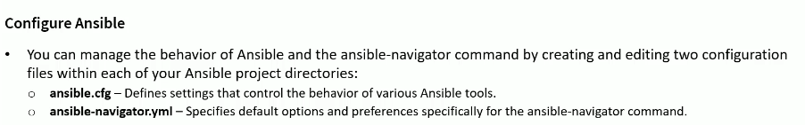
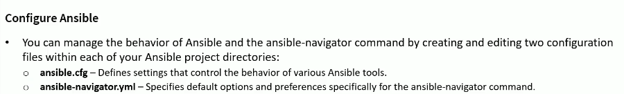
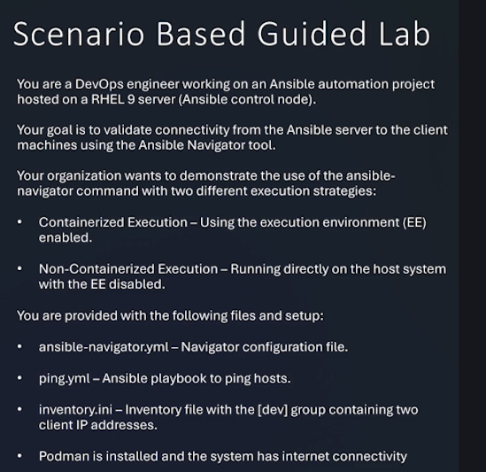
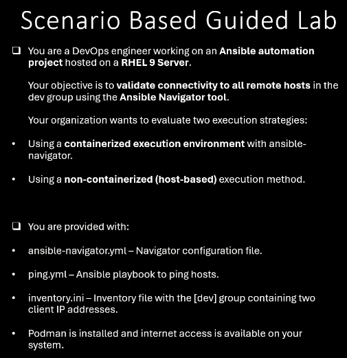

# Managing Ansible Configuration Files

```sh
[ansadmin@ansiblecontroller ~]$ ls -al /etc/ansible/
-rw-r--r--.  1 root root  614 Jan  3  2025 ansible.cfg
-rw-r--r--.  1 root root 1533 Feb  7 22:57 hosts
drwxr-xr-x.  2 root root    6 Jan  3  2025 roles
```


## To see the default configuration file location:

```sh
[ansadmin@ansiblecontroller ~]$ ansible --version
ansible [core 2.14.18]
  config file = /etc/ansible/ansible.cfg
  configured module search path = ['/home/ansadmin/.ansible/plugins/modules', '/usr/share/ansible/plugins/modules']
  ansible python module location = /usr/lib/python3.9/site-packages/ansible
  ansible collection location = /home/ansadmin/.ansible/collections:/usr/share/ansible/collections
  executable location = /usr/bin/ansible
  python version = 3.9.25 (main, Jan 14 2026, 00:00:00) [GCC 11.5.0 20240719 (Red Hat 11.5.0-11)] (/usr/bin/python3)
  jinja version = 3.1.2
  libyaml = True
```

## Settinmg up user-specific Ansible configuration

-Create user label configuration file

```sh
[ansadmin@ansiblecontroller ~]$ pwd
/home/ansadmin

[ansadmin@ansiblecontroller ~]$ vi .ansible.cfg

[defaults]
inventory               =       /home/ansadmin/inventory.ini
remote_user             =       ansadmin
host_key_checking       =       False                                   # Disables SSH host key checking
retry_files_enabled     =       False

[ansadmin@ansiblecontroller ~]$ ansible --version
ansible [core 2.14.18]
  config file = /home/ansadmin/.ansible.cfg
  configured module search path = ['/home/ansadmin/.ansible/plugins/modules', '/usr/share/ansible/plugins/modules']
  ansible python module location = /usr/lib/python3.9/site-packages/ansible
  ansible collection location = /home/ansadmin/.ansible/collections:/usr/share/ansible/collections
  executable location = /usr/bin/ansible
  python version = 3.9.25 (main, Jan 14 2026, 00:00:00) [GCC 11.5.0 20240719 (Red Hat 11.5.0-11)] (/usr/bin/python3)
  jinja version = 3.1.2
  libyaml = True
```

## Defining Inventory File Path in Ansible Config

```sh
[ansadmin@ansiblecontroller ~]$ ansible --version
ansible [core 2.14.18]
  config file = /home/ansadmin/.ansible.cfg
  configured module search path = ['/home/ansadmin/.ansible/plugins/modules', '/usr/share/ansible/plugins/modules']
  ansible python module location = /usr/lib/python3.9/site-packages/ansible
  ansible collection location = /home/ansadmin/.ansible/collections:/usr/share/ansible/collections
  executable location = /usr/bin/ansible
  python version = 3.9.25 (main, Jan 14 2026, 00:00:00) [GCC 11.5.0 20240719 (Red Hat 11.5.0-11)] (/usr/bin/python3)
  jinja version = 3.1.2
  libyaml = True
```

```ini
[dev]
ansibleclient01
ansibleclient02

[test]
servertest1
servertest2

[prod]
serverprod1
serverprod2

[webservers]
webserver1
webserver2

[db]
dbserver1:3306  ansible_user=tchatua

[serverip]
192.168.10.[1:20]

[servername]
appserver[01:10].tchatua.com

[web]
webserver1
webserver2
webserver3    ansible_port=2222
webserver4    ansible_user=admin
web[01:05]
```

```sh
[ansadmin@ansiblecontroller ~]$ ansible --list-hosts all
  hosts (46):
    ansibleclient01
    ansibleclient02
    servertest1
    servertest2
    serverprod1
    serverprod2
    webserver1
    webserver2
    dbserver1
    192.168.10.1
    192.168.10.2
    192.168.10.3
    192.168.10.4
    192.168.10.5
    192.168.10.6
    192.168.10.7
    192.168.10.8
    192.168.10.9
    192.168.10.10
    192.168.10.11
    192.168.10.12
    192.168.10.13
    192.168.10.14
    192.168.10.15
    192.168.10.16
    192.168.10.17
    192.168.10.18
    192.168.10.19
    192.168.10.20
    appserver01.tchatua.com
    appserver02.tchatua.com
    appserver03.tchatua.com
    appserver04.tchatua.com
    appserver05.tchatua.com
    appserver06.tchatua.com
    appserver07.tchatua.com
    appserver08.tchatua.com
    appserver09.tchatua.com
    appserver10.tchatua.com
    webserver3
    webserver4
    web01
    web02
    web03
    web04
    web05
```

## Working with ansible-navigator configuration file



```sh
[ansadmin@ansiblecontroller ~]$ ansible --version
ansible [core 2.14.18]
  config file = /home/ansadmin/.ansible.cfg
  configured module search path = ['/home/ansadmin/.ansible/plugins/modules', '/usr/share/ansible/plugins/modules']
  ansible python module location = /usr/lib/python3.9/site-packages/ansible
  ansible collection location = /home/ansadmin/.ansible/collections:/usr/share/ansible/collections
  executable location = /usr/bin/ansible
  python version = 3.9.25 (main, Jan 14 2026, 00:00:00) [GCC 11.5.0 20240719 (Red Hat 11.5.0-11)] (/usr/bin/python3)
  jinja version = 3.1.2
  libyaml = True

```

```sh
[ansadmin@ansiblecontroller ~]$ ansible-navigator inventory -i /home/ansadmin/inventory.ini --mode stdout --graph dev
@dev:
  |--ansibleclient01
  |--ansibleclient02
```

> vi ansible-navigator.yml
```yml
ansible-navigator:
  execution-environment:
    enabled: false        # To run ansible-navigator directly on the local system, NOT inside a container.
```

```sh
[ansadmin@ansiblecontroller ~]$ ansible-navigator inventory --mode stdout --graph dev
@dev:
  |--ansibleclient01
  |--ansibleclient02
```

## Ansible Navigator - Scenarion Based Guided Lab




## Lab 1



> Using Containerize Execution Environment

- Ansible Playbook Ping

```yml
- hosts: dev
  tasks:
    - name: Ping hosts
      ansible.builtin.ping:
```

```sh
[ansadmin@ansiblecontroller ~]$ ansible-navigator run ping.yml -i inventory.ini --mode stdout

PLAY [dev] *********************************************************************

TASK [Gathering Facts] *********************************************************
ok: [ansibleclient01]
ok: [ansibleclient02]

TASK [Ping hosts] **************************************************************
ok: [ansibleclient01]
ok: [ansibleclient02]

PLAY RECAP *********************************************************************
ansibleclient01            : ok=2    changed=0    unreachable=0    failed=0    skipped=0    rescued=0    ignored=0
ansibleclient02            : ok=2    changed=0    unreachable=0    failed=0    skipped=0    rescued=0    ignored=0
```

```sh
[ansadmin@ansiblecontroller ~]$ podman ps
CONTAINER ID  IMAGE       COMMAND     CREATED     STATUS      PORTS       NAMES
```
