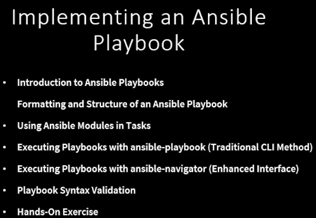
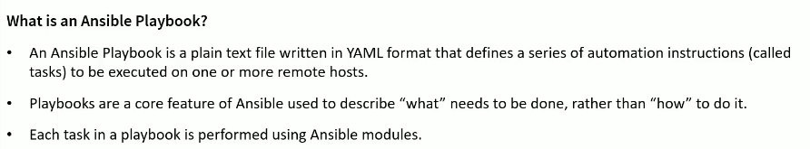
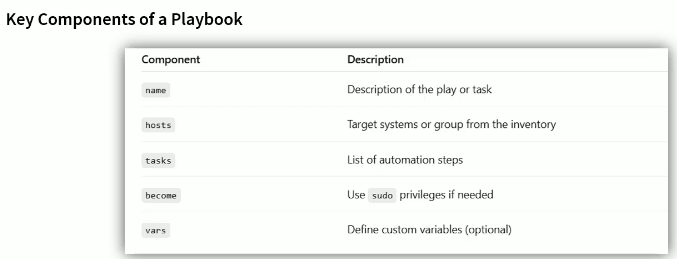
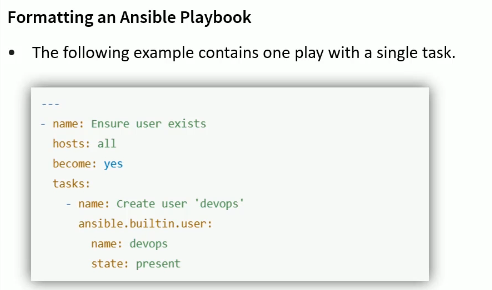
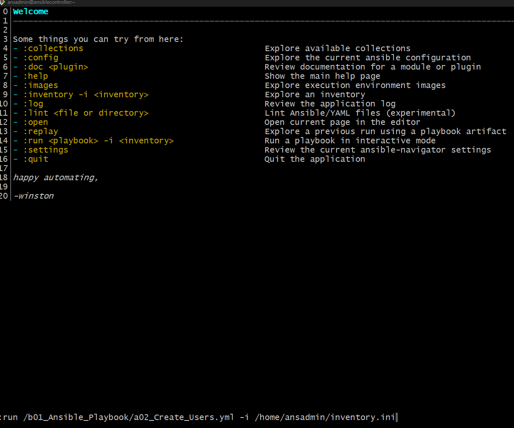
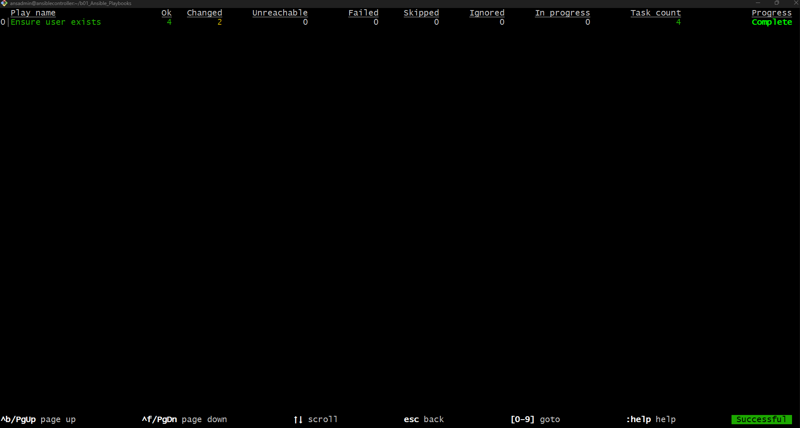
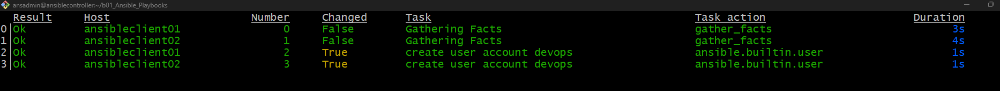
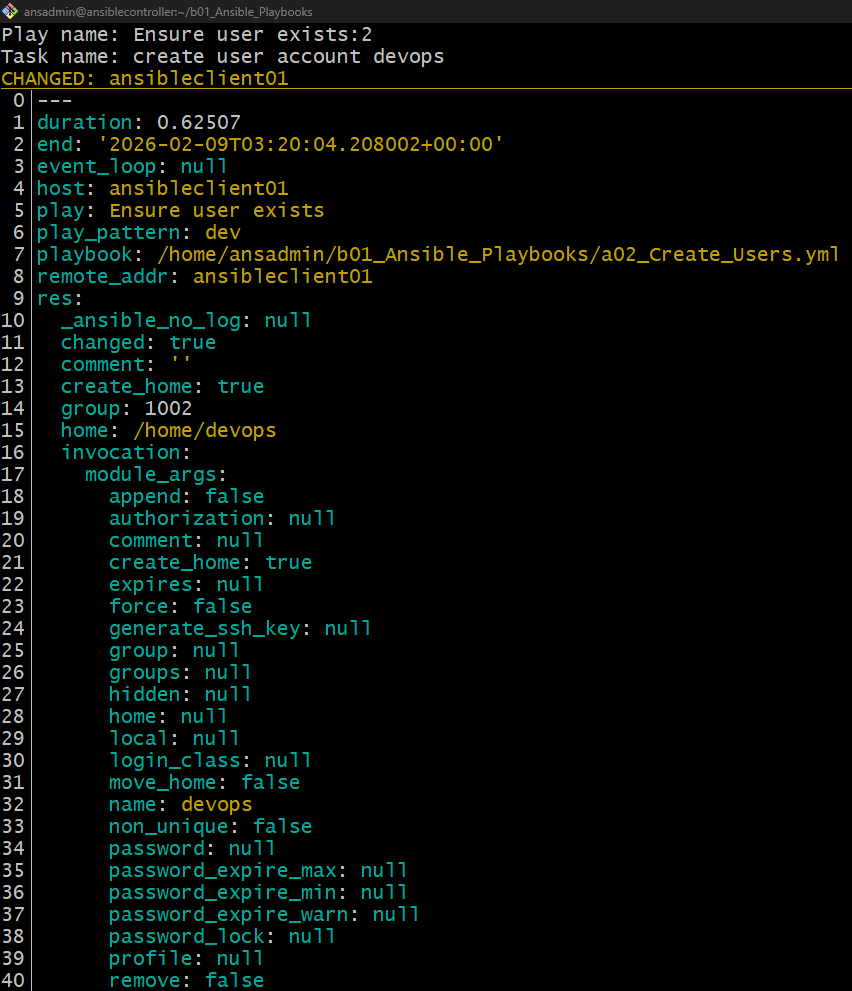

# Implementing Ansible playbook



## What is an Ansible Playbook:




##Ansible Playbooks Syntax and Formating



```yml
---
- name: Ensure user exists
  hosts: dev
  remote_user: ansadmin
  become: yes

  tasks:
    - name: create user account devops
      ansible.builtin.user:
        name: devops 
        state: present
```

- **Check the syntax of my ansible playbook**

```sh
[ansadmin@ansiblecontroller ~]$ ansible-playbook --syntax-check b01_Ansible_Playbooks/a02_Create_Users.yml
playbook: b01_Ansible_Playbooks/a02_Create_Users.yml
```

- **Executing ansible playbook using the tradditional way**

```sh
[ansadmin@ansiblecontroller ~]$ ansible-playbook b01_Ansible_Playbooks/a02_Create_Users.yml

PLAY [Ensure user exists] ************************************************************************************************************************************

TASK [Gathering Facts] ***************************************************************************************************************************************
ok: [ansibleclient01]
ok: [ansibleclient02]

TASK [create user account devops] ****************************************************************************************************************************
changed: [ansibleclient01]
changed: [ansibleclient02]

PLAY RECAP ***************************************************************************************************************************************************
ansibleclient01            : ok=2    changed=1    unreachable=0    failed=0    skipped=0    rescued=0    ignored=0
ansibleclient02            : ok=2    changed=1    unreachable=0    failed=0    skipped=0    rescued=0    ignored=0
```

```sh
ubuntu@ansibleClient01:~$ id devops
uid=1002(devops) gid=1002(devops) groups=1002(devops)
```

```sh
ansadmin@ansibleclient02:~$ id devops
uid=1002(devops) gid=1002(devops) groups=1002(devops)
```

```sh
[ansadmin@ansiblecontroller ~]$ ansible-playbook b01_Ansible_Playbooks/a02_Create_Users.yml

PLAY [Ensure user exists] ************************************************************************************************************************************

TASK [Gathering Facts] ***************************************************************************************************************************************
ok: [ansibleclient02]
ok: [ansibleclient01]

TASK [create user account devops] ****************************************************************************************************************************
ok: [ansibleclient01]
ok: [ansibleclient02]

PLAY RECAP ***************************************************************************************************************************************************
ansibleclient01            : ok=2    changed=0    unreachable=0    failed=0    skipped=0    rescued=0    ignored=0
ansibleclient02            : ok=2    changed=0    unreachable=0    failed=0    skipped=0    rescued=0    ignored=0
```

```sh
ansadmin@ansibleclient02:~$ sudo userdel -r devops
userdel: devops mail spool (/var/mail/devops) not found

ansadmin@ansibleclient02:~$ id devops
id: ‘devops’: no such user
```

```sh
ubuntu@ansibleClient01:~$ id devops
uid=1002(devops) gid=1002(devops) groups=1002(devops)

ubuntu@ansibleClient01:~$ sudo userdel -r devops
userdel: devops mail spool (/var/mail/devops) not found

ubuntu@ansibleClient01:~$ id devops
id: ‘devops’: no such user
```

## Run Playubook using Ansible Navigator

```sh
[ansadmin@ansiblecontroller ~]$ pwd
/home/ansadmin

[ansadmin@ansiblecontroller ~]$ ll b01_Ansible_Playbooks/a02_Create_Users.yml
-rw-r--r--. 1 ansadmin ansadmin 205 Feb  9 02:55 b01_Ansible_Playbooks/a02_Create_Users.yml

[ansadmin@ansiblecontroller ~]$ cat b01_Ansible_Playbooks/a02_Create_Users.yml
---
- name: Ensure user exists
  hosts: dev
  remote_user: ansadmin
  become: yes

  tasks:
    - name: create user account devops
      ansible.builtin.user:
        name: devops
        state: present

[ansadmin@ansiblecontroller ~]$ cat ansible-navigator.yml
ansible-navigator:        # Main configuration block for ansible-navigator
  execution-environment:  # Controls whether Ansible runs inside a container (Podman/Docker)
    enabled: false         # if true: ansible-navigator runs inside a container (execution environment)

    image: ghcr.io/ansible/creator-ee:latest
    # Container image that would be used IF execution environments were enabled
    # This image contains Ansible, collections, and dependencies

    pull:
      policy: missing
      # missing → pull the container image only if it does not already exist locally
      # always  → always pull the latest image
      # never   → never pull the image
```sh
[ansadmin@ansiblecontroller b01_Ansible_Playbooks]$ ansible-navigator```sh
```








```sh
[ansadmin@ansiblecontroller b01_Ansible_Playbooks]$ ansible-navigator run /home/ansadmin/b01_Ansible_Playbooks/a02_Create_Users.yml -i /home/ansadmin/inventory.ini --mode stdout

PLAY [Ensure user exists] ******************************************************

TASK [Gathering Facts] *********************************************************
ok: [ansibleclient02]
ok: [ansibleclient01]

TASK [create user account devops] **********************************************
ok: [ansibleclient01]
ok: [ansibleclient02]

PLAY RECAP *********************************************************************
ansibleclient01            : ok=2    changed=0    unreachable=0    failed=0    skipped=0    rescued=0    ignored=0
ansibleclient02            : ok=2    changed=0    unreachable=0    failed=0    skipped=0    rescued=0    ignored=0
```

## Lab: Ansible navigator with EE enabled

```yml

```

## lab: Directory creation