# Ansible variables

@@ 

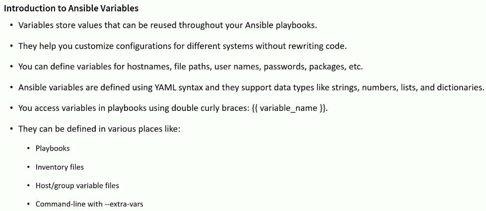
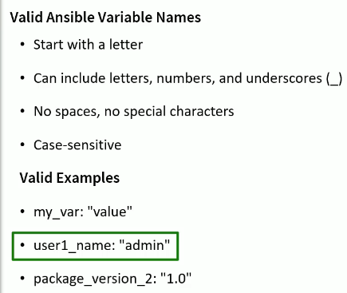
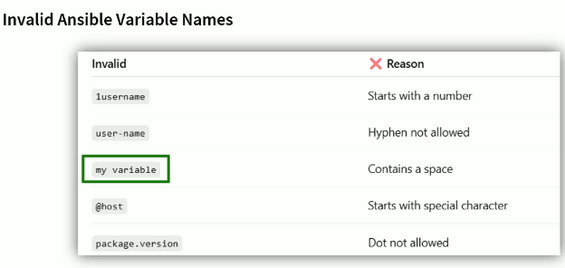
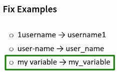
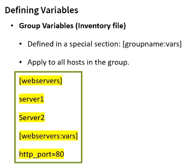

- Inventory
```yml
[webservers]
webserver1
webserver2

[webservers:vars]
A=100
B=200
http_port=8080
```

```sh
[ec2-user@ansiblecontroller a02_Ansible_Variables]$ ansible webservers -i a01_Inventory.yml -m debug -a "var=A,B,http_port"
webserver1 | SUCCESS => {
    "A,B,http_port": "(100, 200, 8080)"
}
webserver2 | SUCCESS => {
    "A,B,http_port": "(100, 200, 8080)"
}
```

## Defining Group Variables

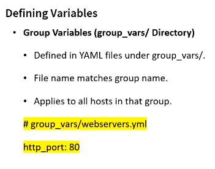

```yml
[webservers]
webserver1
webserver2
[webservers:vars]
A=100
B=200
http_port=8080

[prod]
server1
server2
server3
```

```sh
[ec2-user@ansiblecontroller a02_Ansible_Variables]$ ansible prod -i a01_Inventory.yml -m debug -a "var=C,http_port,doc_root"
server1 | SUCCESS => {
    "C,http_port,doc_root": "(200, 443, '/var/www/html')"
}
server2 | SUCCESS => {
    "C,http_port,doc_root": "(200, 443, '/var/www/html')"
}
server3 | SUCCESS => {
    "C,http_port,doc_root": "(200, 443, '/var/www/html')"
}

# Use msg and print all variables at once

ansible prod -i a01_Inventory.yml -m debug -a 'msg="var=C,http_port,doc_root, {{ C }}, {{ http_port }}, {{ doc_root }}"'
ansible prod -i a01_Inventory.yml -m debug -a 'msg="var={{ C }}, {{ http_port }}, {{ doc_root }}"'
ansible prod -i a01_Inventory.yml -m debug -a "var=C,http_port,doc_root"
```

## Hosts Variables

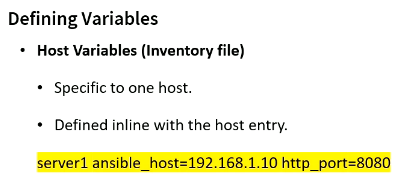
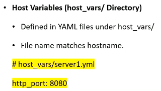
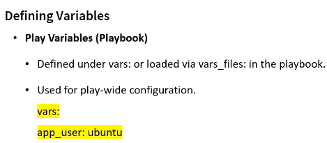
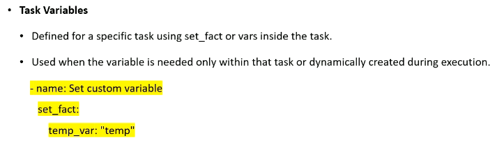

## Variable in Ansible Playbooks

```yml
# Inventory
[dev]
ansibleclient01 ansible_host=10.0.11.241 ansible_user=ec2-user ansible_ssh_private_key_file=/home/ec2-user/a01_Ansible_Lab/terraform_key_pem.pem ansible_python_interpreter=/usr/bin/python3
ansibleclient02 ansible_host=10.0.12.113 ansible_user=ec2-user ansible_ssh_private_key_file=/home/ec2-user/a01_Ansible_Lab/terraform_key_pem.pem ansible_python_interpreter=/usr/bin/python3


```

```yml
---
# Playbook 01
- hosts: dev
  vars:
    message: "Hello from Play-Level Vars"

  tasks:
    - name: Task 01 - Use the variable
      debug:
        msg: "{{ message }}"
    - name: Task 02 - Use the same variable again
      debug:
        msg: "{{ message }}"
```

```sh
[ec2-user@ansiblecontroller a02_Ansible_Variables]$ ansible-playbook a02_Playbook_01.yml -i a01_Inventory.yml

PLAY [dev] ****************************************************************************************************

TASK [Gathering Facts] ****************************************************************************************
ok: [ansibleclient01]
ok: [ansibleclient02]

TASK [Task 01 - Use the variable] *****************************************************************************
ok: [ansibleclient01] => {
    "msg": "Hello from Play-Level Vars"
}
ok: [ansibleclient02] => {
    "msg": "Hello from Play-Level Vars"
}

TASK [Task 02 - Use the same variable again] ******************************************************************
ok: [ansibleclient01] => {
    "msg": "Hello from Play-Level Vars"
}
ok: [ansibleclient02] => {
    "msg": "Hello from Play-Level Vars"
}

PLAY RECAP ****************************************************************************************************
ansibleclient01            : ok=3    changed=0    unreachable=0    failed=0    skipped=0    rescued=0    ignored=0
ansibleclient02            : ok=3    changed=0    unreachable=0    failed=0    skipped=0    rescued=0    ignored=0
```

## set_fact Variable

```yml
---
- hosts: dev

  tasks:
    - name: Set a dynamic variable
      set_fact:
        message: "Hello from set_fact"

    - name: Use the variable later in the play
      debug:
        msg: "{{ message }}"
```

```sh
[ec2-user@ansiblecontroller a02_Ansible_Variables]$ ansible-playbook -i a01_Inventory.yml a03_Task_Vars.yml

PLAY [dev] ****************************************************************************************************

TASK [Gathering Facts] ****************************************************************************************
ok: [ansibleclient02]
ok: [ansibleclient01]

TASK [Set a dynamic variable] *********************************************************************************
ok: [ansibleclient01]
ok: [ansibleclient02]

TASK [Use the variable later in the play] *********************************************************************
ok: [ansibleclient01] => {
    "msg": "Hello from set_fact"
}
ok: [ansibleclient02] => {
    "msg": "Hello from set_fact"
}

PLAY RECAP ****************************************************************************************************
ansibleclient01            : ok=3    changed=0    unreachable=0    failed=0    skipped=0    rescued=0    ignored=0
ansibleclient02            : ok=3    changed=0    unreachable=0    failed=0    skipped=0    rescued=0    ignored=0
```


## Overriding Variables

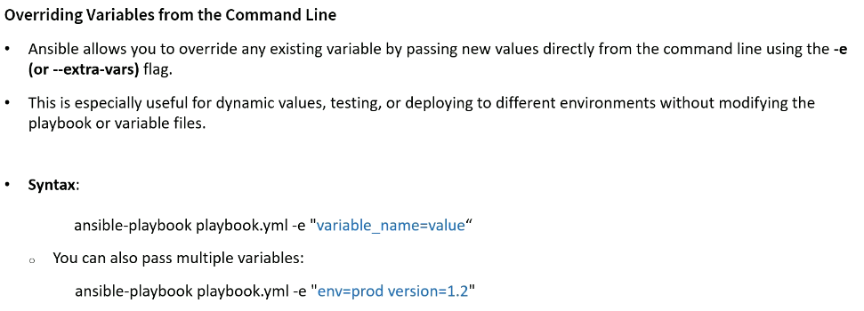
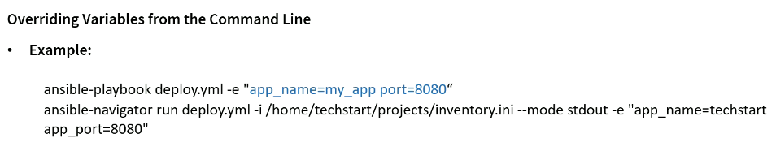
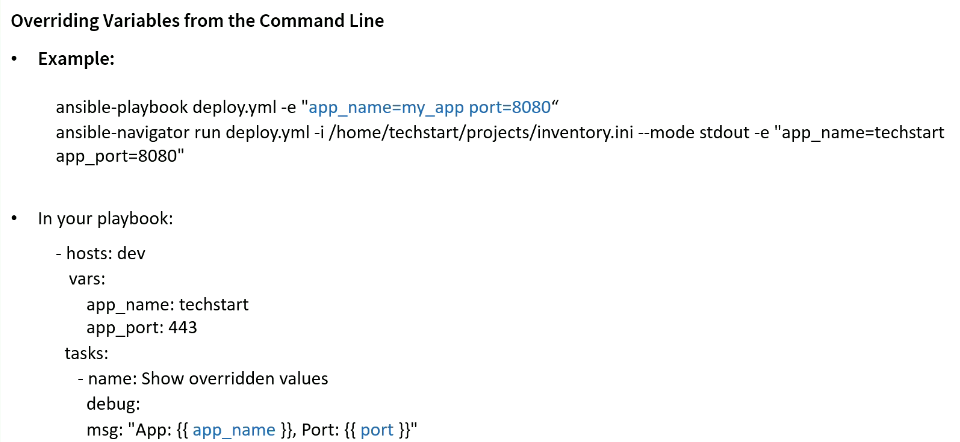

```yml
---
- hosts: dev
  vars:
    app_name: gen_api
    app_port: 8080

  tasks:
    - name: Show Override Value
      debug:
        msg: "App: {{ app_name }}, Port: {{ app_port }}"
```

```sh
ansible-playbook -i a01_Inventory.yml a04_Overide_Variable.yml

PLAY [dev] ****************************************************************************************************

TASK [Gathering Facts] ****************************************************************************************
ok: [ansibleclient02]
ok: [ansibleclient01]

TASK [Show Override Value] ************************************************************************************
ok: [ansibleclient01] => {
    "msg": "App: gen_api, Port: 8080"
}
ok: [ansibleclient02] => {
    "msg": "App: gen_api, Port: 8080"
}

PLAY RECAP ****************************************************************************************************
ansibleclient01            : ok=2    changed=0    unreachable=0    failed=0    skipped=0    rescued=0    ignored=0
ansibleclient02            : ok=2    changed=0    unreachable=0    failed=0    skipped=0    rescued=0    ignored=0

# #########################
# Overiding thos variables
# #########################

ansible-playbook -i a01_Inventory.yml a04_Overide_Variable.yml -e "app_name=agt_app app_port=1981"

PLAY [dev] ****************************************************************************************************

TASK [Gathering Facts] ****************************************************************************************
ok: [ansibleclient02]
ok: [ansibleclient01]

TASK [Show Override Value] ************************************************************************************
ok: [ansibleclient01] => {
    "msg": "App: agt_app, Port: 1981"
}
ok: [ansibleclient02] => {
    "msg": "App: agt_app, Port: 1981"
}

PLAY RECAP ****************************************************************************************************
ansibleclient01            : ok=2    changed=0    unreachable=0    failed=0    skipped=0    rescued=0    ignored=0
ansibleclient02            : ok=2    changed=0    unreachable=0    failed=0    skipped=0    rescued=0    ignored=0
```

## Overriding Variables with ansible-navigator


```sh
ansible-navigator run /home/ec2-user/a02_Ansible_Variables/a02_Override_var.yml -i /home/ec2-user/a02_Ansible_Variables/a01_Inventory.yml --mode stdout -e "app_name=tango app_port=charlie -u ec2-user"

```

## Use Dictionaries Variables in Ansible

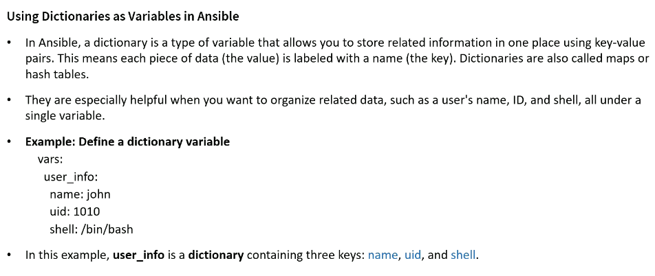
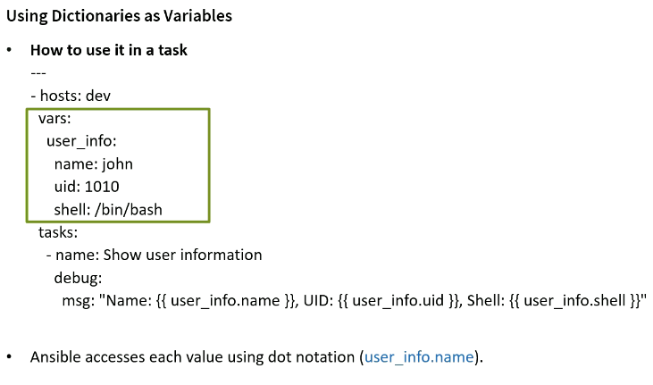


```yml
---
- hosts: dev
  remote_user: ec2-user     # user 
  vars:
    user_info:
      name: Tchatua
      uid: 1025
      shell: /bin/bash

  tasks:
    - name: Show User informations
      debug:
        msg: "Name: {{ user_info.name }}, UID: {{ user_info.uid }}, Shell: {{ user_info.shell }}"
```

```sh
ansible-playbook -i a01_Inventory.yml a03_Dict_Var.yml

PLAY [dev] ****************************************************************************************************

TASK [Gathering Facts] ****************************************************************************************
ok: [ansibleclient02]
ok: [ansibleclient01]

TASK [Show User informations] *********************************************************************************
ok: [ansibleclient01] => {
    "msg": "Name: Tchatua, UID: 1025, Shell: /bin/bash"
}
ok: [ansibleclient02] => {
    "msg": "Name: Tchatua, UID: 1025, Shell: /bin/bash"
}

PLAY RECAP ****************************************************************************************************
ansibleclient01            : ok=2    changed=0    unreachable=0    failed=0    skipped=0    rescued=0    ignored=0
ansibleclient02            : ok=2    changed=0    unreachable=0    failed=0    skipped=0    rescued=0    ignored=0
```

## Capturing Output with Registerd Variables

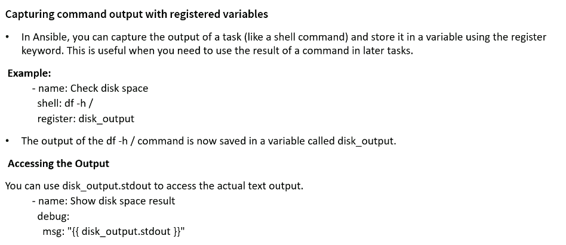

```yml
---
- name: Check Disk Space And Show Result
  hosts: dev
  become: yes
  remote_user: ec2-user     # user 

  tasks:

    - name: 01. Check Disk Space On Root Directory
      shell: df -h /
      register: disk_output

    - name: 02. Show Disk Space Result
      debug:
        msg: "{{ disk_output.stdout }}"
```

```sh
# -----------------------------------------------------------------------------------------------------------
ansible-playbook a04_Capturing_Output.yml -i a01_Inventory.yml

PLAY [Check Disk Space And Show Result] ***********************************************************************

TASK [Gathering Facts] ****************************************************************************************
ok: [ansibleclient02]
ok: [ansibleclient01]

TASK [a01. Check Disk Space On Root Directory] ****************************************************************
changed: [ansibleclient02]
changed: [ansibleclient01]

TASK [a02. Show Disk Space Result] ****************************************************************************
ok: [ansibleclient01] => {
    "msg": "Filesystem      Size  Used Avail Use% Mounted on\n/dev/nvme0n1p1   30G  3.8G   27G  13% /"
}
ok: [ansibleclient02] => {
    "msg": "Filesystem      Size  Used Avail Use% Mounted on\n/dev/nvme0n1p1   30G  3.8G   27G  13% /"
}

PLAY RECAP ****************************************************************************************************
ansibleclient01            : ok=3    changed=1    unreachable=0    failed=0    skipped=0    rescued=0    ignored=0
ansibleclient02            : ok=3    changed=1    unreachable=0    failed=0    skipped=0    rescued=0    ignored=0

# -----------------------------------------------------------------------------------------------------------
[ec2-user@ansiblecontroller a02_Ansible_Variables]$ df -h /
Filesystem      Size  Used Avail Use% Mounted on
/dev/xvda4      8.8G  3.1G  5.7G  36% /

```

```yml
---
- name: Install a package and prints the result
  hosts: dev
  become: yes
  remote_user: ec2-user     # user 

  tasks:

    - name: a01. Install httpd package
      ansible.builtin.dnf: 
        name: httpd
        state: installed
      register: install_result

    - name: a02. Show Installation Result
      debug:
        var: install_result
```

```sh
ansible-playbook a05.yml -i a01_Inventory.yml

PLAY [Install a package and prints the result] ****************************************************************

TASK [Gathering Facts] ****************************************************************************************
ok: [ansibleclient01]
ok: [ansibleclient02]

TASK [a01. Install httpd package] *****************************************************************************
changed: [ansibleclient01]
changed: [ansibleclient02]

TASK [a02. Show Installation Result] **************************************************************************
ok: [ansibleclient01] => {
    "install_result": {
        "changed": true,
        "failed": false,
        "msg": "",
        "rc": 0,
        "results": [
            "Installed: apr-util-lmdb-1.6.3-1.amzn2023.0.2.x86_64",
            "Installed: httpd-2.4.66-1.amzn2023.0.1.x86_64",
            "Installed: httpd-filesystem-2.4.66-1.amzn2023.0.1.noarch",
            "Installed: generic-logos-httpd-18.0.0-12.amzn2023.0.3.noarch",
            "Installed: apr-util-openssl-1.6.3-1.amzn2023.0.2.x86_64",
            "Installed: httpd-core-2.4.66-1.amzn2023.0.1.x86_64",
            "Installed: mailcap-2.1.49-3.amzn2023.0.3.noarch",
            "Installed: apr-1.7.5-1.amzn2023.0.4.x86_64",
            "Installed: mod_lua-2.4.66-1.amzn2023.0.1.x86_64",
            "Installed: libbrotli-1.0.9-4.amzn2023.0.2.x86_64",
            "Installed: lmdb-libs-0.9.29-1.amzn2023.0.3.x86_64",
            "Installed: apr-util-1.6.3-1.amzn2023.0.2.x86_64",
            "Installed: httpd-tools-2.4.66-1.amzn2023.0.1.x86_64",
            "Installed: mod_http2-2.0.27-1.amzn2023.0.3.x86_64"
        ]
    }
}
ok: [ansibleclient02] => {
    "install_result": {
        "changed": true,
        "failed": false,
        "msg": "",
        "rc": 0,
        "results": [
            "Installed: apr-util-lmdb-1.6.3-1.amzn2023.0.2.x86_64",
            "Installed: httpd-2.4.66-1.amzn2023.0.1.x86_64",
            "Installed: httpd-filesystem-2.4.66-1.amzn2023.0.1.noarch",
            "Installed: generic-logos-httpd-18.0.0-12.amzn2023.0.3.noarch",
            "Installed: apr-util-openssl-1.6.3-1.amzn2023.0.2.x86_64",
            "Installed: httpd-core-2.4.66-1.amzn2023.0.1.x86_64",
            "Installed: mailcap-2.1.49-3.amzn2023.0.3.noarch",
            "Installed: apr-1.7.5-1.amzn2023.0.4.x86_64",
            "Installed: mod_lua-2.4.66-1.amzn2023.0.1.x86_64",
            "Installed: libbrotli-1.0.9-4.amzn2023.0.2.x86_64",
            "Installed: lmdb-libs-0.9.29-1.amzn2023.0.3.x86_64",
            "Installed: apr-util-1.6.3-1.amzn2023.0.2.x86_64",
            "Installed: httpd-tools-2.4.66-1.amzn2023.0.1.x86_64",
            "Installed: mod_http2-2.0.27-1.amzn2023.0.3.x86_64"
        ]
    }
}

PLAY RECAP ****************************************************************************************************
ansibleclient01            : ok=3    changed=1    unreachable=0    failed=0    skipped=0    rescued=0    ignored=0
ansibleclient02            : ok=3    changed=1    unreachable=0    failed=0    skipped=0    rescued=0    ignored=0


```


