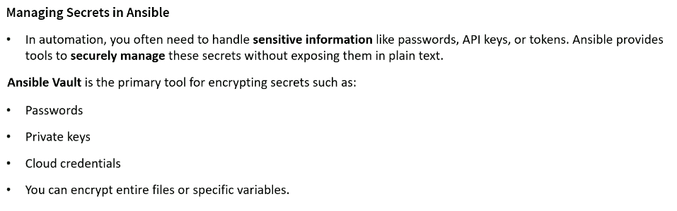
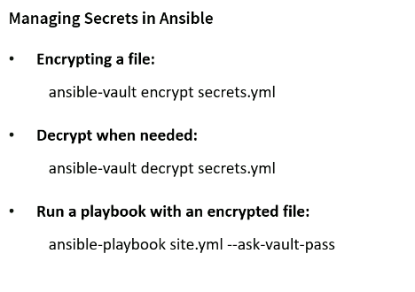
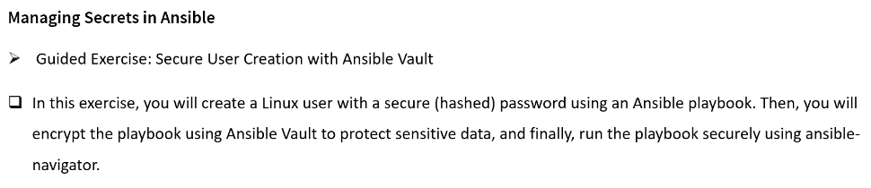

# Managing Secret in Ansible




## Create an encrypted Ansible playbook

```sh
ansible-vault create a01_myplay.yml
New Vault password:
Confirm New Vault password:
```
```yml
---
- name: Simple debug playbook
  hosts: dev
  tasks:
    - name: Print a message
      ansible.builtin.debug:
        msg: "Hello from Ansible"
```
```sh
cat a01_myplay.yml
$ANSIBLE_VAULT;1.1;AES256
32653065623330633637613036333435646238353466333431303739313162663534636562353661
6239363131386235636136623664346666623832663437620a386464626638363839333434613236
31376231383431653132663865313663383864663232613264323064643634343561626565666437
3335616432613263330a616333316533343863326130366237613632306666653862623265313438
37633139376134623963353930643966333663366363633234346234663265633166373235633530
35323432616639666434313437316366306266396239626636383666643736326232383161323235
61333264393730633663613266356565313266313735623631643064393765333366643564366266
34613864376366626532653261373961653237616662306234383534613338373166306130663830
39663339356239383439623738383538653938633335316435613339643862306638383931646636
65346664343437363230613166323833653136383165313064653739356363343837623439616431
61353538626533633333613535656635313363653139356139333535323561306630346134353863
61343238333161643763

```

## View an encrypted Ansible playbook

```sh
ansible-vault view a01_myplay.yml
Vault password:
---
- name: Simple debug playbook
  hosts: dev
  tasks:
    - name: Print a message
      ansible.builtin.debug:
        msg: "Hello from Ansible"

```

## Ansible Vault: Using password files for encryption

```sh
echo "AlphaBravoTango2026" > passwdnew

[ec2-user@ansiblecontroller a03_Secret_in_ansible]$ ls -altr
-rw-r--r--.  1 ec2-user ec2-user   16 Apr 14 00:38 passwdnew

ansible-vault create --vault-password-file=passwdnew a03.yml

```
```yml
- name: Simple debug playbook
  hosts: dev
  tasks:
    - name: Print a message
      ansible.builtin.debug:
        msg: "Hello from Ansible"
---
```sh
cat a03.yml
$ANSIBLE_VAULT;1.1;AES256
39363761663238323462636163303032626438306562303165636332613637626561316333613439
3034396232306564353435326137363833636265613663320a313931643562333834636636623231
64653130633863353364343063666232646263353965643539393464383832363339323635356231
3732343564363861310a663265613965386135333964366636383938316465663633653533623433
61656433393738396666346661663234316438393864393833656466346536326161636431653931
34313964366339646631393632666632616462323266353962663833343061393539363231613163
32656566376235323131383230613039336534306230666536323732306231343536353937623665
38386130303866626435
```

## Create Secure User with Ansible Vault



```sh
# python3 -c "import crypt; print(crypt.crypt('MyPassword123', crypt.mksalt(crypt.METHOD_SHA512)))"
python3 -c "import crypt; print(crypt.crypt('Admin@_-2026', crypt.mksalt(crypt.METHOD_SHA512)))"
$6$dlCgl15i0L3APom7$yzzXgdK4aKiomEvG.D3sA3./ulZGt36q89zVD.qzXw7R0LWBlPR2TDptP6WcnOZfGNQnV9UIJmOixO4GYPQpc/
```

```yml
---
# To generate a Linux‑compatible hashed password using Python
## python3 -c "import crypt; print(crypt.crypt('MyPassword123', crypt.mksalt(crypt.METHOD_SHA512)))"
- name: Simple debug playbook
  hosts: dev
  become: true

  vars:
    username: debugadmin
    user_password: "$6$dlCgl15i0L3APom7$yzzXgdK4aKiomEvG.D3sA3./ulZGt36q89zVD.qzXw7R0LWBlPR2TDptP6WcnOZfGNQnV9UIJmOixO4GYPQpc/"

  tasks:
    - name: Create user "{{ username }}"
      ansible.builtin.user:
        name: "{{ username }}"
        state: present
        password: "{{ user_password }}"

```

- Encrypt the playbook using Ansible Vault

```sh
# ansible-navigator run -m stdout --playbook-artifact-enable false a03_Linux_Secure_User.yml --vault-id @prompt -i /home/ec2-user/a03_Secret_in_ansible/a00_Inventory.ini -u ec2-user
ansible-navigator run -m stdout --playbook-artifact-enable false a03_Linux_Secure_User.yml --vault-id @prompt -i /etc/ansible/hosts -u ec2-user
ansible-navigator run -m stdout --playbook-artifact-enable false a03_Linux_Secure_User.yml --vault-id @prompt -u ec2-user

# ansible-navigator run \
#   -m stdout \
#   --playbook-artifact-enable false \
#   --vault-id @prompt \
#   -i /home/ec2-user/a03_Secret_in_ansible/a00_Inventory.ini \
#   -u ec2-user \
#   a03_Linux_Secure_User.yml
```

- Check if debug admin user exist in the client machine:

```sh
ansible dev -m shell -a "id debugadmin" -i a00_Inventory.ini
ansibleclient01 | FAILED | rc=1 >>
id: ‘debugadmin’: no such usernon-zero return code
ansibleclient02 | FAILED | rc=1 >>
id: ‘debugadmin’: no such usernon-zero return code

 ansible dev -m shell -a "cat /etc/passwd | grep debugadmin" -i a00_Inventory.ini
ansibleclient02 | FAILED | rc=1 >>
non-zero return code
ansibleclient01 | FAILED | rc=1 >>
non-zero return code
```


```sh
ansible-playbook \
 a03_Linux_Secure_User.yml \
 --vault-id @prompt \
 -i /home/ec2-user/a03_Secret_in_ansible/a00_Inventory.ini \
 -u ec2-user
Vault password (default):

PLAY [Create secure user] *************************************************************************************

TASK [Gathering Facts] ****************************************************************************************
ok: [ansibleclient02]
ok: [ansibleclient01]

TASK [Create user "debugadmin"] *******************************************************************************
changed: [ansibleclient02]
changed: [ansibleclient01]

PLAY RECAP ****************************************************************************************************
ansibleclient01            : ok=2    changed=1    unreachable=0    failed=0    skipped=0    rescued=0    ignored=0
ansibleclient02            : ok=2    changed=1    unreachable=0    failed=0    skipped=0    rescued=0    ignored=0

ansible dev -m shell -a "id debugadmin" -i a00_Inventory.ini
ansibleclient02 | CHANGED | rc=0 >>
uid=1002(debugadmin) gid=1002(debugadmin) groups=1002(debugadmin)
ansibleclient01 | CHANGED | rc=0 >>
uid=1002(debugadmin) gid=1002(debugadmin) groups=1002(debugadmin)
```