# Task Control Implementation on Ansible

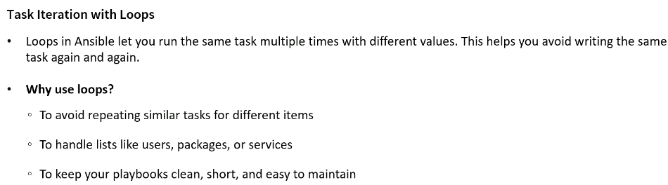
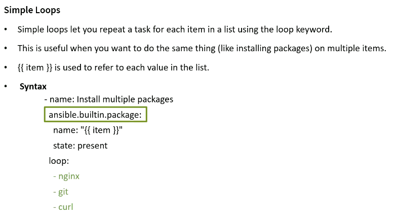


```sh
ansible-playbook a01_Install-Multiple_Packages.yml -i a00_Inventory.ini

PLAY [Install Multiple packages] ******************************************************************************

TASK [Gathering Facts] ****************************************************************************************
ok: [ansibleclient01]
ok: [ansibleclient02]

TASK [Install Multiple packages] ******************************************************************************
changed: [ansibleclient01] => (item=nginx)
changed: [ansibleclient02] => (item=nginx)
changed: [ansibleclient01] => (item=git)
changed: [ansibleclient02] => (item=git)
ok: [ansibleclient01] => (item=curl-minimal)
ok: [ansibleclient02] => (item=curl-minimal)

PLAY RECAP ****************************************************************************************************
ansibleclient01            : ok=2    changed=1    unreachable=0    failed=0    skipped=0    rescued=0    ignored=0
ansibleclient02            : ok=2    changed=1    unreachable=0    failed=0    skipped=0    rescued=0    ignored=0


ansible dev -m shell -a "rpm -qa | grep nginx" -i a00_Inventory.ini
ansibleclient02 | CHANGED | rc=0 >>
nginx-filesystem-1.28.2-1.amzn2023.0.1.noarch
nginx-mimetypes-2.1.49-3.amzn2023.0.3.noarch
nginx-core-1.28.2-1.amzn2023.0.1.x86_64
nginx-1.28.2-1.amzn2023.0.1.x86_64
ansibleclient01 | CHANGED | rc=0 >>
nginx-filesystem-1.28.2-1.amzn2023.0.1.noarch
nginx-mimetypes-2.1.49-3.amzn2023.0.3.noarch
nginx-core-1.28.2-1.amzn2023.0.1.x86_64
nginx-1.28.2-1.amzn2023.0.1.x86_64

```

## Loop with a Variable list

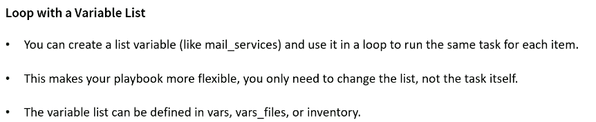
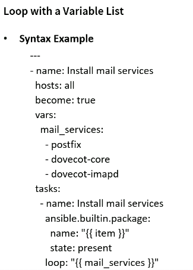

## Ansible loops with List of Dictionaries


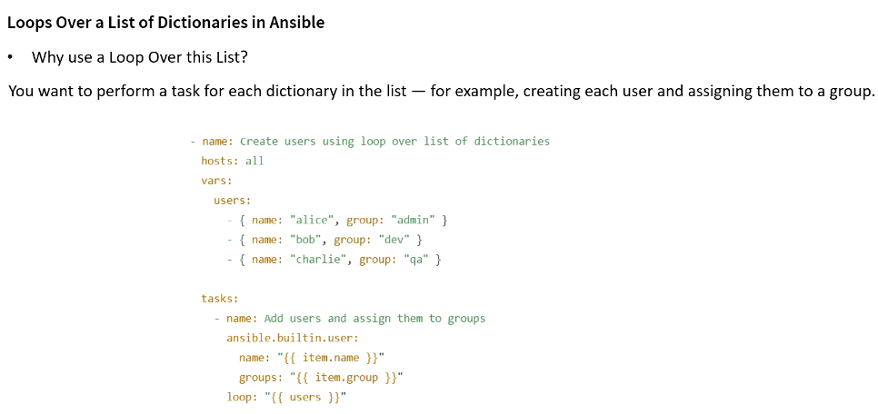
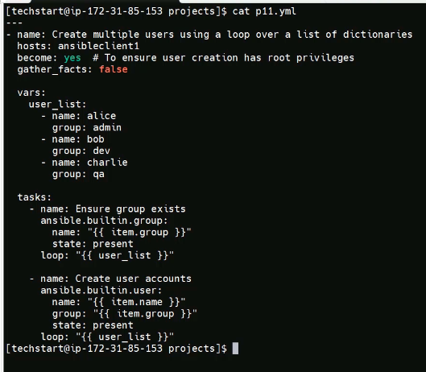

```yml
---
- name: Create multiple users using a loop over a list of dictionaries
  hosts: dev
  become: yes # To ensure user creation has root privileges
  remote_user: ec2-user
  gather_facts: false # Skip collecting all system facts. Don’t run the setup module.
  
  vars:
    users:
      - name: metchim
        group: manager
      - name: goumgue
        group: admin
      - name: chagom
        group: dev
      - name: jimbock
        group: prod
      - name: kengne
        group: dr

  tasks:
    - name: Ensure group exists
      ansible.builtin.group:
        name: "{{ item.group }}"
        state: present
      loop: "{{ users }}"

    - name: Create users and assign them to groups
      ansible.builtin.user:
        name: "{{ item.name }}"
        groups: "{{ item.group }}"
        state: present
      loop: "{{ users }}"

```

```sh
ansible-playbook -i a00_Inventory.ini a03_01_Loop_over_List_of_Dictionary.yml

PLAY [Create multiple users using a loop over a list of dictionaries] *****************************************

TASK [Ensure group exists] ************************************************************************************
ok: [ansibleclient01] => (item={'name': 'metchim', 'group': 'manager'})
ok: [ansibleclient02] => (item={'name': 'metchim', 'group': 'manager'})
ok: [ansibleclient01] => (item={'name': 'goumgue', 'group': 'admin'})
ok: [ansibleclient02] => (item={'name': 'goumgue', 'group': 'admin'})
ok: [ansibleclient02] => (item={'name': 'chagom', 'group': 'dev'})
ok: [ansibleclient01] => (item={'name': 'chagom', 'group': 'dev'})
changed: [ansibleclient02] => (item={'name': 'jimbock', 'group': 'prod'})
changed: [ansibleclient01] => (item={'name': 'jimbock', 'group': 'prod'})
changed: [ansibleclient02] => (item={'name': 'kengne', 'group': 'dr'})
changed: [ansibleclient01] => (item={'name': 'kengne', 'group': 'dr'})

TASK [Create users and assign them to groups] *****************************************************************
changed: [ansibleclient01] => (item={'name': 'metchim', 'group': 'manager'})
changed: [ansibleclient02] => (item={'name': 'metchim', 'group': 'manager'})
changed: [ansibleclient01] => (item={'name': 'goumgue', 'group': 'admin'})
changed: [ansibleclient02] => (item={'name': 'goumgue', 'group': 'admin'})
changed: [ansibleclient02] => (item={'name': 'chagom', 'group': 'dev'})
changed: [ansibleclient01] => (item={'name': 'chagom', 'group': 'dev'})
changed: [ansibleclient01] => (item={'name': 'jimbock', 'group': 'prod'})
changed: [ansibleclient02] => (item={'name': 'jimbock', 'group': 'prod'})
changed: [ansibleclient02] => (item={'name': 'kengne', 'group': 'dr'})
changed: [ansibleclient01] => (item={'name': 'kengne', 'group': 'dr'})

PLAY RECAP ****************************************************************************************************
ansibleclient01            : ok=2    changed=2    unreachable=0    failed=0    skipped=0    rescued=0    ignored=0
ansibleclient02            : ok=2    changed=2    unreachable=0    failed=0    skipped=0    rescued=0    ignored=0
```

## Earlier-style loop keywords: with_items, with_dict, etc

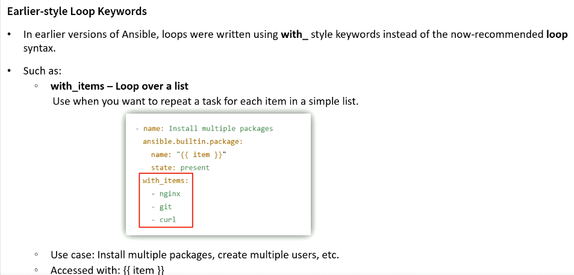

```yml
- name: Install Multiple packages
  hosts: dev
  become: true
  remote_user: ec2-user

  tasks:
    - name: Install Multiple packages
      ansible.builtin.package:
        name: "{{ item }}"
        state: present
      with_items:
        - nginx
        - git
        - curl-minimal
```

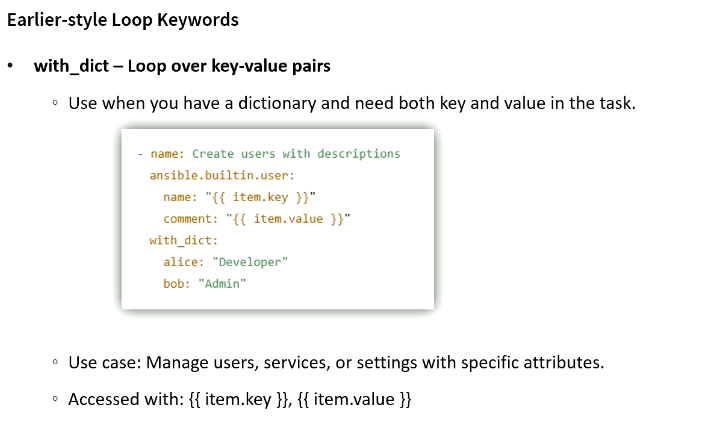

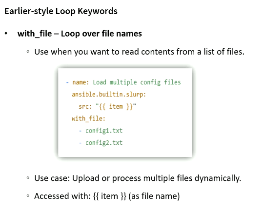

## Register with loop in Ansible

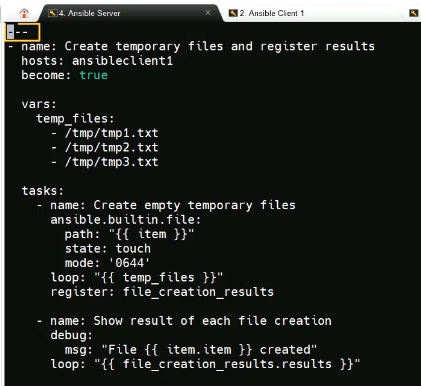

## Implement Task Control - Running Tasks Conditionally

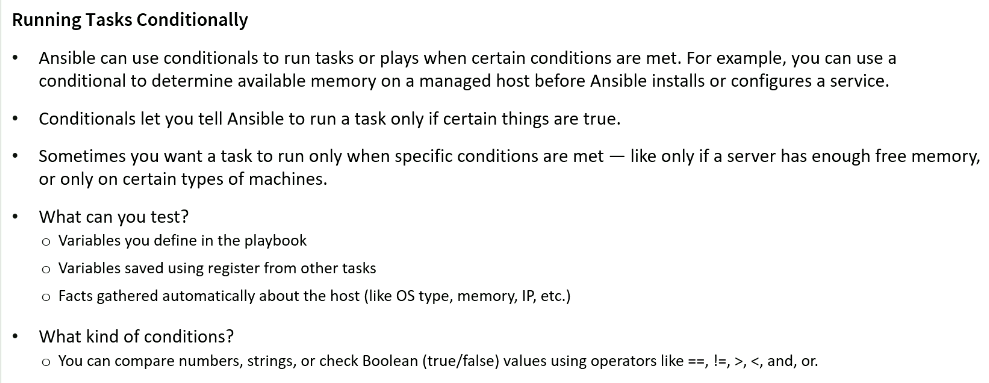

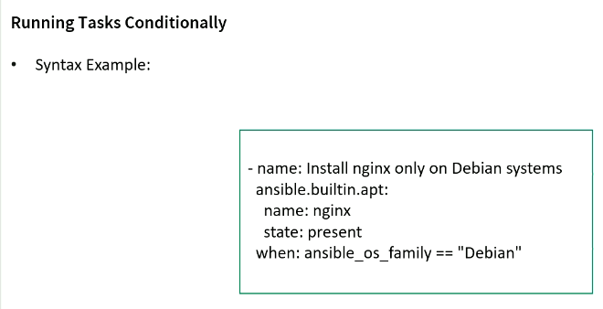

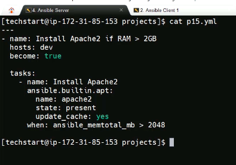

```yml
---
- name: Install Aopache2 if RAM > 2GB
  hosts: dev
  become: true
  remote_user: ec2-user

  tasks:
    - name: Install Apache2
      ansible.builtin.apt:
        name: Apache2
        state: present
        update_cache: yes
      when: ansible_memtotal_mb > 2048
```

```sh
ansible-playbook -i a00_Inventory.ini a06_Task_Control_Install_Apache2_if_RAM_greather_than_2_GB.yml --check

PLAY [Install Aopache2 if RAM > 2GB] **************************************************************************

TASK [Gathering Facts] ****************************************************************************************
ok: [ansibleclient02]
ok: [ansibleclient01]

TASK [Install Apache2] ****************************************************************************************
skipping: [ansibleclient01]
skipping: [ansibleclient02]

PLAY RECAP ****************************************************************************************************
ansibleclient01            : ok=1    changed=0    unreachable=0    failed=0    skipped=1    rescued=0    ignored=0
ansibleclient02            : ok=1    changed=0    unreachable=0    failed=0    skipped=1    rescued=0    ignored=0
```

## Run task only if OD is Amazon Linux

```sh
ansible dev -m setup -a 'filter=ansible_distribution' -i a00_Inventory.ini
ansibleclient02 | SUCCESS => {
    "ansible_facts": {
        "ansible_distribution": "Amazon"
    },
    "changed": false
}
ansibleclient01 | SUCCESS => {
    "ansible_facts": {
        "ansible_distribution": "Amazon"
    },
    "changed": false
}
```


## Deploying Files to managed Hosts
