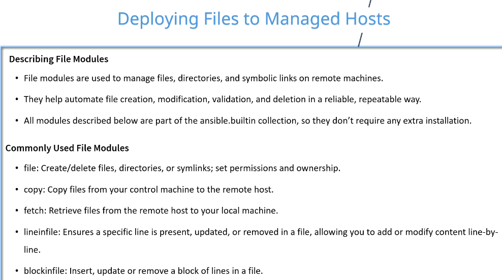
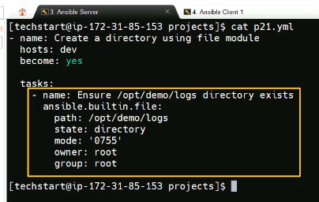

# Deploying Files to Managed Hosts





```ini

```

```yml
---
- name: Create directory using file module
  hosts: dev
  become: yes
  remote_user: ec2-user
  gather_facts: true

  tasks:
    - name: Ensure /opt/demo/logs directory exists
      ansible.builtin.file:
        path: /opt/demo/logs
        state: directory
        mode: '0755'
        owner: root
        group: root
```

```sh
ansible dev -m shell -a "ls -al /tmp | grep demo" -i a00_Inventory.ini
ansibleclient02 | CHANGED | rc=0 >>
-rw-r--r--.  1 root     root      23 Apr 20 01:38 demo.txt
ansibleclient01 | CHANGED | rc=0 >>
-rw-r--r--.  1 root     root      23 Apr 20 01:38 demo.txt
```

```yml
---
- name: Fetch File From Remote Machine Using Fetch Module
  hosts: ansibleclient01
  become: yes
  remote_user: ec2-user
  gather_facts: true

  tasks:
    - name: Fetch sshd_confil from remote to local 
      ansible.builtin.fetch:
        src: /etc/ssh/ssh_config 
        dest: /home/ec2-user/a05_Deploy_Files/
        flat: yes
```

```sh
>$ll ssh_config
-rw-r--r--. 1 ec2-user ec2-user 1921 Apr 20 02:09 ssh_config
```

```yml
---
- name: Insert line using lineinfile module
  hosts: dev
  become: yes
  remote_user: ec2-user
  gather_facts: true

  tasks:
    - name: Ensure a setting line exist in config file
      ansible.builtin.lineinfile:
        path: /tmp/demo.txt 
        line: 'enable_feature=true'
```

```sh
ansible-playbook -i a00_Inventory.ini a04.yml

PLAY [Insert line using lineinfile module] ********************************************************************

TASK [Gathering Facts] ****************************************************************************************
ok: [ansibleclient01]
ok: [ansibleclient02]

TASK [Ensure a setting line exist in config file] *************************************************************
changed: [ansibleclient01]
changed: [ansibleclient02]

PLAY RECAP ****************************************************************************************************
ansibleclient01            : ok=2    changed=1    unreachable=0    failed=0    skipped=0    rescued=0    ignored=0
ansibleclient02            : ok=2    changed=1    unreachable=0    failed=0    skipped=0    rescued=0    ignored=0


>$ansible dev -m shell -a "cat /tmp/demo.txt" -i a00_Inventory.ini
ansibleclient01 | CHANGED | rc=0 >>
Arristide Tchatua file
enable_feature=true
ansibleclient02 | CHANGED | rc=0 >>
Arristide Tchatua file
enable_feature=true
```

## Insert Config Block Using blockinfile