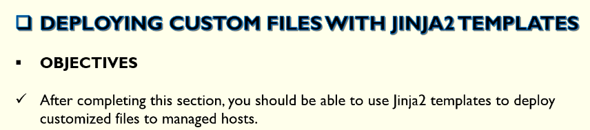
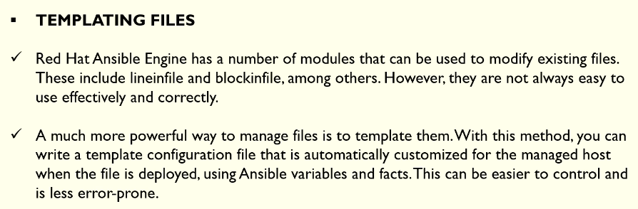
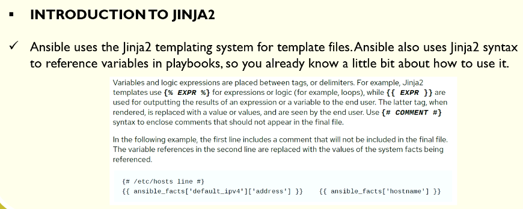
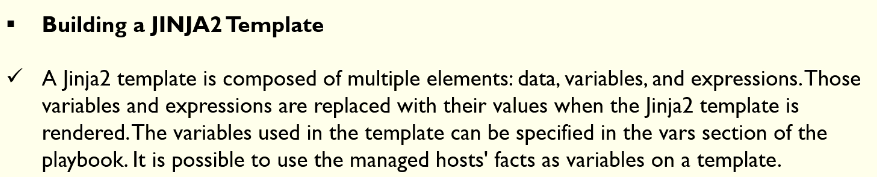
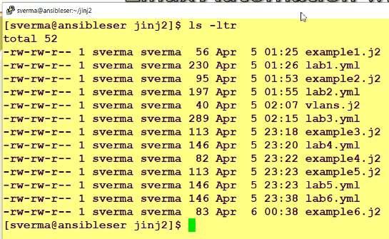
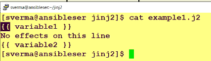
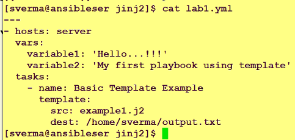
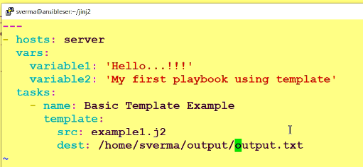

# Deploying Custom Files with Jinja2 Templates

















```ini
[dev]
ansibleclient01 ansible_host=10.0.11.241 ansible_user=ec2-user ansible_ssh_private_key_file=/home/ec2-user/terraform_key_pem.pem ansible_python_interpreter=/usr/bin/python3
ansibleclient02 ansible_host=10.0.12.113 ansible_user=ec2-user ansible_ssh_private_key_file=/home/ec2-user/terraform_key_pem.pem ansible_python_interpreter=/usr/bin/python3
```

```j2
{{ variable01 }}
No effetcs on this line
{{ variable02 }}
```

```yml
---
- name: Basic Templates Example
  hosts: dev
  become: yes
  remote_user: ec2-user
  gather_facts: true
  vars:
    variable01: "Hello Pennington, I'm on my way"
    variable02: "Playbook using template"

  tasks:
    - name: Basic Templates Example
      template:
        src: a01_Example.j2
        dest: /opt/a01_output.txt
```

```sh
ansible dev -m shell -a "cat /opt/a01_output.txt" -i a00_Inventory.ini

ansibleclient01 | CHANGED | rc=0 >>
Hello Pennington, I'm on my way
No effetcs on this line
Playbook using template

ansibleclient02 | CHANGED | rc=0 >>
Hello Pennington, I'm on my way
No effetcs on this line
Playbook using template
```

## Control structures with loop and variables


```sh
# cat a03_Using_ForLoops_for_Control_Structures.j2
```
```j2

{{ number }}

```

```yml
---
- name: Template Loop Example
  hosts: dev
  become: yes
  remote_user: ec2-user
  gather_facts: true

  tasks:
    - name: Template Loop Example
      template:
        src: a03_Using_ForLoops_for_Control_Structures.j2
        dest: /opt/a02_output.txt

```

```sh
ansible-playbook -i a00_Inventory.ini a04.yml

PLAY [Template Loop Example] **********************************************************************************

TASK [Gathering Facts] ****************************************************************************************
ok: [ansibleclient01]
ok: [ansibleclient02]

TASK [Template Loop Example] **********************************************************************************
changed: [ansibleclient01]
changed: [ansibleclient02]

PLAY RECAP ****************************************************************************************************
ansibleclient01            : ok=2    changed=1    unreachable=0    failed=0    skipped=0    rescued=0    ignored=0
ansibleclient02            : ok=2    changed=1    unreachable=0    failed=0    skipped=0    rescued=0    ignored=0

# Verification
ansible dev -m shell -a "cat /opt/a02_output.txt" -i a00_Inventory.ini
ansibleclient02 | CHANGED | rc=0 >>
0
1
2
3
4
5
6
7
8
9
10
ansibleclient01 | CHANGED | rc=0 >>
0
1
2
3
4
5
6
7
8
9
10

```j2

{{ item }}

```

```yml
---
- name: Template Loop Example
  hosts: dev
  become: yes
  remote_user: ec2-user
  gather_facts: true
  vars:
    a06_list: ['Alpha', 'Bravo', 'Charlie', 'Delta', 'Echo' ]

  tasks:
    - name: Template Loop Example
      template:
        src: a05_Template_Module_loop_with_List.j2
        dest: /opt/a03_output.txt

```

```sh
ansible-playbook -i a00_Inventory.ini a06.yml

PLAY [Template Loop Example] **********************************************************************************

TASK [Gathering Facts] ****************************************************************************************
ok: [ansibleclient01]
ok: [ansibleclient02]

TASK [Template Loop Example] **********************************************************************************
changed: [ansibleclient01]
changed: [ansibleclient02]

PLAY RECAP ****************************************************************************************************
ansibleclient01            : ok=2    changed=1    unreachable=0    failed=0    skipped=0    rescued=0    ignored=0
ansibleclient02            : ok=2    changed=1    unreachable=0    failed=0    skipped=0    rescued=0    ignored=0
#
>$ansible dev -m shell -a "ls -al /opt/*.txt" -i a00_Inventory.ini
ansibleclient02 | CHANGED | rc=0 >>
-rw-r--r--. 1 root root 80 Apr 20 11:40 /opt/a01_output.txt
-rw-r--r--. 1 root root 23 Apr 20 12:00 /opt/a02_output.txt
-rw-r--r--. 1 root root 31 Apr 20 12:14 /opt/a03_output.txt
ansibleclient01 | CHANGED | rc=0 >>
-rw-r--r--. 1 root root 80 Apr 20 11:40 /opt/a01_output.txt
-rw-r--r--. 1 root root 23 Apr 20 12:00 /opt/a02_output.txt
-rw-r--r--. 1 root root 31 Apr 20 12:14 /opt/a03_output.txt
#
ansible dev -m shell -a "cat /opt/a03_output.txt" -i a00_Inventory.ini
ansibleclient01 | CHANGED | rc=0 >>
Alpha
Bravo
Charlie
Delta
Echo
ansibleclient02 | CHANGED | rc=0 >>
Alpha
Bravo
Charlie
Delta
Echo
```

# Control structures

```j2

    {{ item.id }} {{ item.name }}

```

```yml
---
- name: Template Loop Example
  hosts: dev
  become: yes
  remote_user: ec2-user
  gather_facts: true
  vars:
    vlan: 
      - id: 10
        name: LB
      - id: 20
        name: WB_01
      - id: 30
        name: WB_02
      - id: 40
        name: DB

  tasks:
    - name: Template Loop Example
      template:
        src: a07_Template_Module_Loop_with_List.j2
        dest: /opt/a04_output.txt

```

```sh
ansible dev -m shell -a "ls -al /opt/*.txt" -i a00_Inventory.ini
ansibleclient02 | CHANGED | rc=0 >>
-rw-r--r--. 1 root root 80 Apr 20 11:40 /opt/a01_output.txt
-rw-r--r--. 1 root root 23 Apr 20 12:00 /opt/a02_output.txt
-rw-r--r--. 1 root root 44 Apr 20 12:20 /opt/a03_output.txt
-rw-r--r--. 1 root root 46 Apr 20 16:52 /opt/a04_output.txt
ansibleclient01 | CHANGED | rc=0 >>
-rw-r--r--. 1 root root 80 Apr 20 11:40 /opt/a01_output.txt
-rw-r--r--. 1 root root 23 Apr 20 12:00 /opt/a02_output.txt
-rw-r--r--. 1 root root 44 Apr 20 12:20 /opt/a03_output.txt
-rw-r--r--. 1 root root 46 Apr 20 16:52 /opt/a04_output.txt
>$ansible dev -m shell -a "cat /opt/a04*.txt" -i a00_Inventory.ini
ansibleclient02 | CHANGED | rc=0 >>
    10 LB
    20 WB_01
    30 WB_02
    40 DB
ansibleclient01 | CHANGED | rc=0 >>
    10 LB
    20 WB_01
    30 WB_02
    40 DB
```


```sh
ansible dev -m shell -a "ls -al /opt/*.txt" -i a00_Inventory.ini
ansibleclient02 | CHANGED | rc=0 >>
-rw-r--r--. 1 root root 80 Apr 20 11:40 /opt/a01_output.txt
-rw-r--r--. 1 root root 23 Apr 20 12:00 /opt/a02_output.txt
-rw-r--r--. 1 root root 44 Apr 20 12:20 /opt/a03_output.txt
-rw-r--r--. 1 root root 46 Apr 20 16:52 /opt/a04_output.txt
-rw-r--r--. 1 root root  4 Apr 20 17:19 /opt/a05_output.txt
ansibleclient01 | CHANGED | rc=0 >>
-rw-r--r--. 1 root root 80 Apr 20 11:40 /opt/a01_output.txt
-rw-r--r--. 1 root root 23 Apr 20 12:00 /opt/a02_output.txt
-rw-r--r--. 1 root root 44 Apr 20 12:20 /opt/a03_output.txt
-rw-r--r--. 1 root root 46 Apr 20 16:52 /opt/a04_output.txt
-rw-r--r--. 1 root root  4 Apr 20 17:19 /opt/a05_output.txt
>$ansible dev -m shell -a "cay /opt/a05*.txt" -i a00_Inventory.ini
ansibleclient02 | FAILED | rc=127 >>
/bin/sh: line 1: cay: command not foundnon-zero return code
ansibleclient01 | FAILED | rc=127 >>
/bin/sh: line 1: cay: command not foundnon-zero return code
>$ansible dev -m shell -a "cat /opt/a05*.txt" -i a00_Inventory.ini
ansibleclient02 | CHANGED | rc=0 >>
        5
ansibleclient01 | CHANGED | rc=0 >>
        5
```


```sh
ansible dev -m setup -i a00_Inventory.ini | grep processor
        "ansible_processor": [
        "ansible_processor_cores": 1,
        "ansible_processor_count": 1,
        "ansible_processor_nproc": 2,
        "ansible_processor_threads_per_core": 2,
        "ansible_processor_vcpus": 2,
        "ansible_processor": [
        "ansible_processor_cores": 1,
        "ansible_processor_count": 1,
        "ansible_processor_nproc": 2,
        "ansible_processor_threads_per_core": 2,
        "ansible_processor_vcpus": 2,

$ansible dev -m setup -i a00_Inventory.ini | grep processor_count
        "ansible_processor_count": 1,
        "ansible_processor_count": 1,


ansible dev -m setup -i a00_Inventory.ini | grep mem
                "host": "Non-Volatile memory controller: Amazon.com, Inc. NVMe EBS Controller",
        "ansible_memfree_mb": 228,
        "ansible_memory_mb": {
        "ansible_memtotal_mb": 916,
                "host": "Non-Volatile memory controller: Amazon.com, Inc. NVMe EBS Controller",
        "ansible_memfree_mb": 238,
        "ansible_memory_mb": {
        "ansible_memtotal_mb": 916,

>$ansible dev -m setup -i a00_Inventory.ini | grep memtotal_mb
        "ansible_memtotal_mb": 916,
        "ansible_memtotal_mb": 916,
```


```j2
System's Total Memory {{ ansible_fact['memtotal_mb'] }}
System's Processor Count {{ ansible_fact['processor_count'] }}
```


```j2
System's Total Memory: {{ ansible_facts['memtotal_mb'] }}
System's Processor Count: {{ ansible_facts['processor_count'] }}
```

```yml
---
# This playbook renders a Jinja2 template using Ansible facts
# and writes the output to /etc/motd/motd on all hosts in the "dev" group.
- name: Display the file information module
  hosts: dev
  become: yes
  remote_user: ec2-user
  gather_facts: true      # Required because the template uses ansible_facts

  tasks:
    - name: Configure custom /etc/motd
      template:
        src: a13_Template_Memory_Processor_Count.j2   # Jinja2 template file
        dest: /etc/motd   
        mode: 0644
        owner: root
        group: root

    - name: Check file stat
      stat: 
        path: /etc/motd 
      register: motd_info

    - name: Display file result
      debug: 
        var: motd_info
```

```sh
ansible dev -m shell -a "cat /etc/motd" -i a00_Inventory.ini
ansibleclient01 | CHANGED | rc=0 >>

A newer release of "Amazon Linux" is available.
  Version 2023.11.20260413:
Run "/usr/bin/dnf check-release-update" for full release and version update info
ansibleclient02 | CHANGED | rc=0 >>

A newer release of "Amazon Linux" is available.
  Version 2023.11.20260413:
Run "/usr/bin/dnf check-release-update" for full release and version update info


ansible-playbook -i a00_Inventory.ini a14.yml

PLAY [Display the file information module] ********************************************************************

TASK [Gathering Facts] ****************************************************************************************
ok: [ansibleclient01]
ok: [ansibleclient02]

TASK [Configure custom /etc/motd] *****************************************************************************
changed: [ansibleclient02]
changed: [ansibleclient01]

TASK [Check file informations (stat)] *************************************************************************
ok: [ansibleclient01]
ok: [ansibleclient02]

TASK [Display file result] ************************************************************************************
ok: [ansibleclient01] => {
    "motd_info": {
        "changed": false,
        "failed": false,
        "stat": {
            "atime": 1776729881.204687,
            "attr_flags": "",
            "attributes": [],
            "block_size": 4096,
            "blocks": 8,
            "charset": "us-ascii",
            "checksum": "a484b7554a2ee84e8b9cad56b663c5057d6dfdad",
            "ctime": 1776729881.7346904,
            "dev": 66305,
            "device_type": 0,
            "executable": false,
            "exists": true,
            "gid": 0,
            "gr_name": "root",
            "inode": 48261274,
            "isblk": false,
            "ischr": false,
            "isdir": false,
            "isfifo": false,
            "isgid": false,
            "islnk": false,
            "isreg": true,
            "issock": false,
            "isuid": false,
            "mimetype": "text/plain",
            "mode": "0644",
            "mtime": 1776729881.204687,
            "nlink": 1,
            "path": "/etc/motd",
            "pw_name": "root",
            "readable": true,
            "rgrp": true,
            "roth": true,
            "rusr": true,
            "size": 60,
            "uid": 0,
            "version": "3927137672",
            "wgrp": false,
            "woth": false,
            "writeable": true,
            "wusr": true,
            "xgrp": false,
            "xoth": false,
            "xusr": false
        }
    }
}
ok: [ansibleclient02] => {
    "motd_info": {
        "changed": false,
        "failed": false,
        "stat": {
            "atime": 1776729881.2054894,
            "attr_flags": "",
            "attributes": [],
            "block_size": 4096,
            "blocks": 8,
            "charset": "us-ascii",
            "checksum": "a484b7554a2ee84e8b9cad56b663c5057d6dfdad",
            "ctime": 1776729881.7454934,
            "dev": 66305,
            "device_type": 0,
            "executable": false,
            "exists": true,
            "gid": 0,
            "gr_name": "root",
            "inode": 38255327,
            "isblk": false,
            "ischr": false,
            "isdir": false,
            "isfifo": false,
            "isgid": false,
            "islnk": false,
            "isreg": true,
            "issock": false,
            "isuid": false,
            "mimetype": "text/plain",
            "mode": "0644",
            "mtime": 1776729881.2054894,
            "nlink": 1,
            "path": "/etc/motd",
            "pw_name": "root",
            "readable": true,
            "rgrp": true,
            "roth": true,
            "rusr": true,
            "size": 60,
            "uid": 0,
            "version": "3950575321",
            "wgrp": false,
            "woth": false,
            "writeable": true,
            "wusr": true,
            "xgrp": false,
            "xoth": false,
            "xusr": false
        }
    }
}

PLAY RECAP ****************************************************************************************************
ansibleclient01            : ok=4    changed=1    unreachable=0    failed=0    skipped=0    rescued=0    ignored=0
ansibleclient02            : ok=4    changed=1    unreachable=0    failed=0    skipped=0    rescued=0    ignored=0


ansible dev -m shell -a "cat /etc/motd" -i a00_Inventory.ini
ansibleclient02 | CHANGED | rc=0 >>


System's Total Memory: 916
System's Processor Count: 1
ansibleclient01 | CHANGED | rc=0 >>


System's Total Memory: 916
System's Processor Count: 1

```

