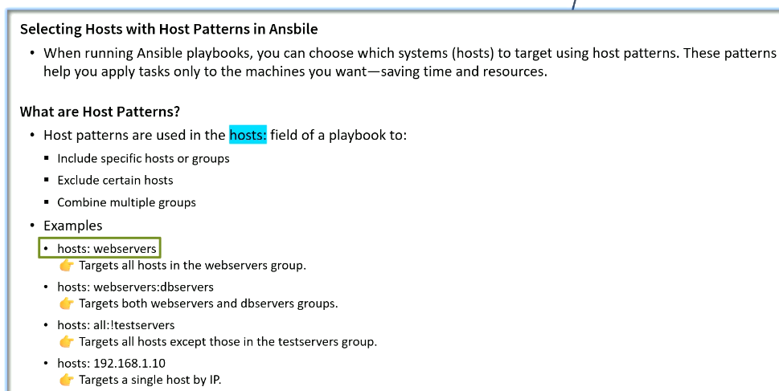
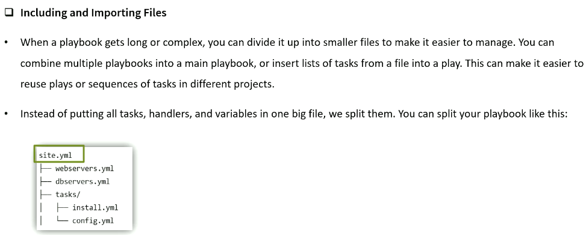
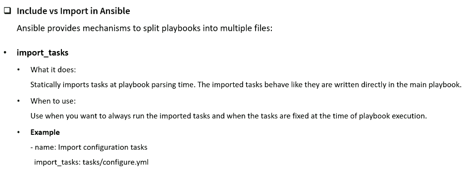
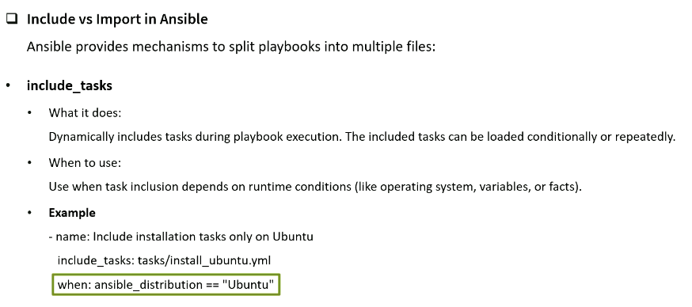
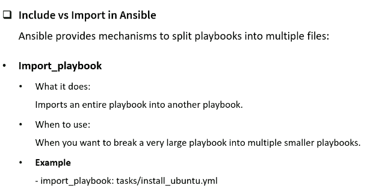
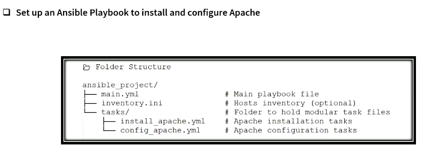

# Managing Complex plays and playbooks

## Selecting Hosts with Host Patterns in ansible













# 


```sh
ansible-playbook -i a02_Inventory.ini a01_Main.yml

PLAY [Install and start Apache on Amazon Linux] ***************************************************************

TASK [Gathering Facts] ****************************************************************************************
ok: [ansibleclient01]

TASK [Include installation taskss Only On Amazon linux] *******************************************************
included: /home/ec2-user/a06_Deploy_Custom_Files_with_Jinja2_Templates/d01/d01_Tasks/a01_Install_Apache.yml for ansibleclient01

TASK [Install Apache (httpd)] *********************************************************************************
ok: [ansibleclient01]

TASK [Enable and start Apache service] ************************************************************************
changed: [ansibleclient01]

TASK [Create custom index.html] *******************************************************************************
changed: [ansibleclient01]

RUNNING HANDLER [Restart Apache] ******************************************************************************
changed: [ansibleclient01]

PLAY RECAP ****************************************************************************************************
ansibleclient01            : ok=6    changed=3    unreachable=0    failed=0    skipped=0    rescued=0    ignored=0

```
