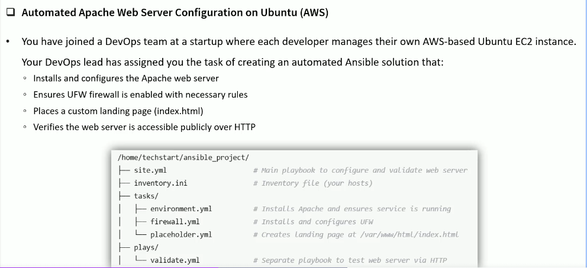

# Apache webserver Automation



```css
d01_Project/
├── a01_site.yml                     # main playbook to confirm and validate web server
├── a02_inventory.ini                # Inventory file
├── d01_tasks/
│        ├── a01_environment.yml     # Install apache and ensures service is running
│        ├── a02_firewall.yml        # Install and configure UFW
|        └── a03_placeholder.yml     # Create landing page at /var/www/html/ondex.html
└── d02_plays/
             └── a01_validate.yml    # Separate playbook to test web server via HTTP
```
