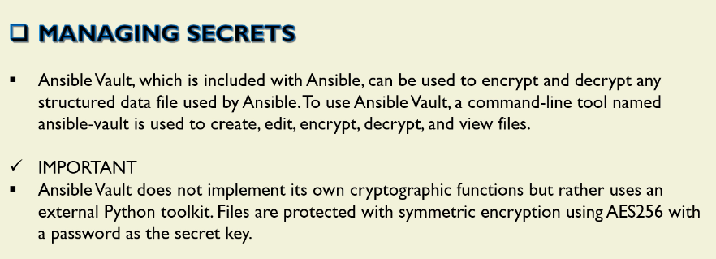

# Managing Secret

## Ansible Vault Command




### To create an ecrypted file

```sh
ansible-vault create a01_myplaybook.yml
New Vault password:
Confirm New Vault password:

[ec2-user@ansiblecontroller ~]$ cat a01_myplaybook.yml
$ANSIBLE_VAULT;1.1;AES256
37633862303434643064353937373363623261613638356431313830326334306135303438356166
6131386332633937373634386433323334613866373731380a373430326139373036323764303739
30326665323031373764623564383463663639303566636432623062373734626531383062316262
6264393862353339360a666138626333323339313463323630643732323238313862666565636663
35656564656330383034396665333263383164306262306163353863623864303865366430383735
61636132343164653135336135383262306264663638356139653138623133353266663533313230
66656162316235343235643961323731616361303235373465616530346362353863613033393831
35613164343638653130386533373538376466303836396265366637616131356432643035396133
35613165656432616238343733663435343766306364363334646330646438353762323432373535
65333237323635336431343062333932346630303962353833313534653864373562313838386131
33356235616137616234663262376339303138643165643039373464396431383361346366623061
36656637363263653566333637636433653936323730313535353831613365383933663430613166
31306433363630363035376261363061303466343065366466633537323232613963336261623839
32623938646261326361393633363561616137313633616464346231356166373737336663653666
616464613338383663666266643966656235
```

### To view the content of an ecrypted file

```sh
ansible-vault view a01_myplaybook.yml
Vault password:
---
- name: Pud
  become: yes
  remote_user: ec2-user
  gather_facts: true
  tasks:
    - name: First task
      # ansible.builtin.include_tasks: d01_tasks/a01_environment.yml
      # vars:
      #   package: apache2
```

### To create an ecrypted file from the file password


```sh
[ec2-user@ansiblecontroller a07_Manage_Secret]$ cat > a02_passwd
password
[ec2-user@ansiblecontroller a07_Manage_Secret]$ cat a02_passwd
PasswoRd@#2026
[ec2-user@ansiblecontroller a07_Manage_Secret]$ ansible-vault create --vault-password-file=a02_passwd a03_MyNewPlaybook.yml

[ec2-user@ansiblecontroller a07_Manage_Secret]$ cat a03_MyNewPlaybook.yml
$ANSIBLE_VAULT;1.1;AES256
37363165323738633765633763336439393562653734653236376335646433623965623762323039
6463616136323830383966303338353039336234323337340a353763306663306433646539653438
34373238626365303838636139636139613836306664306463633366363830316361396437663631
6630316264316438640a363830353432383232336565356466306337336461633066363235613133
3963

[ec2-user@ansiblecontroller a07_Manage_Secret]$ ansible-vault view --vault-password-file=a02_passwd a03_MyNewPlaybook.yml
---
- name:
```

### To encrypt the file a02_passwd and save the encrypted output as a04_Encrypt_Passwd_File, the correct Ansible Vault command is:
```sh
ansible-vault encrypt a02_passwd --output=a04_Encrypt_Passwd_File
New Vault password:
Confirm New Vault password:
Encryption successful

[ec2-user@ansiblecontroller a07_Manage_Secret]$ ll
total 16
-rw-------. 1 ec2-user ec2-user 1197 Apr 24 02:27 a01_myplaybook.yml
-rw-------. 1 ec2-user ec2-user   16 Apr 24 02:34 a02_passwd
-rw-------. 1 ec2-user ec2-user  355 Apr 23 21:14 a03_MyNewPlaybook.yml
-rw-------. 1 ec2-user ec2-user  419 Apr 24 02:55 a04_Encrypt_Passwd_File

[ec2-user@ansiblecontroller a07_Manage_Secret]$ cat a02_passwd
password

[ec2-user@ansiblecontroller a07_Manage_Secret]$ cat a04_Encrypt_Passwd_File
$ANSIBLE_VAULT;1.1;AES256
39373730313335616332666436393863633634656635316532336163363337393036303433633436
3132346334333063313565373836626130373662376636640a663734666561366333353130393263
64353436356666373266666239366433646335653039343234616166353234636533303132306139
3839313630623231300a636433313933306334303037613839356531663264383131626239393935
33323866383239383834643538353462383439633264323735323734336364616536

```

### To change the password of an ecrypted file


```sh
cat a01_myplaybook.yml
$ANSIBLE_VAULT;1.1;AES256
64663031333065346339666565383566633636646565656263383663373862663561386431623233
6562313761653865623565343133656662613966346533640a626366623837373736346634383439
35326337343935633661663161333933343139623764633637623663343135356531326133646233
3565353334653539310a353833613365343166343864643132666230323533653639333332336535
38346231323261613539623938323061333864353864303764636534393738323465616535663137
61626363363464386135666465383264633736613264383336393966653537613033653238643164
38346163346633353964303331306266313562383866656233376661643861343166326635383266
61636362303734383237666331373262333530326162353933356538323735363265313633376431
65613236373163613736626637376639616130363931633631363262383737346134386339623864
39643866643233653530316231633630383231376531323634613534376530353231336535386666
35333066623563626332356434393530343330396362396431333161306531363536626262663236
66376636303861323361663465623664653735663338663534636630613963363934313465623961
63346431363131386661646666666439303465346239363836376534636135376233316334326538
33653732313737333137633364633638653866313334303037303634383536623263666530343730
636138306435353335366162393564396463

[ec2-user@ansiblecontroller a07_Manage_Secret]$ ansible-vault view a01_myplaybook.yml
Vault password:
---
- name: Pud
  become: yes
  remote_user: ec2-user
  gather_facts: true
  tasks:
    - name: First task
       ansible.builtin.include_tasks: d01_tasks/a01_environment.yml
        vars:
          package: apache2


[ec2-user@ansiblecontroller a07_Manage_Secret]$ ansible-vault rekey a01_myplaybook.yml
Vault password:
New Vault password:
Confirm New Vault password:
Rekey successful
```

## Guided Exercice: How to play a playbook with an encrypted

- using idempotent, secure, and Ansible‑best‑practice methods.

```sh
ansible-vault create a05_User_Creation.yml
New Vault password:
Confirm New Vault password:

[ec2-user@ansiblecontroller a07_Manage_Secret]$ cat a05_User_Creation.yml
$ANSIBLE_VAULT;1.1;AES256
61646363303738303563646161653539623963643539643834383061616466353064663562616436
6233653031396539353538363633636639646438373761350a373463376335386265353133353564
38393036356361613334353362623333646362393464383234626461646630623437306634313738
3433616537633637320a336537333531373938383936626434663235356333323334373137633861
35363061343665343661333539373137313730343561643864643432373161613634366330396565
31666563653165303765663061313662363135366336363363326263363132393562383931636464
63643632316264623439343637653736636430343930376439386637653938616139386362306437
33306561323139616663666661643239326335393132313038386433393638363733353439363531
66653032346631666536333733326337333530656464306163396638623435613237613965653139
63393932323334316334313764316132323033363462383563356162656361383366343864613034
38623938336366333531396263356232363239663232653962613630316464316435366639633363
64656337383366346230363632643565353838393536616365623333346334303232623334323565
32313637643863353031616638363064343334366461343331616166633265663664346335613734
38393565653336313766306163323434373535326164313132366336316434333563376235353436
34333432383163393835343836383766613362303935656633303234383262356435366239383131
64633963653062303262653030653338303866623663343465326631323461393363646336613962
31393438613761616139356232616463306134303362646335343963613832663730653636343165
6638313766386638396130376231323531353932663063353865


ansible dev -m shell -a "id ansadmin" -i a00_Inventory.ini
ansibleclient02 | FAILED | rc=1 >>
id: ‘ansadmin’: no such usernon-zero return code
ansibleclient01 | FAILED | rc=1 >>
id: ‘ansadmin’: no such usernon-zero return code


ansible-playbook --vault-id @prompt a05_User_Creation.yml -i a00_Inventory.ini
Vault password (default):

PLAY [User Account Creation] **********************************************************************************

TASK [Gathering Facts] ****************************************************************************************
ok: [ansibleclient01]
ok: [ansibleclient02]

TASK [User Account Creation] **********************************************************************************
[WARNING]: The input password appears not to have been hashed. The 'password' argument must be encrypted for
this module to work properly.
changed: [ansibleclient02]
changed: [ansibleclient01]

PLAY RECAP ****************************************************************************************************
ansibleclient01            : ok=2    changed=1    unreachable=0    failed=0    skipped=0    rescued=0    ignored=0
ansibleclient02            : ok=2    changed=1    unreachable=0    failed=0    skipped=0    rescued=0    ignored=0


ansible dev -m shell -a "id ansadmin" -i a00_Inventory.ini
ansibleclient01 | CHANGED | rc=0 >>
uid=1013(ansadmin) gid=1019(ansadmin) groups=1019(ansadmin)
ansibleclient02 | CHANGED | rc=0 >>
uid=1013(ansadmin) gid=1019(ansadmin) groups=1019(ansadmin)


cat: /etc/shadow: Permission denied
[ec2-user@ansiblecontroller a07_Manage_Secret]$ sudo cat /etc/shadow
root:*:19760:0:99999:7:::
bin:*:19760:0:99999:7:::
daemon:*:19760:0:99999:7:::
adm:*:19760:0:99999:7:::
lp:*:19760:0:99999:7:::
sync:*:19760:0:99999:7:::
shutdown:*:19760:0:99999:7:::
halt:*:19760:0:99999:7:::
mail:*:19760:0:99999:7:::
operator:*:19760:0:99999:7:::
games:*:19760:0:99999:7:::
ftp:*:19760:0:99999:7:::
nobody:*:19760:0:99999:7:::
systemd-coredump:!!:20543::::::
dbus:!!:20543::::::
polkitd:!!:20543::::::
tss:!!:20543::::::
sssd:!!:20543::::::
sshd:!!:20543::::::
chrony:!!:20543::::::
ec2-user:!!:20555:0:99999:7:::
ansadmin:$6$rounds=100000$5Cgg4Gl260IkLkCP$DdfnnNjR8Vr.J6ofwspAOAIAfq.MmbD8v2cQrMg/dlmsF105y/iDSiZvQPQj0.YfDxxe5IEsp.9PKnCIML5sr0:20555:0:99999:7:::
```

```yml
---
- name: User Account Creation
  hosts: dev
  become: yes
  become_user: root
  tasks:
    - name: User Account Creation
      ansible.builtin.user: 
        name: ansadmin02
        password: "$6$rounds=100000$5Cgg4Gl260IkLkCP$DdfnnNjR8Vr.J6ofwspAOAIAfq.MmbD8v2cQrMg/dlmsF105y/iDSiZvQPQj0.YfDxxe5IEsp.9PKnCIML5sr0" # Good practice # sudoi cat /etc/shadow
        comment: "Ansible Test account" 
        state: present
```

```sh
ansible-vault edit a05_User_Creation.yml                       Vault password:


[ec2-user@ansiblecontroller a07_Manage_Secret]$ ansible-playbook --vault-id @prompt a05_User_Creation.yml -K -i a00_Inventory.ini
BECOME password:
Vault password (default):

PLAY [User Account Creation] **********************************************************************************

TASK [Gathering Facts] ****************************************************************************************
ok: [ansibleclient02]
ok: [ansibleclient01]

TASK [User Account Creation] **********************************************************************************
```

###

- plain text secret password

```yml
username: ansadmin03
hwpass: "$6$rounds=100000$5Cgg4Gl260IkLkCP$DdfnnNjR8Vr.J6ofwspAOAIAfq.MmbD8v2cQrMg/dlmsF105y/iDSiZvQPQj0.YfDxxe5IEsp.9PKnCIML5sr0"
```

- Encrypting plain text secret password

```sh
ansible-vault encrypt a04_Secret.yml
```

- Plain text ansible playbook

```yml
---
- name: User Account Creation
  hosts: dev
  become: yes
  become_user: root
  vars:
    - a04_Secret.yml
  tasks:
    - name: User Account Creation
      ansible.builtin.user: 
        name: {{ username }}
        password: {{ hwpass }}
        comment: "Ansible Test account" 
        state: present
```

```sh
vim a06_Secret.yml


[ec2-user@ansiblecontroller a07_Manage_Secret]$ ansible-vault encrypt a06_Secret.yml
New Vault password:
Confirm New Vault password:
Encryption successful
[ec2-user@ansiblecontroller a07_Manage_Secret]$ cat a06_Secret.yml
$ANSIBLE_VAULT;1.1;AES256
61313963623266373065303666626339613236356261353932653161663734393738326330303436
3363386163343436613266333131373164353761333165340a613532633234626165623561366166
33396466643133656438633239353130666337666465353730656230656235366636346162356237
3662326532623132350a323561326138373463616564303137303562313436303631346635333866
32653436663631633762376233343665653431373161643038363230326236386433653336343563
66396465303533663833653536393639663661626366373262643361623633396433396261383034
36323838353332373431356239393261643334333764386266666239343765633834383765396463
33363538666633626463633331646233313764333364356363373639656638316561353361383835
32393530363164386631353863306430366635366534383535376430363266663235643733663164
36633034353535656463633037613333616461303533613161356235666464613866623036653734
32373464663064633366376434653434663231383031343666306666346534393335643261313565
34373265363063626364


cat a07_Creation_User.yml
---
- name: User Account Creation
  hosts: dev
  become: yes
  become_user: root
  vars_files:
   - a06_Secret.yml
  tasks:
    - name: User Account Creation
      ansible.builtin.user:
        name: "{{ username }}"
        password: "{{ hwpass }}"
        comment: "Ansible Test account"
        state: present


ansible-playbook --syntax-check a07_Creation_User.yml
ERROR! Attempting to decrypt but no vault secrets found


ansible-playbook --syntax-check --vault-id @prompt a07_Creation_User.yml
Vault password (default):

playbook: a07_Creation_User.yml

# ####################################################################
# Make sure the password of the secret an of the playbook are the same
# ####################################################################
ansible-vault encrypt a07_Creation_User.yml
New Vault password:
Confirm New Vault password:
Encryption successful


cat a07_Creation_User.yml
$ANSIBLE_VAULT;1.1;AES256
64313133373761666263366531383834303064323835653964613736323331363462386635333562
3038393838353036343833653230323538326564613561630a643665363764353265323262356265
61376433623962383762616633326361636335373963303431636137646635656664623235626337
6136326262643737390a303939343535623136343935613835646361663731353830613837633533
37366465623933346630666437366661303637316164613035363436386538653663363037633938
62643663626535343138363538646532653636663233623362373036333531656131343263393634
36373464333531346239376365396562663937636465356562336538343235663039333066303766
63383665313562653561316365356637653338653230626630623035623161376137323337616264
65613135653139623837313131316264353734373037623061316538303662353735396463363863
39663737303263623164616434393933613333653564626439363431343038396134663332376235
39326431353636373337366661303430393665656134396335613065633161663265346161363235
32366166643639313362376466373863376365376463316332623964663361353165326630653334
33663833663936343663333734363133616661333430323836373436316231383630393237653236
38353362306463386536376162656632373639633131333634396633636538333439366335373139
31356430343564303066633235313234326132373464376336623532656333623434363834383039
64646231353930653037636461636434376439323563323837343963313838643836626531356266
65303833316163386439303064383437353062356635396566383234313064633063356531353732
37613235653037666236313565623162343234666363613064636665616239353038633339656431
32313462666635303332303365346432343534303635316235333739336137386634633962646364
30376538346537643930


ansible dev -m shell -a "id ansadmin03" -i a00_Inventory.ini
ansibleclient02 | FAILED | rc=1 >>
id: ‘ansadmin03’: no such usernon-zero return code
ansibleclient01 | FAILED | rc=1 >>
id: ‘ansadmin03’: no such usernon-zero return code


ansible-playbook --vault-id @prompt a07_Creation_User.yml -i a00_Inventory.ini -K
BECOME password:
Vault password (default):

PLAY [User Account Creation] **********************************************************************************

TASK [Gathering Facts] ****************************************************************************************
ok: [ansibleclient01]
ok: [ansibleclient02]

TASK [User Account Creation] **********************************************************************************
changed: [ansibleclient01]
changed: [ansibleclient02]

PLAY RECAP ****************************************************************************************************
ansibleclient01            : ok=2    changed=1    unreachable=0    failed=0    skipped=0    rescued=0    ignored=0
ansibleclient02            : ok=2    changed=1    unreachable=0    failed=0    skipped=0    rescued=0    ignored=0


ansible dev -m shell -a "id ansadmin03" -i a00_Inventory.ini   ansibleclient02 | CHANGED | rc=0 >>
uid=1015(ansadmin03) gid=1021(ansadmin03) groups=1021(ansadmin03)
ansibleclient01 | CHANGED | rc=0 >>
uid=1015(ansadmin03) gid=1021(ansadmin03) groups=1021(ansadmin03)


```


