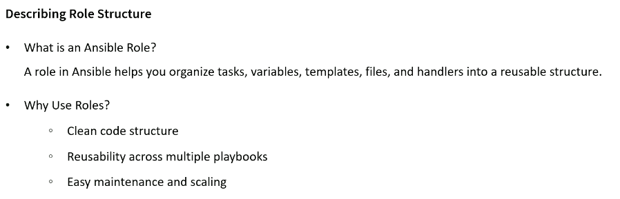
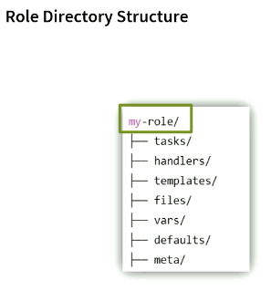
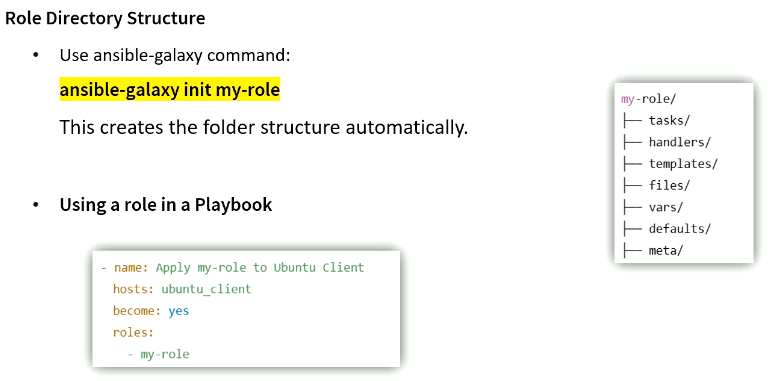
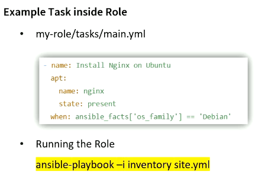
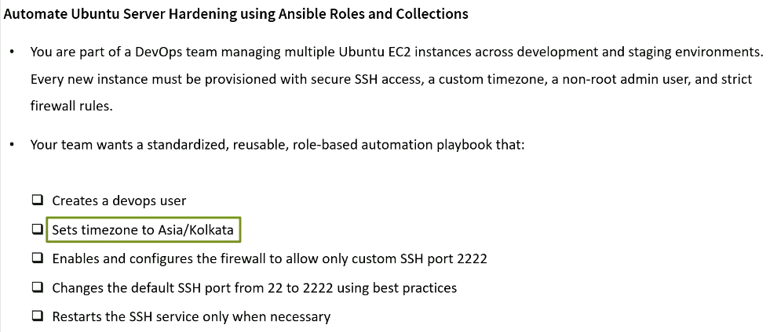

# Modular Playbook Design with Roles and Collections












```sh

ansible dev -m shell -a "sudo ss -tlnp | grep ssh" -i a00_Inventory.ini
ansibleclient02 | CHANGED | rc=0 >>
LISTEN 0      128          0.0.0.0:22        0.0.0.0:*    users:(("sshd",pid=622,fd=3))                        
LISTEN 0      128             [::]:22           [::]:*    users:(("sshd",pid=622,fd=4))                        
ansibleclient01 | CHANGED | rc=0 >>
LISTEN 0      128          0.0.0.0:22        0.0.0.0:*    users:(("sshd",pid=617,fd=3))                        
LISTEN 0      128             [::]:22           [::]:*    users:(("sshd",pid=617,fd=4)) 

ansible-playbook site.yml -i a00_Inventory.ini
[WARNING]: Collection community.general does not support Ansible version 2.14.18

PLAY [Automate Ubuntu Server Hardening] ***********************************************************************

TASK [Gathering Facts] ****************************************************************************************
ok: [ansibleclient02]
ok: [ansibleclient01]

TASK [d01_user_create : User Account Creation] ****************************************************************
ok: [ansibleclient02]
ok: [ansibleclient01]

TASK [d02_time_zone_set : Set Tim Zone To Asia/Kolkata] *******************************************************
ok: [ansibleclient01]
ok: [ansibleclient02]

TASK [d03_firewall_config : Ensure UFW is installed] **********************************************************
ok: [ansibleclient02]
ok: [ansibleclient01]

TASK [d03_firewall_config : Allow SSH on port 2222] ***********************************************************
ok: [ansibleclient02]
ok: [ansibleclient01]

TASK [d03_firewall_config : Enable UFW] ***********************************************************************
ok: [ansibleclient02]
ok: [ansibleclient01]

TASK [d04_ssh_config : Change SSH Port to 2222] ***************************************************************
changed: [ansibleclient02]
changed: [ansibleclient01]

RUNNING HANDLER [d04_ssh_config : Reload System] **************************************************************
changed: [ansibleclient02]
changed: [ansibleclient01]

RUNNING HANDLER [d04_ssh_config : Restart SSH] ****************************************************************
changed: [ansibleclient02]
changed: [ansibleclient01]

PLAY RECAP ****************************************************************************************************
ansibleclient01            : ok=9    changed=3    unreachable=0    failed=0    skipped=0    rescued=0    ignored=0
ansibleclient02            : ok=9    changed=3    unreachable=0    failed=0    skipped=0    rescued=0    ignored=0


$>ansible dev -m shell -a "sudo ss -tlnp | grep ssh" -i a00_Inventory.ini
ansibleclient02 | CHANGED | rc=0 >>
LISTEN 0      128          0.0.0.0:2222      0.0.0.0:*    users:(("sshd",pid=20698,fd=3))                      
LISTEN 0      128             [::]:2222         [::]:*    users:(("sshd",pid=20698,fd=4))                      
ansibleclient01 | CHANGED | rc=0 >>
LISTEN 0      128          0.0.0.0:2222      0.0.0.0:*    users:(("sshd",pid=21009,fd=3))
LISTEN 0      128             [::]:2222         [::]:*    users:(("sshd",pid=21009,fd=4))

ansible dev -m shell -a "id devops" -i a00_Inventory.ini
ansibleclient02 | CHANGED | rc=0 >>
uid=1001(devops) gid=1001(devops) groups=1001(devops)
ansibleclient01 | CHANGED | rc=0 >>
uid=1001(devops) gid=1001(devops) groups=1001(devops)

ansibleclient01 ansible_host=10.0.11.248 ansible_user=ubuntu ...
ansibleclient02 ansible_host=10.0.12.199 ansible_user=ubuntu ...

ansibleclient01 ansible_host=10.0.11.248 ansible_port=2222 ansible_user=ubuntu ansible_ssh_private_key_file=/home/ec2-user/terraform_key_pem.pem ansible_python_interpreter=/usr/bin/python3
ansibleclient02 ansible_host=10.0.12.199 ansible_port=2222 ansible_user=ubuntu ansible_ssh_private_key_file=/home/ec2-user/terraform_key_pem.pem ansible_python_interpreter=/usr/bin/python3


ansible dev -m shell -a "sudo ufw status" -i a00_Inventory.ini
ansibleclient02 | CHANGED | rc=0 >>
Status: active

To                         Action      From
--                         ------      ----
Apache                     ALLOW       Anywhere
OpenSSH                    ALLOW       Anywhere
2222/tcp                   ALLOW       Anywhere
Apache (v6)                ALLOW       Anywhere (v6)
OpenSSH (v6)               ALLOW       Anywhere (v6)
2222/tcp (v6)              ALLOW       Anywhere (v6)
ansibleclient01 | CHANGED | rc=0 >>
Status: active

To                         Action      From
--                         ------      ----
Apache                     ALLOW       Anywhere
OpenSSH                    ALLOW       Anywhere
2222/tcp                   ALLOW       Anywhere
Apache (v6)                ALLOW       Anywhere (v6)
OpenSSH (v6)               ALLOW       Anywhere (v6)
2222/tcp (v6)              ALLOW       Anywhere (v6)


ansible dev -m shell -a "sudo cat /etc/ssh/sshd_config | grep 2222" -i a00_Inventory.ini
ansibleclient01 | CHANGED | rc=0 >>
Port 2222
ansibleclient02 | CHANGED | rc=0 >>
Port 2222
```