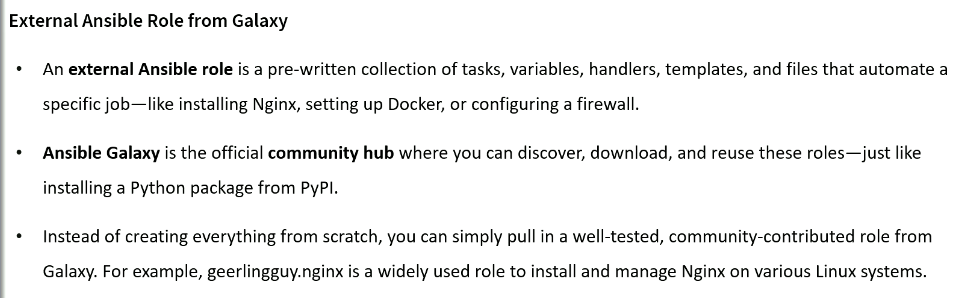
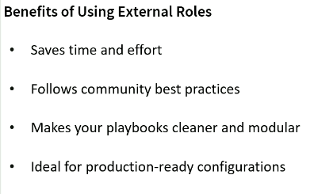

# Using External Ansible Roles from Ansible Galaxy





```css
Install a role from Ansible Galaxy
Use it in my playbook
Deploy Nginx on a remote Ubuntu server
```

## geerlingguy.nginx

```css
geerlingguy.nginx is one of the most popular, battle‑tested Ansible Galaxy roles created by Jeff Geerling — a well‑known DevOps engineer and author in the Ansible community.
Think of it as a pre‑built, production‑ready Nginx automation module that saves you from writing dozens of tasks yourself.

Let me break it down cleanly so you see exactly what it is and why people use it.

What geerlingguy.nginx actually is
    It is an Ansible role that:
        - Installs Nginx
        - Configures Nginx
        - Manages Nginx service
        - Supports custom vhosts
        - Supports SSL
        - Works on Ubuntu, Debian, CentOS, RHEL, Amazon Linux, etc.
        - Is fully idempotent and follows best practices
        - It’s basically a complete Nginx automation toolkit.

What it does for you
    Instead of writing tasks like:
        - Install nginx
        - Configure nginx.conf
        - Create vhosts
        - Manage service
        - Handle OS differences
        - Handle package differences
        - Handle directory structure differences
        - You simply include the role:
```

```yml
roles:
  - geerlingguy.nginx
```

## How to install it

```sh
ansible-galaxy install -r a01_requirements.yml --roles-path roles/
Starting galaxy role install process
- downloading role 'nginx', owned by geerlingguy
- downloading role from https://github.com/geerlingguy/ansible-role-nginx/archive/3.3.0.tar.gz
- extracting geerlingguy.nginx to /home/ec2-user/a10_External_Ansible_Roles/roles/geerlingguy.nginx
- geerlingguy.nginx (3.3.0) was installed successfully


>ll
-rw-r--r--. 1 ec2-user ec2-user 39 Apr 26 01:54 a01_requirements.yml
drwxr-xr-x. 3 ec2-user ec2-user 31 Apr 26 01:58 roles

ll roles/
drwxr-xr-x. 10 ec2-user ec2-user 4096 Apr 26 01:58 geerlingguy.nginx

ll roles/geerlingguy.nginx/
drwxr-xr-x. 2 ec2-user ec2-user    22 Apr 26 01:58 defaults
drwxr-xr-x. 2 ec2-user ec2-user    22 Apr 26 01:58 handlers
-rw-r--r--. 1 ec2-user ec2-user  1080 Dec  2 16:05 LICENSE
drwxr-xr-x. 2 ec2-user ec2-user    50 Apr 26 01:58 meta
drwxr-xr-x. 3 ec2-user ec2-user    21 Apr 26 01:58 molecule
-rw-r--r--. 1 ec2-user ec2-user 11874 Dec  2 16:05 README.md
drwxr-xr-x. 2 ec2-user ec2-user  4096 Apr 26 01:58 tasks
drwxr-xr-x. 2 ec2-user ec2-user    64 Apr 26 01:58 templates
drwxr-xr-x. 2 ec2-user ec2-user   155 Apr 26 01:58 vars


ll roles/geerlingguy.nginx/tasks/
-rw-r--r--. 1 ec2-user ec2-user 1371 Dec  2 16:05 main.yml
-rw-r--r--. 1 ec2-user ec2-user  105 Dec  2 16:05 setup-Archlinux.yml
-rw-r--r--. 1 ec2-user ec2-user  249 Dec  2 16:05 setup-Debian.yml
-rw-r--r--. 1 ec2-user ec2-user  331 Dec  2 16:05 setup-FreeBSD.yml
-rw-r--r--. 1 ec2-user ec2-user  211 Dec  2 16:05 setup-OpenBSD.yml
-rw-r--r--. 1 ec2-user ec2-user  306 Dec  2 16:05 setup-RedHat.yml
-rw-r--r--. 1 ec2-user ec2-user  369 Dec  2 16:05 setup-Suse.yml
-rw-r--r--. 1 ec2-user ec2-user  502 Dec  2 16:05 setup-Ubuntu.yml
-rw-r--r--. 1 ec2-user ec2-user 1234 Dec  2 16:05 vhosts.yml


ansible-galaxy install -r a01_requirements.yml --roles-path roles/
ll
ll roles/
ll roles/geerlingguy.nginx/
ll roles/geerlingguy.nginx/tasks/
ll
vim a02_nginx.yml
ansible-playbook --syntax-check a02_nginx.yml
#ansible-playbook a02_nginx.yml -i ../
cd ..
ll
cd a10_External_Ansible_Roles/
ll ../
ll ../a09_Roles_and_Collections/
cp ../a09_Roles_and_Collections/a00_Inventory.ini .
ll
ansible-playbook a02_nginx.yml -i a00_Inventory.ini --check
ansible-playbook a02_nginx.yml -i a00_Inventory.ini
ansible dev -m shell -a "sudo systemctl status nginx" -i a00_Inventory.ini
ansible dev -m shell -a "sudo journalctl -xeu nginx" -i a00_Inventory.ini
ansible dev -m shell -a "sudo systemctl status apache2" -i a00_Inventory.ini
ansible dev -m shell -a "sudo systemctl stop apache2" -i a00_Inventory.ini
ansible dev -m shell -a "sudo systemctl disable apache2" -i a00_Inventory.ini
ansible dev -m shell -a "sudo systemctl start nginx" -i a00_Inventory.ini
ansible dev -m shell -a "sudo systemctl status nginx" -i a00_Inventory.ini
ansible dev -m shell -a "sudo systemctl status nginx | grep active" -i a00_Inventory.ini
ansible-playbook a02_nginx.yml -i a00_Inventory.ini
ansible dev -m shell -a "curl http://localhost" -i a00_Inventory.ini
ansible dev -m shell -a "la -al /var/www/html/" -i a00_Inventory.ini
ansible dev -m shell -a "ls -al /var/www/html/" -i a00_Inventory.ini
ansible dev -m shell -a "cat /var/www/html/index.nginx-debian.html" -i a00_Inventory.ini
ansible dev -m shell -a "curl http://localhost" -i a00_Inventory.ini
#curl http://
cat a00_Inventory.ini
curl http://ansibleclient01
curl http://10.0.11.248
history > text.sh


```