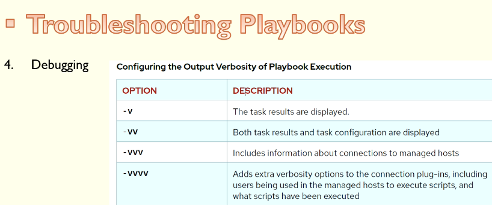

# Troubleshooting Playbooks

## Log Files For Ansible


```sh
ll /etc/ansible/ansible.cfg
-rw-r--r--. 1 root root 614 Jan  3  2025 /etc/ansible/ansible.cfg
$>cat /etc/ansible/ansible.cfg
```
### Enable Log Files in Ansible

```cfg
# Since Ansible 2.12 (core):
# To generate an example config file (a "disabled" one with all default settings, commented out):
#               $ ansible-config init --disabled > ansible.cfg
#
# Also you can now have a more complete file by including existing plugins:
# ansible-config init --disabled -t all > ansible.cfg

# For previous versions of Ansible you can check for examples in the 'stable' branches of each version
# Note that this file was always incomplete  and lagging changes to configuration settings

# for example, for 2.9: https://github.com/ansible/ansible/blob/stable-2.9/examples/ansible.cfg

[defaults]
log_path = /var/log/ansible.log

[inventory]
[privilege_escalation]
[paramiko_connection]
[connection]
[persistent_connection]
[accelerate]
[selinux]
[colors]
[diff]

```


```sh
ansible dev -m shell -a "ls -al /var/log/ | grep ansible" -i a00_Inventory.ini
[WARNING]: log file at /var/log/ansible.log is not writeable and we cannot create it, aborting

ansibleclient02 | FAILED | rc=1 >>
non-zero return code
ansibleclient01 | FAILED | rc=1 >>
non-zero return code


ansible dev -m shell -a "ls -al /var/log/ | grep dpkg" -i a00_Inventory.ini
[WARNING]: log file at /var/log/ansible.log is not writeable and we cannot create it, aborting

ansibleclient02 | CHANGED | rc=0 >>
-rw-r--r--   1 root      root             44539 Apr 26 07:39 dpkg.log
ansibleclient01 | CHANGED | rc=0 >>
-rw-r--r--   1 root      root             44539 Apr 26 07:39 dpkg.log


# Create ansible.cfg
sudo touch /var/log/ansible.log

#
ansible-playbook --syntax-check ../a10_External_Ansible_Roles/a02_nginx.yml
[WARNING]: log file at /var/log/ansible.log is not writeable and we cannot create it, aborting


playbook: ../a10_External_Ansible_Roles/a02_nginx.yml

#
sudo chmod 777 /var/log/ansible.log

$>ansible-playbook --syntax-check ../a10_External_Ansible_Roles/a02_nginx.yml

playbook: ../a10_External_Ansible_Roles/a02_nginx.yml

$>cat /var/log/ansible.log
2026-04-26 02:51:04,370 p=7147 u=ec2-user n=ansible | playbook: ../a10_External_Ansible_Roles/a02_nginx.yml
$>

```

## The Debug module

```sh
ansible-playbook a01_Display_Free_Mem.yml -i a00_Inventory.ini

PLAY [Display free Memory] ************************************************************************************

TASK [Gathering Facts] ****************************************************************************************
ok: [ansibleclient01]
ok: [ansibleclient02]

TASK [Display free Memory] ************************************************************************************
ok: [ansibleclient01] => {
    "msg": "Free memory for this system is 272"
}
ok: [ansibleclient02] => {
    "msg": "Free memory for this system is 263"
}

PLAY RECAP ****************************************************************************************************
ansibleclient01            : ok=2    changed=0    unreachable=0    failed=0    skipped=0    rescued=0    ignored=0
ansibleclient02            : ok=2    changed=0    unreachable=0    failed=0    skipped=0    rescued=0    ignored=0
```


## managing Errors

```sh
ansible-playbook a02_Install_Apache2.yml --list-tasks

playbook: a02_Install_Apache2.yml

  play #1 (dev): Install Apache2        TAGS: []
    tasks:
      Install Apache2   TAGS: []
      Display the output of results_output      TAGS: []
```



```sh
ansible-playbook a02_Install_Apache2.yml -i a00_Inventory.ini -v
Using /etc/ansible/ansible.cfg as config file

PLAY [Install Apache2] ****************************************************************************************

TASK [Gathering Facts] ****************************************************************************************
ok: [ansibleclient01]
ok: [ansibleclient02]

TASK [Install Apache2] ****************************************************************************************
changed: [ansibleclient02] => {"cache_update_time": 1777202116, "cache_updated": true, "changed": true, "stderr": "", "stderr_lines": [], "stdout": "Reading package lists...\nBuilding dependency tree...\nReading state information...\nSuggested packages:\n  apache2-doc apache2-suexec-pristine | apache2-suexec-custom www-browser\nThe following NEW packages will be installed:\n  apache2\n0 upgraded, 1 newly installed, 0 to remove and 0 not upgraded.\nNeed to get 0 B/97.9 kB of archives.\nAfter this operation, 549 kB of additional disk space will be used.\nSelecting previously unselected package apache2.\r\n(Reading database ... \r(Reading database ... 5%\r(Reading database ... 10%\r(Reading database ... 15%\r(Reading database ... 20%\r(Reading database ... 25%\r(Reading database ... 30%\r(Reading database ... 35%\r(Reading database ... 40%\r(Reading database ... 45%\r(Reading database ... 50%\r(Reading database ... 55%\r(Reading database ... 60%\r(Reading database ... 65%\r(Reading database ... 70%\r(Reading database ... 75%\r(Reading database ... 80%\r(Reading database ... 85%\r(Reading database ... 90%\r(Reading database ... 95%\r(Reading database ... 100%\r(Reading database ... 66996 files and directories currently installed.)\r\nPreparing to unpack .../apache2_2.4.52-1ubuntu4.19_amd64.deb ...\r\nUnpacking apache2 (2.4.52-1ubuntu4.19) ...\r\nSetting up apache2 (2.4.52-1ubuntu4.19) ...\r\napache2.service is a disabled or a static unit not running, not starting it.\r\napache-htcacheclean.service is a disabled or a static unit not running, not starting it.\r\nProcessing triggers for man-db (2.10.2-1) ...\r\nProcessing triggers for ufw (0.36.1-4ubuntu0.1) ...\r\nRules updated for profile 'Apache'\r\nRules updated for profile 'OpenSSH'\r\nSkipped reloading firewall\r\n\nRunning kernel seems to be up-to-date.\n\nNo services need to be restarted.\n\nNo containers need to be restarted.\n\nNo user sessions are running outdated binaries.\n\nNo VM guests are running outdated hypervisor (qemu) binaries on this host.\n", "stdout_lines": ["Reading package lists...", "Building dependency tree...", "Reading state information...", "Suggested packages:", "  apache2-doc apache2-suexec-pristine | apache2-suexec-custom www-browser", "The following NEW packages will be installed:", "  apache2", "0 upgraded, 1 newly installed, 0 to remove and 0 not upgraded.", "Need to get 0 B/97.9 kB of archives.", "After this operation, 549 kB of additional disk space will be used.", "Selecting previously unselected package apache2.", "(Reading database ... ", "(Reading database ... 5%", "(Reading database ... 10%", "(Reading database ... 15%", "(Reading database ... 20%", "(Reading database ... 25%", "(Reading database ... 30%", "(Reading database ... 35%", "(Reading database ... 40%", "(Reading database ... 45%", "(Reading database ... 50%", "(Reading database ... 55%", "(Reading database ... 60%", "(Reading database ... 65%", "(Reading database ... 70%", "(Reading database ... 75%", "(Reading database ... 80%", "(Reading database ... 85%", "(Reading database ... 90%", "(Reading database ... 95%", "(Reading database ... 100%", "(Reading database ... 66996 files and directories currently installed.)", "Preparing to unpack .../apache2_2.4.52-1ubuntu4.19_amd64.deb ...", "Unpacking apache2 (2.4.52-1ubuntu4.19) ...", "Setting up apache2 (2.4.52-1ubuntu4.19) ...", "apache2.service is a disabled or a static unit not running, not starting it.", "apache-htcacheclean.service is a disabled or a static unit not running, not starting it.", "Processing triggers for man-db (2.10.2-1) ...", "Processing triggers for ufw (0.36.1-4ubuntu0.1) ...", "Rules updated for profile 'Apache'", "Rules updated for profile 'OpenSSH'", "Skipped reloading firewall", "", "Running kernel seems to be up-to-date.", "", "No services need to be restarted.", "", "No containers need to be restarted.", "", "No user sessions are running outdated binaries.", "", "No VM guests are running outdated hypervisor (qemu) binaries on this host."]}
changed: [ansibleclient01] => {"cache_update_time": 1777202116, "cache_updated": true, "changed": true, "stderr": "", "stderr_lines": [], "stdout": "Reading package lists...\nBuilding dependency tree...\nReading state information...\nSuggested packages:\n  apache2-doc apache2-suexec-pristine | apache2-suexec-custom www-browser\nThe following NEW packages will be installed:\n  apache2\n0 upgraded, 1 newly installed, 0 to remove and 0 not upgraded.\nNeed to get 0 B/97.9 kB of archives.\nAfter this operation, 549 kB of additional disk space will be used.\nSelecting previously unselected package apache2.\r\n(Reading database ... \r(Reading database ... 5%\r(Reading database ... 10%\r(Reading database ... 15%\r(Reading database ... 20%\r(Reading database ... 25%\r(Reading database ... 30%\r(Reading database ... 35%\r(Reading database ... 40%\r(Reading database ... 45%\r(Reading database ... 50%\r(Reading database ... 55%\r(Reading database ... 60%\r(Reading database ... 65%\r(Reading database ... 70%\r(Reading database ... 75%\r(Reading database ... 80%\r(Reading database ... 85%\r(Reading database ... 90%\r(Reading database ... 95%\r(Reading database ... 100%\r(Reading database ... 66996 files and directories currently installed.)\r\nPreparing to unpack .../apache2_2.4.52-1ubuntu4.19_amd64.deb ...\r\nUnpacking apache2 (2.4.52-1ubuntu4.19) ...\r\nSetting up apache2 (2.4.52-1ubuntu4.19) ...\r\napache2.service is a disabled or a static unit not running, not starting it.\r\napache-htcacheclean.service is a disabled or a static unit not running, not starting it.\r\nProcessing triggers for man-db (2.10.2-1) ...\r\nProcessing triggers for ufw (0.36.1-4ubuntu0.1) ...\r\nRules updated for profile 'Apache'\r\nRules updated for profile 'OpenSSH'\r\nSkipped reloading firewall\r\n\nRunning kernel seems to be up-to-date.\n\nNo services need to be restarted.\n\nNo containers need to be restarted.\n\nNo user sessions are running outdated binaries.\n\nNo VM guests are running outdated hypervisor (qemu) binaries on this host.\n", "stdout_lines": ["Reading package lists...", "Building dependency tree...", "Reading state information...", "Suggested packages:", "  apache2-doc apache2-suexec-pristine | apache2-suexec-custom www-browser", "The following NEW packages will be installed:", "  apache2", "0 upgraded, 1 newly installed, 0 to remove and 0 not upgraded.", "Need to get 0 B/97.9 kB of archives.", "After this operation, 549 kB of additional disk space will be used.", "Selecting previously unselected package apache2.", "(Reading database ... ", "(Reading database ... 5%", "(Reading database ... 10%", "(Reading database ... 15%", "(Reading database ... 20%", "(Reading database ... 25%", "(Reading database ... 30%", "(Reading database ... 35%", "(Reading database ... 40%", "(Reading database ... 45%", "(Reading database ... 50%", "(Reading database ... 55%", "(Reading database ... 60%", "(Reading database ... 65%", "(Reading database ... 70%", "(Reading database ... 75%", "(Reading database ... 80%", "(Reading database ... 85%", "(Reading database ... 90%", "(Reading database ... 95%", "(Reading database ... 100%", "(Reading database ... 66996 files and directories currently installed.)", "Preparing to unpack .../apache2_2.4.52-1ubuntu4.19_amd64.deb ...", "Unpacking apache2 (2.4.52-1ubuntu4.19) ...", "Setting up apache2 (2.4.52-1ubuntu4.19) ...", "apache2.service is a disabled or a static unit not running, not starting it.", "apache-htcacheclean.service is a disabled or a static unit not running, not starting it.", "Processing triggers for man-db (2.10.2-1) ...", "Processing triggers for ufw (0.36.1-4ubuntu0.1) ...", "Rules updated for profile 'Apache'", "Rules updated for profile 'OpenSSH'", "Skipped reloading firewall", "", "Running kernel seems to be up-to-date.", "", "No services need to be restarted.", "", "No containers need to be restarted.", "", "No user sessions are running outdated binaries.", "", "No VM guests are running outdated hypervisor (qemu) binaries on this host."]}

TASK [Display the output of results_output] *******************************************************************
ok: [ansibleclient01] => {
    "results_output": {
        "cache_update_time": 1777202116,
        "cache_updated": true,
        "changed": true,
        "diff": {},
        "failed": false,
        "stderr": "",
        "stderr_lines": [],
        "stdout": "Reading package lists...\nBuilding dependency tree...\nReading state information...\nSuggested packages:\n  apache2-doc apache2-suexec-pristine | apache2-suexec-custom www-browser\nThe following NEW packages will be installed:\n  apache2\n0 upgraded, 1 newly installed, 0 to remove and 0 not upgraded.\nNeed to get 0 B/97.9 kB of archives.\nAfter this operation, 549 kB of additional disk space will be used.\nSelecting previously unselected package apache2.\r\n(Reading database ... \r(Reading database ... 5%\r(Reading database ... 10%\r(Reading database ... 15%\r(Reading database ... 20%\r(Reading database ... 25%\r(Reading database ... 30%\r(Reading database ... 35%\r(Reading database ... 40%\r(Reading database ... 45%\r(Reading database ... 50%\r(Reading database ... 55%\r(Reading database ... 60%\r(Reading database ... 65%\r(Reading database ... 70%\r(Reading database ... 75%\r(Reading database ... 80%\r(Reading database ... 85%\r(Reading database ... 90%\r(Reading database ... 95%\r(Reading database ... 100%\r(Reading database ... 66996 files and directories currently installed.)\r\nPreparing to unpack .../apache2_2.4.52-1ubuntu4.19_amd64.deb ...\r\nUnpacking apache2 (2.4.52-1ubuntu4.19) ...\r\nSetting up apache2 (2.4.52-1ubuntu4.19) ...\r\napache2.service is a disabled or a static unit not running, not starting it.\r\napache-htcacheclean.service is a disabled or a static unit not running, not starting it.\r\nProcessing triggers for man-db (2.10.2-1) ...\r\nProcessing triggers for ufw (0.36.1-4ubuntu0.1) ...\r\nRules updated for profile 'Apache'\r\nRules updated for profile 'OpenSSH'\r\nSkipped reloading firewall\r\n\nRunning kernel seems to be up-to-date.\n\nNo services need to be restarted.\n\nNo containers need to be restarted.\n\nNo user sessions are running outdated binaries.\n\nNo VM guests are running outdated hypervisor (qemu) binaries on this host.\n",
        "stdout_lines": [
            "Reading package lists...",
            "Building dependency tree...",
            "Reading state information...",
            "Suggested packages:",
            "  apache2-doc apache2-suexec-pristine | apache2-suexec-custom www-browser",
            "The following NEW packages will be installed:",
            "  apache2",
            "0 upgraded, 1 newly installed, 0 to remove and 0 not upgraded.",
            "Need to get 0 B/97.9 kB of archives.",
            "After this operation, 549 kB of additional disk space will be used.",
            "Selecting previously unselected package apache2.",
            "(Reading database ... ",
            "(Reading database ... 5%",
            "(Reading database ... 10%",
            "(Reading database ... 15%",
            "(Reading database ... 20%",
            "(Reading database ... 25%",
            "(Reading database ... 30%",
            "(Reading database ... 35%",
            "(Reading database ... 40%",
            "(Reading database ... 45%",
            "(Reading database ... 50%",
            "(Reading database ... 55%",
            "(Reading database ... 60%",
            "(Reading database ... 65%",
            "(Reading database ... 70%",
            "(Reading database ... 75%",
            "(Reading database ... 80%",
            "(Reading database ... 85%",
            "(Reading database ... 90%",
            "(Reading database ... 95%",
            "(Reading database ... 100%",
            "(Reading database ... 66996 files and directories currently installed.)",
            "Preparing to unpack .../apache2_2.4.52-1ubuntu4.19_amd64.deb ...",
            "Unpacking apache2 (2.4.52-1ubuntu4.19) ...",
            "Setting up apache2 (2.4.52-1ubuntu4.19) ...",
            "apache2.service is a disabled or a static unit not running, not starting it.",
            "apache-htcacheclean.service is a disabled or a static unit not running, not starting it.",
            "Processing triggers for man-db (2.10.2-1) ...",
            "Processing triggers for ufw (0.36.1-4ubuntu0.1) ...",
            "Rules updated for profile 'Apache'",
            "Rules updated for profile 'OpenSSH'",
            "Skipped reloading firewall",
            "",
            "Running kernel seems to be up-to-date.",
            "",
            "No services need to be restarted.",
            "",
            "No containers need to be restarted.",
            "",
            "No user sessions are running outdated binaries.",
            "",
            "No VM guests are running outdated hypervisor (qemu) binaries on this host."
        ]
    }
}
ok: [ansibleclient02] => {
    "results_output": {
        "cache_update_time": 1777202116,
        "cache_updated": true,
        "changed": true,
        "diff": {},
        "failed": false,
        "stderr": "",
        "stderr_lines": [],
        "stdout": "Reading package lists...\nBuilding dependency tree...\nReading state information...\nSuggested packages:\n  apache2-doc apache2-suexec-pristine | apache2-suexec-custom www-browser\nThe following NEW packages will be installed:\n  apache2\n0 upgraded, 1 newly installed, 0 to remove and 0 not upgraded.\nNeed to get 0 B/97.9 kB of archives.\nAfter this operation, 549 kB of additional disk space will be used.\nSelecting previously unselected package apache2.\r\n(Reading database ... \r(Reading database ... 5%\r(Reading database ... 10%\r(Reading database ... 15%\r(Reading database ... 20%\r(Reading database ... 25%\r(Reading database ... 30%\r(Reading database ... 35%\r(Reading database ... 40%\r(Reading database ... 45%\r(Reading database ... 50%\r(Reading database ... 55%\r(Reading database ... 60%\r(Reading database ... 65%\r(Reading database ... 70%\r(Reading database ... 75%\r(Reading database ... 80%\r(Reading database ... 85%\r(Reading database ... 90%\r(Reading database ... 95%\r(Reading database ... 100%\r(Reading database ... 66996 files and directories currently installed.)\r\nPreparing to unpack .../apache2_2.4.52-1ubuntu4.19_amd64.deb ...\r\nUnpacking apache2 (2.4.52-1ubuntu4.19) ...\r\nSetting up apache2 (2.4.52-1ubuntu4.19) ...\r\napache2.service is a disabled or a static unit not running, not starting it.\r\napache-htcacheclean.service is a disabled or a static unit not running, not starting it.\r\nProcessing triggers for man-db (2.10.2-1) ...\r\nProcessing triggers for ufw (0.36.1-4ubuntu0.1) ...\r\nRules updated for profile 'Apache'\r\nRules updated for profile 'OpenSSH'\r\nSkipped reloading firewall\r\n\nRunning kernel seems to be up-to-date.\n\nNo services need to be restarted.\n\nNo containers need to be restarted.\n\nNo user sessions are running outdated binaries.\n\nNo VM guests are running outdated hypervisor (qemu) binaries on this host.\n",
        "stdout_lines": [
            "Reading package lists...",
            "Building dependency tree...",
            "Reading state information...",
            "Suggested packages:",
            "  apache2-doc apache2-suexec-pristine | apache2-suexec-custom www-browser",
            "The following NEW packages will be installed:",
            "  apache2",
            "0 upgraded, 1 newly installed, 0 to remove and 0 not upgraded.",
            "Need to get 0 B/97.9 kB of archives.",
            "After this operation, 549 kB of additional disk space will be used.",
            "Selecting previously unselected package apache2.",
            "(Reading database ... ",
            "(Reading database ... 5%",
            "(Reading database ... 10%",
            "(Reading database ... 15%",
            "(Reading database ... 20%",
            "(Reading database ... 25%",
            "(Reading database ... 30%",
            "(Reading database ... 35%",
            "(Reading database ... 40%",
            "(Reading database ... 45%",
            "(Reading database ... 50%",
            "(Reading database ... 55%",
            "(Reading database ... 60%",
            "(Reading database ... 65%",
            "(Reading database ... 70%",
            "(Reading database ... 75%",
            "(Reading database ... 80%",
            "(Reading database ... 85%",
            "(Reading database ... 90%",
            "(Reading database ... 95%",
            "(Reading database ... 100%",
            "(Reading database ... 66996 files and directories currently installed.)",
            "Preparing to unpack .../apache2_2.4.52-1ubuntu4.19_amd64.deb ...",
            "Unpacking apache2 (2.4.52-1ubuntu4.19) ...",
            "Setting up apache2 (2.4.52-1ubuntu4.19) ...",
            "apache2.service is a disabled or a static unit not running, not starting it.",
            "apache-htcacheclean.service is a disabled or a static unit not running, not starting it.",
            "Processing triggers for man-db (2.10.2-1) ...",
            "Processing triggers for ufw (0.36.1-4ubuntu0.1) ...",
            "Rules updated for profile 'Apache'",
            "Rules updated for profile 'OpenSSH'",
            "Skipped reloading firewall",
            "",
            "Running kernel seems to be up-to-date.",
            "",
            "No services need to be restarted.",
            "",
            "No containers need to be restarted.",
            "",
            "No user sessions are running outdated binaries.",
            "",
            "No VM guests are running outdated hypervisor (qemu) binaries on this host."
        ]
    }
}

PLAY RECAP ****************************************************************************************************
ansibleclient01            : ok=3    changed=1    unreachable=0    failed=0    skipped=0    rescued=0    ignored=0
ansibleclient02            : ok=3    changed=1    unreachable=0    failed=0    skipped=0    rescued=0    ignored=0
```

## Using check_mode to test playbook execution


