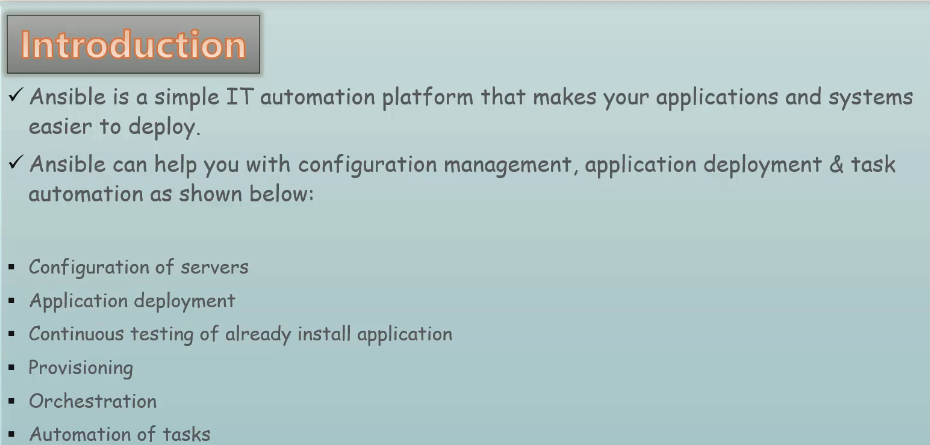
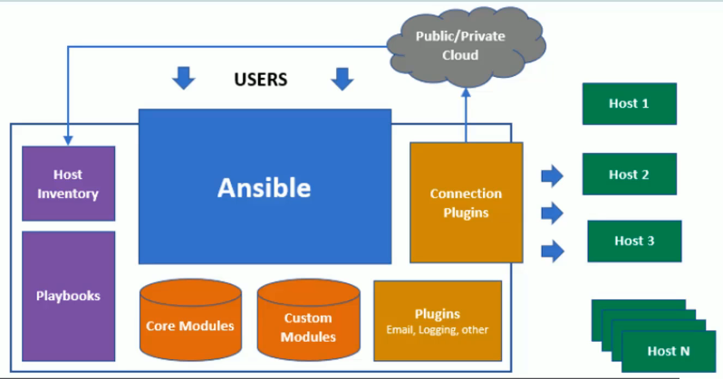
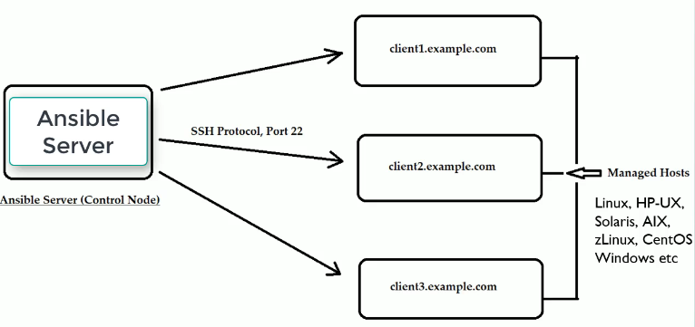
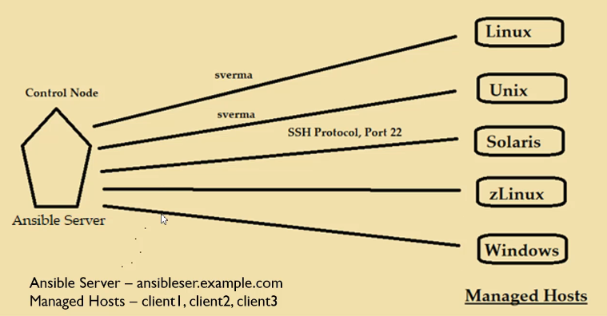
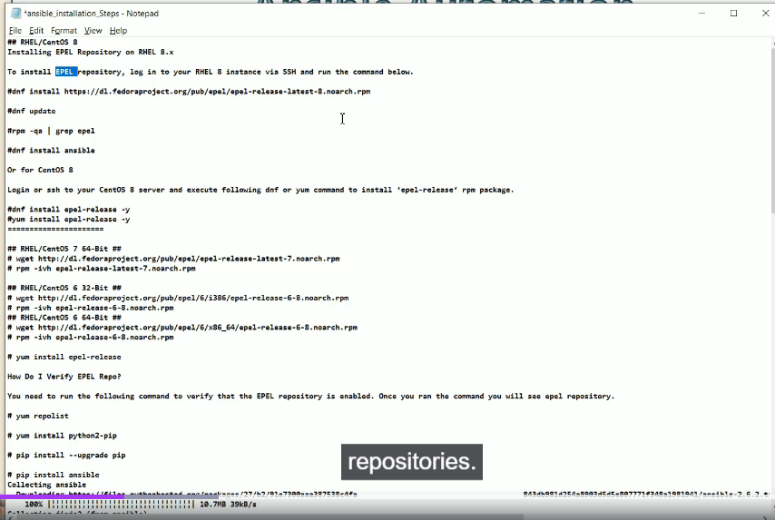
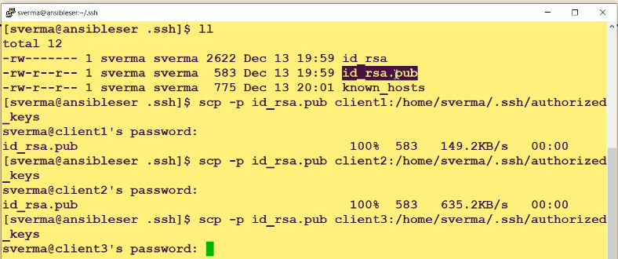
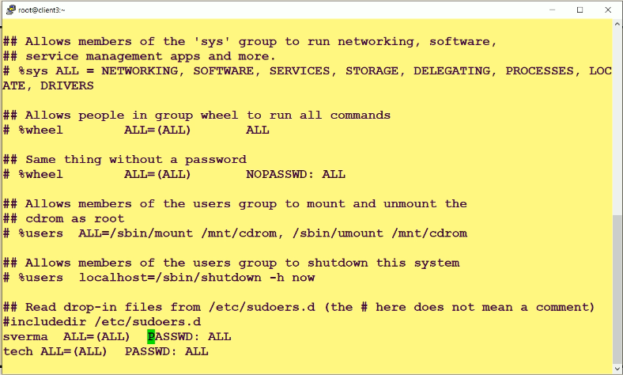

# RedHat System Administration and Automation with Ansible





## Ansible Limitations


# Ansible Architecture



## Ansible Setup



## Ansible Installation



```sh
cat /etc/redhat-release
Red Hat Enterprise Linux release 9.7 (Plow)

#
ls -al /etc/yum.repos.d/
total 40
drwxr-xr-x.  2 root root  143 Mar 31 13:20 .
drwxr-xr-x. 93 root root 8192 Apr 25 17:48 ..
-rw-r--r--.  1 root root 4723 Feb 10 11:55 redhat-rhui-beta.repo.disabled
-rw-r--r--.  1 root root  467 Mar 31 13:20 redhat-rhui-client-config.repo
-rw-r--r--.  1 root root 7524 Feb 10 11:55 redhat-rhui-eus.repo.disabled
-rw-r--r--.  1 root root 7332 Mar 31 13:20 redhat-rhui.repo


#
cat /etc/yum.repos.d/redhat-rhui-client-config.repo
[rhui-client-config-server-9]
name=Red Hat Enterprise Linux 9 Client Configuration
mirrorlist=https://rhui.REGION.aws.ce.redhat.com/pulp/mirror/protected/rhui-client-config/rhel/server/9/$basearch/os
enabled=1
gpgcheck=1
gpgkey=file:///etc/pki/rpm-gpg/RPM-GPG-KEY-redhat-release
sslverify=1
sslcacert=/etc/pki/rhui/cdn.redhat.com-chain.crt
sslclientcert=/etc/pki/rhui/product/rhui-client-config-server-9.crt
sslclientkey=/etc/pki/rhui/rhui-client-config-server-9.key

#
ansible --version
ansible [core 2.14.18]
  config file = /etc/ansible/ansible.cfg
  configured module search path = ['/home/ec2-user/.ansible/plugins/modules', '/usr/share/ansible/plugins/modules']
  ansible python module location = /usr/lib/python3.9/site-packages/ansible
  ansible collection location = /home/ec2-user/.ansible/collections:/usr/share/ansible/collections
  executable location = /usr/bin/ansible
  python version = 3.9.25 (main, Feb 25 2026, 00:00:00) [GCC 11.5.0 20240719 (Red Hat 11.5.0-11)] (/usr/bin/python3)
  jinja version = 3.1.2
  libyaml = True

```


### Create Ansible user on each single servers clients and controller
### Generate public and private key and copy it in all clients

## Make it sudo user in each client 



