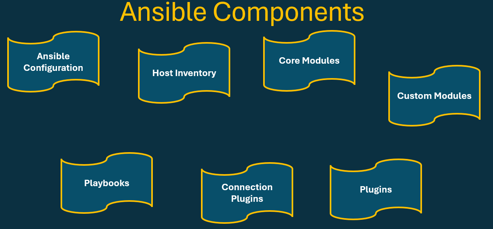
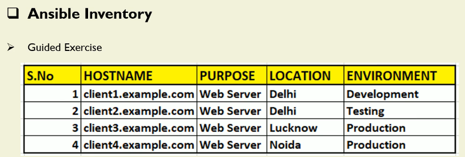
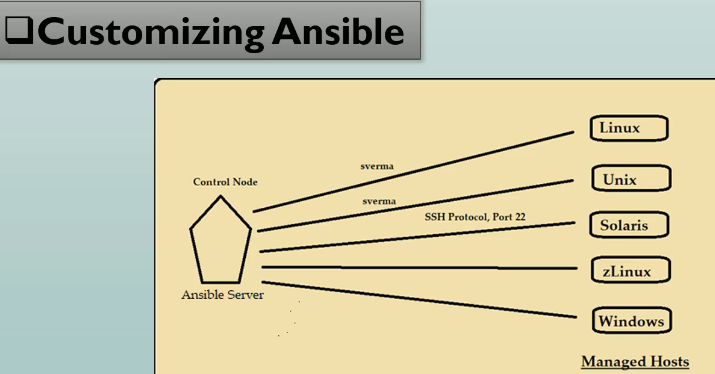
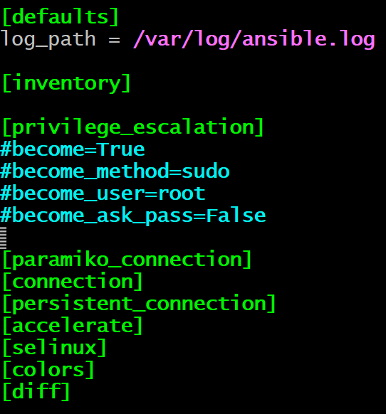

# Deploying Ansible

## Ansible Component


- Ansible’s main building blocks concise breakdown of the components that make Ansible such a powerful automation tool:

```css
Let’s take a quick look at the major components of Ansible.

        1. Ansible Configuration
Ansible includes configuration settings that define how it behaves.
I can modify or customize Ansible’s behavior by adjusting values in its configuration file.

        2. Host Inventory
The host inventory file is where I define the managed hosts — the client machines Ansible will control.
I can organize these hosts into groups, and each group can contain multiple managed clients.
This grouping becomes extremely useful when running tasks against specific sets of machines.

        3. Core Modules
Core modules are the built‑in modules that ship with Ansible.
Once Ansible is installed, I automatically have access to hundreds of these modules — over 500 in total.

                Custom Modules
Ansible is also extensible.
With Python knowledge, I can write my own modules to extend Ansible’s functionality.
Once I start working with playbooks, I’ll used modules them.

        4. Playbooks
Playbooks are YAML files that define tasks using modules and their arguments.
Whenever I want Ansible to perform an action — copying files, installing software, configuring services — I write a playbook.

A playbook is simply a collection of plays, and each play describes what I want to do on a set of hosts.

        5. Connection Plugins
Although SSH is the default and most common method for connecting to managed hosts, Ansible supports other connection types through plugins.

For example, Ansible provides a Docker connection plugin that allows me to manage Docker containers directly without SSH.
Using the appropriate connection plugin, I can easily connect to and configure containers or other environments.

        6. Plugins
Plugins extend Ansible’s capabilities.
They provide additional features such as logging, email notifications, caching, and more.
Think of plugins as enhancements that improve or customize Ansible’s behavior.
```

## Inventory Files

```ini

[dev]

ansibleclient01 ansible_host=10.0.11.248 ansible_port=2222 ansible_user=ubuntu ansible_ssh_private_key_file=/home/ec2-user/terraform_key_pem.pem ansible_python_interpreter=/usr/bin/python3
ansibleclient02 ansible_host=10.0.12.199 ansible_port=2222 ansible_user=ubuntu ansible_ssh_private_key_file=/home/ec2-user/terraform_key_pem.pem ansible_python_interpreter=/usr/bin/python3

[qa]
client1:2222 ansible_connection=ssh ansible_user=tchatua
client2
client3

[tesyt]
client4
client5
client6


[prod]
client7
client8
client9

[webserver]
client1
client4
client7

[serverip]
192.168.10.[10:110]

[servername]
server[01:20].tchatua.com
```

```sh
ansible --list-hosts all -i a02_Inventory.ini
  hosts (11):
    ansibleclient01
    ansibleclient02
    client1
    client2
    client3
    client4
    client5
    client6
    client7
    client8
    client9

```


```ini
[webservers]
webserver[1:4].tchatua.com

[delhi]
webserver1.tchatua.com
webserver2.tchatua.com

[lucknow]
webserver3.tchatua.com

[noida]
webserver4.tchatua.com

[development]
webserver1.tchatua.com

[testing]
webserver2.tchatua.com

[production]
webserver3.tchatua.com
webserver4.tchatua.com

[up:children]
lucknow
noida

```

```sh
ansible -i a02_Inventory.ini --list-hosts webservers
  hosts (4):
    webserver1.tchatua.com
    webserver2.tchatua.com
    webserver3.tchatua.com
    webserver4.tchatua.com

ansible -i a02_Inventory.ini --list-hosts delhi
  hosts (2):
    webserver1.tchatua.com
    webserver2.tchatua.com

ansible -i a02_Inventory.ini --list-hosts development
  hosts (1):
    webserver1.tchatua.com

ansible -i a02_Inventory.ini --list-hosts testing
  hosts (1):
    webserver2.tchatua.com   

ansible -i a02_Inventory.ini --list-hosts up
  hosts (2):
    webserver3.tchatua.com
    webserver4.tchatua.com

```

## Configuring Ansible







