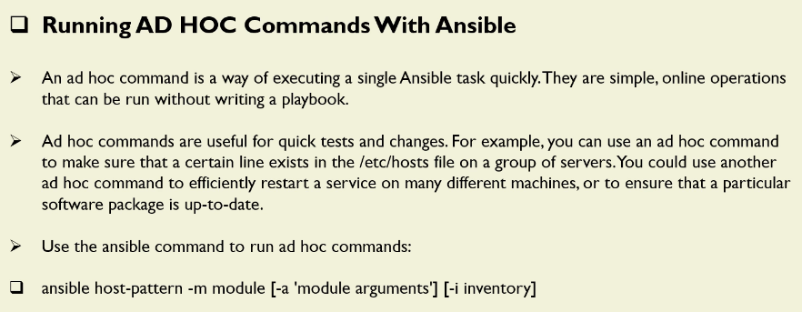
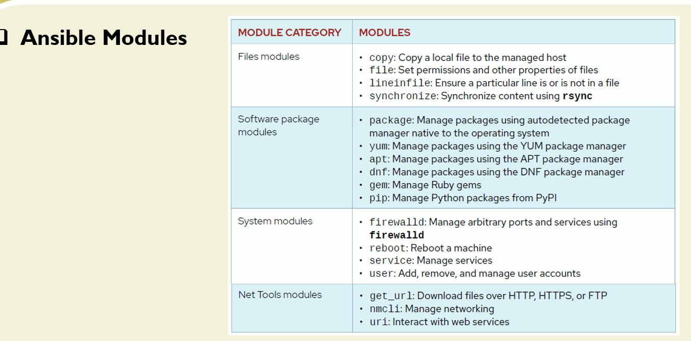
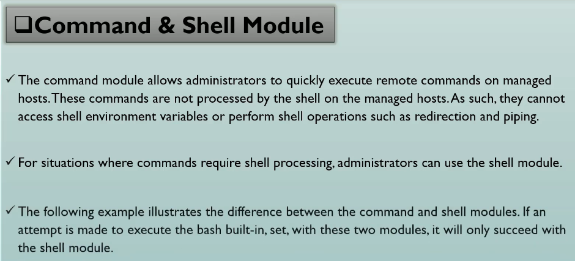
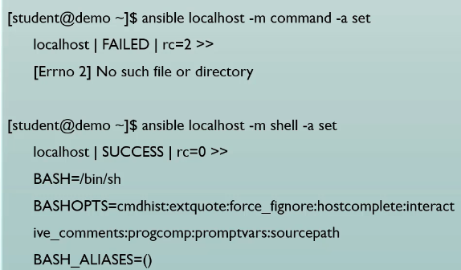
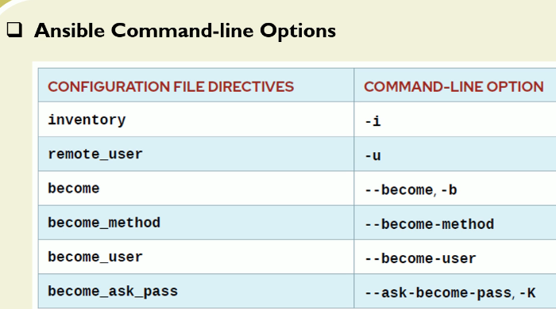

# AD HOC Commands



```sh
ansible-doc -l | wc -l
[WARNING]: Collection community.general does not support Ansible version
2.14.18
659

#
ansible-doc shell
> ANSIBLE.BUILTIN.SHELL    (/usr/lib/python3.9/site-packages/ansible/modules/shell.py)

        The `shell' module takes the command name followed by a list of space-delimited
        arguments. Either a free form command or `cmd' parameter is required, see the
        examples. It is almost exactly like the [ansible.builtin.command] module but
        runs the command through a shell (`/bin/sh') on the remote node. For Windows
        targets, use the [ansible.windows.win_shell] module instead.

ADDED IN: version 0.2 of ansible-core

  * note: This module has a corresponding action plugin.

OPTIONS (= is mandatory):

- chdir
        Change into this directory before running the command.
        default: null
        type: path
        added in: version 0.6 of ansible-core


- cmd
        The command to run followed by optional arguments.
        default: null
        type: str

- creates
        A filename, when it already exists, this step will *not* be run.
        default: null
        type: path


```

## Ansible Modules


```sh
#
ansible dev -m command -a "/usr/bin/hostname" -i a00_Inventory.ini --become
ansibleclient02 | CHANGED | rc=0 >>
appserver
ansibleclient01 | CHANGED | rc=0 >>
appserver

ansible dev -m command -a "/usr/bin/hostname" -i a00_Inventory.ini --become -o
ansibleclient01 | CHANGED | rc=0 | (stdout) appserver
ansibleclient02 | CHANGED | rc=0 | (stdout) appserver
```





```sh
ansible dev -m command -a "set" -i a00_Inventory.ini
ansibleclient02 | FAILED | rc=2 >>
[Errno 2] No such file or directory: b'set'
ansibleclient01 | FAILED | rc=2 >>
[Errno 2] No such file or directory: b'set'


#
ansible dev -m shell -a "set" -i a00_Inventory.ini
ansibleclient02 | CHANGED | rc=0 >>
DBUS_SESSION_BUS_ADDRESS='unix:path=/run/user/1000/bus'
HOME='/home/ubuntu'
IFS='
'
LANG='C.UTF-8'
LOGNAME='ubuntu'
MOTD_SHOWN='pam'
OPTIND='1'
PATH='/usr/local/sbin:/usr/local/bin:/usr/sbin:/usr/bin:/sbin:/bin:/usr/games:/usr/local/games:/snap/bin'
PPID='33075'
PS1='$ '
PS2='> '
PS4='+ '
PWD='/home/ubuntu'
SHELL='/bin/bash'
SHLVL='0'
SSH_CLIENT='10.0.1.92 45238 2222'
SSH_CONNECTION='10.0.1.92 45238 10.0.12.199 2222'
SSH_TTY='/dev/pts/0'
TERM='xterm'
USER='ubuntu'
XDG_RUNTIME_DIR='/run/user/1000'
XDG_SESSION_CLASS='user'
XDG_SESSION_ID='141'
XDG_SESSION_TYPE='tty'
_='/bin/sh'
ansibleclient01 | CHANGED | rc=0 >>
DBUS_SESSION_BUS_ADDRESS='unix:path=/run/user/1000/bus'
HOME='/home/ubuntu'
IFS='
'
LANG='C.UTF-8'
LOGNAME='ubuntu'
MOTD_SHOWN='pam'
OPTIND='1'
PATH='/usr/local/sbin:/usr/local/bin:/usr/sbin:/usr/bin:/sbin:/bin:/usr/games:/usr/local/games:/snap/bin'
PPID='33417'
PS1='$ '
PS2='> '
PS4='+ '
PWD='/home/ubuntu'
SHELL='/bin/bash'
SHLVL='0'
SSH_CLIENT='10.0.1.92 57214 2222'
SSH_CONNECTION='10.0.1.92 57214 10.0.11.248 2222'
SSH_TTY='/dev/pts/0'
TERM='xterm'
USER='ubuntu'
XDG_RUNTIME_DIR='/run/user/1000'
XDG_SESSION_CLASS='user'
XDG_SESSION_ID='141'
XDG_SESSION_TYPE='tty'
_='/bin/sh'
```




