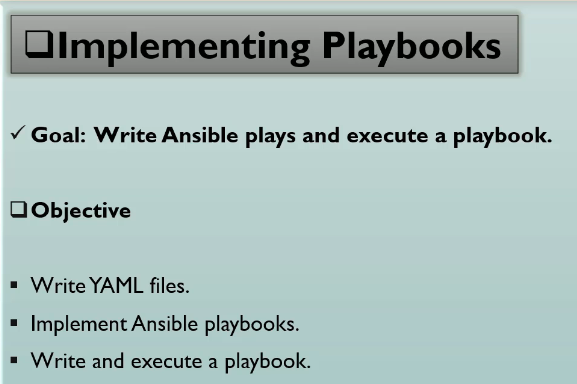
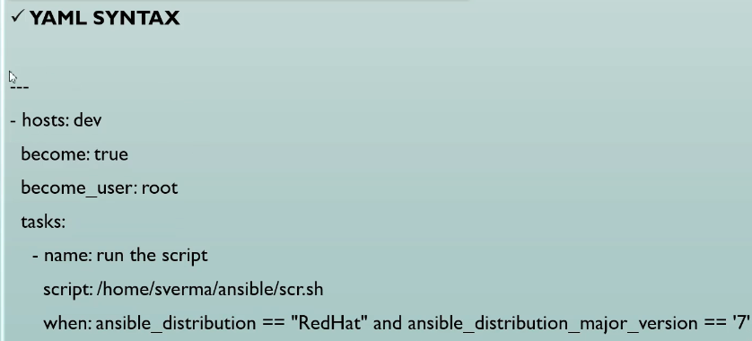
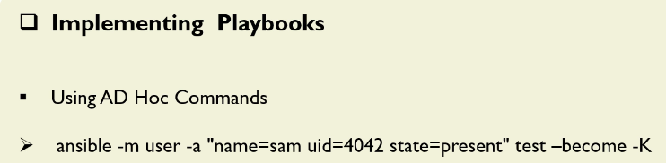
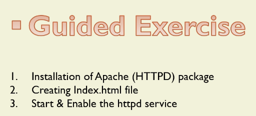
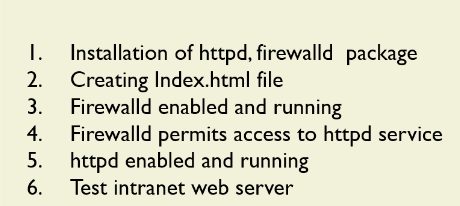

# Implementing Playbook

```sh
ansible dev -m ping -i a00_Inventory.ini
ansibleclient02 | SUCCESS => {
    "changed": false,
    "ping": "pong"
}
ansibleclient01 | SUCCESS => {
    "changed": false,
    "ping": "pong"
}
```

## Overview of Playbook






## Lab - Writing a simple playbook - User creation task




```ini
# cat a00_Inventory.ini
[dev]
ansibleclient01 ansible_host=10.0.11.248 ansible_port=2222 ansible_user=ubuntu ansible_ssh_private_key_file=/home/ec2-user/terraform_key_pem.pem ansible_python_interpreter=/usr/bin/python3
ansibleclient02 ansible_host=10.0.12.199 ansible_port=2222 ansible_user=ubuntu ansible_ssh_private_key_file=/home/ec2-user/terraform_key_pem.pem ansible_python_interpreter=/usr/bin/python3
```

```yml
---
# cat a01_Create_User_Account.yml
- name: User Creation
  hosts: dev
  become: true

  tasks:
    - name: Create a simple user account
      ansible.builtin.user:
        name: grace
        uid: 4041
        state: present  
```

```sh
# -------------------------------------------------------------------------------------------------------------------
$>ansible --list-hosts dev -i a00_Inventory.ini
  hosts (2):
    ansibleclient01
    ansibleclient02

# -------------------------------------------------------------------------------------------------------------------
$>ansible dev -m shell -a "id grace" -i a00_Inventory.ini
ansibleclient02 | FAILED | rc=1 >>
id: ‘grace’: no such usernon-zero return code
ansibleclient01 | FAILED | rc=1 >>
id: ‘grace’: no such usernon-zero return code
# -------------------------------------------------------------------------------------------------------------------
ansible-playbook --syntax-check a01_Create_User_Account.yml

playbook: a01_Create_User_Account.yml

# -------------------------------------------------------------------------------------------------------------------
$>ansible-playbook a01_Create_User_Account.yml -i a00_Inventory.ini --check

PLAY [User Creation] ******************************************************************************************

TASK [Gathering Facts] ****************************************************************************************
ok: [ansibleclient02]
ok: [ansibleclient01]

TASK [Create a simple user account] ***************************************************************************
changed: [ansibleclient02]
changed: [ansibleclient01]

PLAY RECAP ****************************************************************************************************
ansibleclient01            : ok=2    changed=1    unreachable=0    failed=0    skipped=0    rescued=0    ignored=0
ansibleclient02            : ok=2    changed=1    unreachable=0    failed=0    skipped=0    rescued=0    ignored=0

# -------------------------------------------------------------------------------------------------------------------
ansible-playbook a01_Create_User_Account.yml -i a00_Inventory.ini

PLAY [User Creation] ******************************************************************************************

TASK [Gathering Facts] ****************************************************************************************
ok: [ansibleclient02]
ok: [ansibleclient01]

TASK [Create a simple user account] ***************************************************************************
changed: [ansibleclient01]
changed: [ansibleclient02]

PLAY RECAP ****************************************************************************************************
ansibleclient01            : ok=2    changed=1    unreachable=0    failed=0    skipped=0    rescued=0    ignored=0
ansibleclient02            : ok=2    changed=1    unreachable=0    failed=0    skipped=0    rescued=0    ignored=0

# -------------------------------------------------------------------------------------------------------------------
ansible dev -m shell -a "id grace" -i a00_Inventory.ini
ansibleclient02 | CHANGED | rc=0 >>
uid=4041(grace) gid=4041(grace) groups=4041(grace)
ansibleclient01 | CHANGED | rc=0 >>
uid=4041(grace) gid=4041(grace) groups=4041(grace)

# -------------------------------------------------------------------------------------------------------------------
ansible dev -m shell -a "ls -al /home" -i a00_Inventory.ini
ansibleclient01 | CHANGED | rc=0 >>
total 24
drwxr-xr-x  6 root   root   4096 Apr 29 03:37 .
drwxr-xr-x 19 root   root   4096 Apr 29 02:21 ..
drwxr-x---  2 devops devops 4096 Apr 26 06:33 devops
drwxr-x---  2 grace  grace  4096 Apr 29 03:37 grace
drwxr-x---  2 test   test   4096 Apr 26 21:40 test
drwxr-x---  5 ubuntu ubuntu 4096 Apr 25 23:58 ubuntu
ansibleclient02 | CHANGED | rc=0 >>
total 24
drwxr-xr-x  6 root   root   4096 Apr 29 03:37 .
drwxr-xr-x 19 root   root   4096 Apr 29 02:21 ..
drwxr-x---  2 devops devops 4096 Apr 26 06:33 devops
drwxr-x---  2 grace  grace  4096 Apr 29 03:37 grace
drwxr-x---  2 test   test   4096 Apr 26 21:40 test
drwxr-x---  5 ubuntu ubuntu 4096 Apr 25 23:58 ubuntu
# -------------------------------------------------------------------------------------------------------------------
```

## Web Server Installation



```yml
---
- name: Apache installation
  hosts: dev
  become: true
  gather_facts: true

  tasks:
    - name: Install the latest version of Apache
      ansible.builtin.apt:
        name: apache2
        state: latest
        update_cache: true

    - name: Creation of index.html file
      ansible.builtin.copy:
        content: "Welcome to Linux Automation Lab"
        dest: /var/www/html/index.html

    - name: Star and enable service
      ansible.builtin.service:
        name: apache2
        state: started
        enabled: true
```



```sh
ansible-playbook a04_Apache_Installation_with_Firewall.yml --syntax-check
[WARNING]: Collection community.general does not support Ansible version 2.14.18

playbook: a04_Apache_Installation_with_Firewall.yml

#
pip3 install --upgrade ansible
ansible-galaxy collection install community.general:==6.5.0

#
ansible-playbook a04_Apache_Installation_with_Firewall.yml --syntax-check

playbook: a04_Apache_Installation_with_Firewall.yml


```