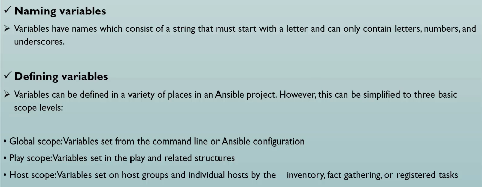
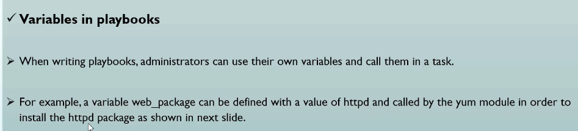
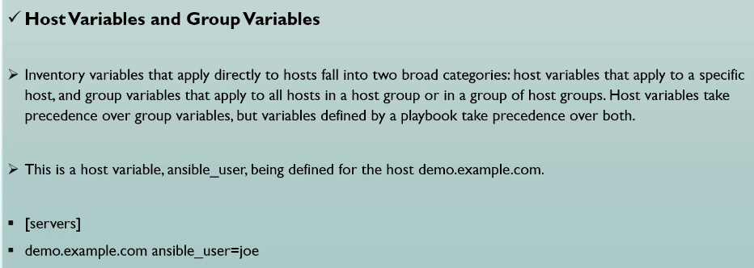
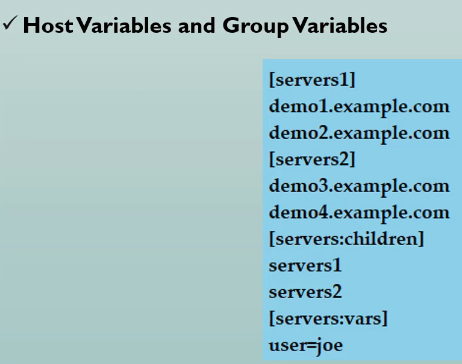
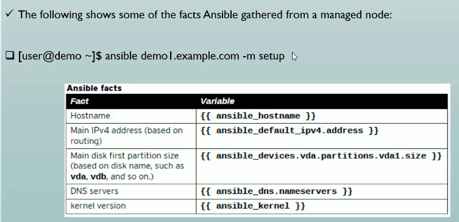

# managing Variables & Facts in Ansible

## Managing Variables






```yml

```

```sh
ansible-playbook a01_Install_Apache.yml --syntax-check    
playbook: a01_Install_Apache.yml

ansible --list-hosts dev -i a00_Inventory.ini
  hosts (2):
    ansibleclient01
    ansibleclient02
#

 ansible-playbook a01_Install_Apache.yml -i a00_Inventory.ini

PLAY [Install and configure Apache web server] ****************************************************************

TASK [Gathering Facts] ****************************************************************************************
ok: [ansibleclient02]
ok: [ansibleclient01]

TASK [Install required packages] ******************************************************************************
ok: [ansibleclient02] => (item=apache2)
ok: [ansibleclient01] => (item=apache2)
ok: [ansibleclient02] => (item=git)
ok: [ansibleclient01] => (item=git)

TASK [Deploy custom index.html] *******************************************************************************
ok: [ansibleclient01]
ok: [ansibleclient02]

TASK [Allow Apache through UFW] *******************************************************************************
ok: [ansibleclient02]
ok: [ansibleclient01]

TASK [Ensure Apache service is running and enabled] ***********************************************************
ok: [ansibleclient02]
ok: [ansibleclient01]

TASK [Validate intranet web endpoints] ************************************************************************
ok: [ansibleclient01] => (item=http://10.0.11.148)
ok: [ansibleclient02] => (item=http://10.0.11.148)
ok: [ansibleclient02] => (item=http://10.0.12.221)
ok: [ansibleclient01] => (item=http://10.0.12.221)

PLAY RECAP ****************************************************************************************************
ansibleclient01            : ok=6    changed=0    unreachable=0    failed=0    skipped=0    rescued=0    ignored=0
ansibleclient02            : ok=6    changed=0    unreachable=0    failed=0    skipped=0    rescued=0    ignored=0

#
ansible dev -a shell -a "cat /var/www/html/index.html" -i a00_Inventory.ini
ansibleclient01 | CHANGED | rc=0 >>
Welcome to Linux Automation Lab
ansibleclient02 | CHANGED | rc=0 >>
Welcome to Linux Automation Lab
```





```ini
# cat a00_Inventory.ini
[dev]
ansibleclient01 ansible_host=10.0.11.148 ansible_port=22 ansible_user=ubuntu ansible_ssh_private_key_file=/home/ec2-user/terraform_key_pem.pem ansible_python_interpreter=/usr/bin/python3
ansibleclient02 ansible_host=10.0.12.221 ansible_port=22 ansible_user=ubuntu ansible_ssh_private_key_file=/home/ec2-user/terraform_key_pem.pem ansible_python_interpreter=/usr/bin/python3

[servers1]
demo1.tchatua.com
demo2.tchatua.com

[servers2]
demo3.tchatua.com
demo4.tchatua.com

[servers:children]
servers1
servers2

[servers:vars]
user=tchatua
```

```sh
$>ansible --list-hosts servers1 -i a00_Inventory.ini
  hosts (2):
    demo1.tchatua.com
    demo2.tchatua.com

$>ansible --list-hosts servers2 -i a00_Inventory.ini
  hosts (2):
    demo3.tchatua.com
    demo4.tchatua.com

$>ansible --list-hosts servers -i a00_Inventory.ini
  hosts (4):
    demo1.tchatua.com
    demo2.tchatua.com
    demo3.tchatua.com
    demo4.tchatua.com

```

```yml
---
- name: Install and configure Apache web server
  hosts: dev
  become: true
  gather_facts: true

  vars:
    remote_dir: /etc/ansible/facts.d
    facts_file: custom.fact
  
  tasks:
    - name: Create a remote directory
      ansible.builtin.file:
        state: directory
        recurse: yes
        path: "{{ remote_dir }}"

    - name: Copy a file
      ansible.builtin.copy:
        src: "{{ facts_file }}"
        dest: "{{ remote_dir }}"
```

```sh
$>ansible dev -m shell -a "ls -al /etc | grep ansible" -i a00_Inventory.ini
ansibleclient01 | FAILED | rc=1 >>
non-zero return code
ansibleclient02 | FAILED | rc=1 >>
non-zero return code

#
$>ll
-rw-r--r--. 1 ec2-user ec2-user  456 May  2 17:20 a02_+Create_Dir.yml
-rw-r--r--. 1 ec2-user ec2-user   28 May  2 17:23 custom.fact

#
$>ansible-playbook a02_+Create_Dir.yml -i a00_Inventory.ini --step

PLAY [Install and configure Apache web server] ****************************************************************
Perform task: TASK: Gathering Facts (N)o/(y)es/(c)ontinue: y

Perform task: TASK: Gathering Facts (N)o/(y)es/(c)ontinue: ****************************************************

TASK [Gathering Facts] ****************************************************************************************
ok: [ansibleclient02]
ok: [ansibleclient01]
Perform task: TASK: Create a remote directory (N)o/(y)es/(c)ontinue: y

Perform task: TASK: Create a remote directory (N)o/(y)es/(c)ontinue: ******************************************

TASK [Create a remote directory] ******************************************************************************
changed: [ansibleclient02]
changed: [ansibleclient01]
Perform task: TASK: Copy a file (N)o/(y)es/(c)ontinue: y

Perform task: TASK: Copy a file (N)o/(y)es/(c)ontinue: ********************************************************

TASK [Copy a file] ********************************************************************************************
changed: [ansibleclient02]
changed: [ansibleclient01]

PLAY RECAP ****************************************************************************************************
ansibleclient01            : ok=3    changed=2    unreachable=0    failed=0    skipped=0    rescued=0    ignored=0
ansibleclient02            : ok=3    changed=2    unreachable=0    failed=0    skipped=0    rescued=0    ignored=0
```

## Ansible facts are the predefine variables pulled by setup module





```sh
ansible ansibleclient01 -m setup -a "filter=*ipv4*" -i a00_Inventory.ini
[WARNING]: error loading facts as JSON or ini - please check content: /etc/ansible/facts.d/custom.fact
ansibleclient01 | SUCCESS => {
    "ansible_facts": {
        "ansible_all_ipv4_addresses": [
            "10.0.11.148"
        ],
        "ansible_default_ipv4": {
            "address": "10.0.11.148",
            "alias": "ens5",
            "broadcast": "",
            "gateway": "10.0.11.1",
            "interface": "ens5",
            "macaddress": "02:5d:47:06:ef:79",
            "mtu": 9001,
            "netmask": "255.255.255.0",
            "network": "10.0.11.0",
            "prefix": "24",
            "type": "ether"
        }
    },
    "changed": false
}

#
ansible ansibleclient01 -m setup -a "filter=hostname" -i a00_Inventory.ini
[WARNING]: error loading facts as JSON or ini - please check content: /etc/ansible/facts.d/custom.fact
ansibleclient01 | SUCCESS => {
    "ansible_facts": {
        "ansible_hostname": "appserver"
    },
    "changed": false
}

#
ansible ansibleclient01 -m setup -a "filter=fqdn" -i a00_Inventory.ini
[WARNING]: error loading facts as JSON or ini - please check content: /etc/ansible/facts.d/custom.fact
ansibleclient01 | SUCCESS => {
    "ansible_facts": {
        "ansible_fqdn": "ip-10-0-11-148.us-east-2.compute.internal"
    },
    "changed": false
}

```