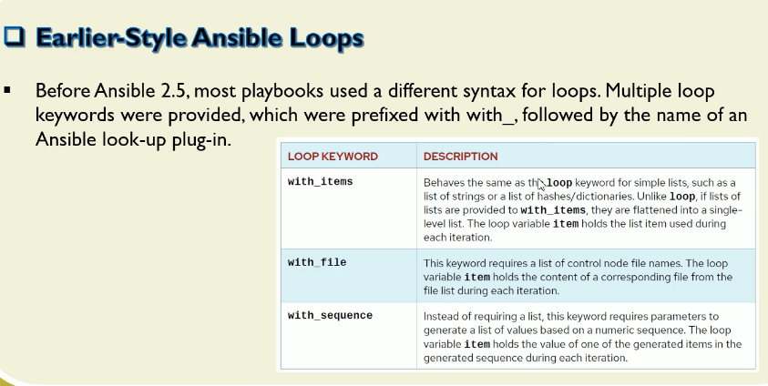
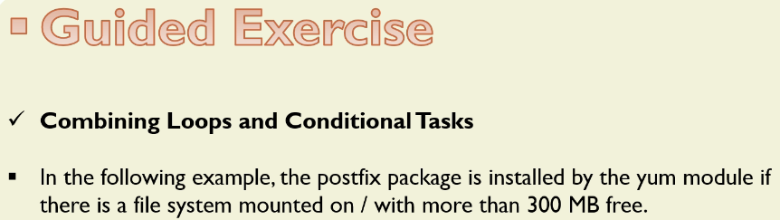
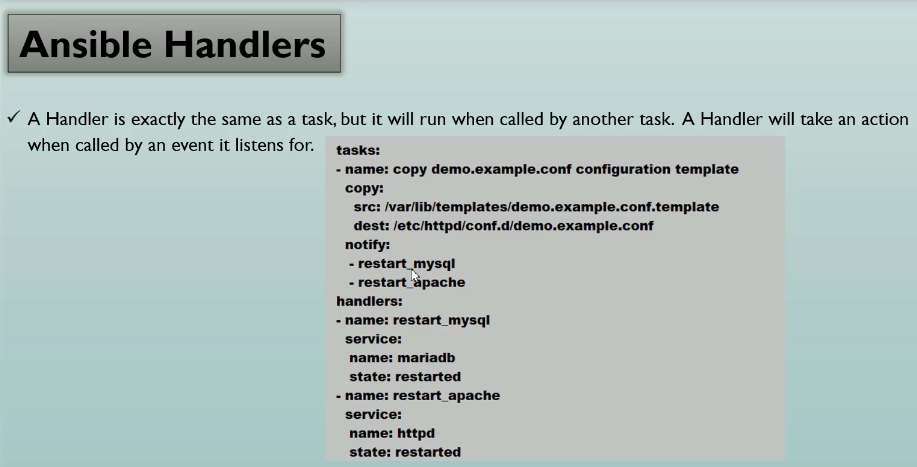
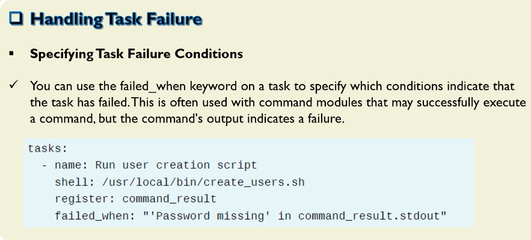

# Implementing task Control

```yml
---
- name: Create Multiple Users
  hosts: dev
  become: true

  vars:
    user_list:
      - { name: "editflore",      groups: "nj" }
      - { name: "neophilesevan",  groups: "pa" }
      - { name: "leamurielle",    groups: "ny" }
      - { name: "khloegabrielle", groups: "de" }
      - { name: "gracecyrielle",  groups: "dc" }

  tasks:
    - name: Ensure groups exist
      ansible.builtin.group:
        name: "{{ item.groups }}"
        state: present
      loop: "{{ user_list }}"
      
    - name: Users exist
      ansible.builtin.user:
        name: "{{ item.name }}"
        groups: "{{ item.groups }}"
      loop: "{{ user_list }}"
```

```sh
ansible dev -m shell -a "id editflore; id neophilesevan; id leamurielle; id khloegabrielle; id gracecyrielle" -i a00_Inventory.ini
ansibleclient01 | CHANGED | rc=0 >>
uid=1001(editflore) gid=1006(editflore) groups=1006(editflore),1001(nj)
uid=1002(neophilesevan) gid=1007(neophilesevan) groups=1007(neophilesevan),1002(pa)
uid=1003(leamurielle) gid=1008(leamurielle) groups=1008(leamurielle),1003(ny)
uid=1004(khloegabrielle) gid=1009(khloegabrielle) groups=1009(khloegabrielle),1004(de)
uid=1005(gracecyrielle) gid=1010(gracecyrielle) groups=1010(gracecyrielle),1005(dc)
ansibleclient02 | CHANGED | rc=0 >>
uid=1001(editflore) gid=1006(editflore) groups=1006(editflore),1001(nj)
uid=1002(neophilesevan) gid=1007(neophilesevan) groups=1007(neophilesevan),1002(pa)
uid=1003(leamurielle) gid=1008(leamurielle) groups=1008(leamurielle),1003(ny)
uid=1004(khloegabrielle) gid=1009(khloegabrielle) groups=1009(khloegabrielle),1004(de)
uid=1005(gracecyrielle) gid=1010(gracecyrielle) groups=1010(gracecyrielle),1005(dc)

```
  



```
# cat a05_01_file
user1
user2
user3
user4
user5
```

```yml
---
# cat a05_02_with_file.yml
- name: with file
  hosts: dev
  become: true

  vars:
    data:
      - a05_01_file

  tasks:
    - name: with file
      ansible.builtin.debug:
        msg: "{{ item }}"
      with_file: "{{ data }}"
```

```sh
ansible-playbook a05_02.yml -i a00_Inventory.ini --check

PLAY [with file] **********************************************************************************************

TASK [Gathering Facts] ****************************************************************************************
[WARNING]: error loading facts as JSON or ini - please check content: /etc/ansible/facts.d/custom.fact
ok: [ansibleclient02]
ok: [ansibleclient01]

TASK [with file] **********************************************************************************************
ok: [ansibleclient01] => (item=user1
user2
user3
user4
user5) => {
    "msg": "user1\nuser2\nuser3\nuser4\nuser5"
}
ok: [ansibleclient02] => (item=user1
user2
user3
user4
user5) => {
    "msg": "user1\nuser2\nuser3\nuser4\nuser5"
}

PLAY RECAP ****************************************************************************************************
ansibleclient01            : ok=2    changed=0    unreachable=0    failed=0    skipped=0    rescued=0    ignored=0
ansibleclient02            : ok=2    changed=0    unreachable=0    failed=0    skipped=0    rescued=0    ignored=0
```


```yml
---
- name: When Statement
  hosts: dev
  become: true

  vars:
    # my_task: false
    my_task: true

  tasks:
    - name: Postfix package installation
      ansible.builtin.apt: 
        name: postfix
        state: latest
      when: my_task
```

```sh
ansible-playbook a08_When_Statement.yml -i a00_Inventory.ini

PLAY [When Statement] *****************************************************************************************

TASK [Gathering Facts] ****************************************************************************************
[WARNING]: error loading facts as JSON or ini - please check content: /etc/ansible/facts.d/custom.fact
ok: [ansibleclient02]
ok: [ansibleclient01]

TASK [Postfix package installation] ***************************************************************************
changed: [ansibleclient01]
changed: [ansibleclient02]

PLAY RECAP ****************************************************************************************************
ansibleclient01            : ok=2    changed=1    unreachable=0    failed=0    skipped=0    rescued=0    ignored=0
ansibleclient02            : ok=2    changed=1    unreachable=0    failed=0    skipped=0    rescued=0    ignored=0
```




```sh
ansible dev -m setup -a "filter=ansible_mounts" -i a00_Inventory.ini
[WARNING]: error loading facts as JSON or ini - please check content: /etc/ansible/facts.d/custom.fact
ansibleclient01 | SUCCESS => {
    "ansible_facts": {
        "ansible_mounts": [
            {
                "block_available": 1448596,
                "block_size": 4096,
                "block_total": 1985394,
                "block_used": 536798,
                "device": "/dev/root",
                "fstype": "ext4",
                "inode_available": 954417,
                "inode_total": 1032192,
                "inode_used": 77775,
                "mount": "/",
                "options": "rw,relatime,discard,errors=remount-ro",
                "size_available": 5933449216,
                "size_total": 8132173824,
                "uuid": "add94f77-06be-4406-90ba-7315d25e8b90"
            },
            {
                "block_available": 0,
                "block_size": 131072,
                "block_total": 226,
                "block_used": 226,
                "device": "/dev/loop0",
                "fstype": "squashfs",
                "inode_available": 0,
                "inode_total": 14,
                "inode_used": 14,
                "mount": "/snap/amazon-ssm-agent/13009",
                "options": "ro,nodev,relatime,errors=continue,threads=single",
                "size_available": 0,
                "size_total": 29622272,
                "uuid": "N/A"
            },
            {
                "block_available": 0,
                "block_size": 131072,
                "block_total": 511,
                "block_used": 511,
                "device": "/dev/loop1",
                "fstype": "squashfs",
                "inode_available": 0,
                "inode_total": 11908,
                "inode_used": 11908,
                "mount": "/snap/core20/2769",
                "options": "ro,nodev,relatime,errors=continue,threads=single",
                "size_available": 0,
                "size_total": 66977792,
                "uuid": "N/A"
            },
            {
                "block_available": 0,
                "block_size": 131072,
                "block_total": 734,
                "block_used": 734,
                "device": "/dev/loop2",
                "fstype": "squashfs",
                "inode_available": 0,
                "inode_total": 961,
                "inode_used": 961,
                "mount": "/snap/lxd/38800",
                "options": "ro,nodev,relatime,errors=continue,threads=single",
                "size_available": 0,
                "size_total": 96206848,
                "uuid": "N/A"
            },
            {
                "block_available": 0,
                "block_size": 131072,
                "block_total": 592,
                "block_used": 592,
                "device": "/dev/loop3",
                "fstype": "squashfs",
                "inode_available": 0,
                "inode_total": 14270,
                "inode_used": 14270,
                "mount": "/snap/core22/2411",
                "options": "ro,nodev,relatime,errors=continue,threads=single",
                "size_available": 0,
                "size_total": 77594624,
                "uuid": "N/A"
            },
            {
                "block_available": 0,
                "block_size": 131072,
                "block_total": 395,
                "block_used": 395,
                "device": "/dev/loop4",
                "fstype": "squashfs",
                "inode_available": 0,
                "inode_total": 610,
                "inode_used": 610,
                "mount": "/snap/snapd/26865",
                "options": "ro,nodev,relatime,errors=continue,threads=single",
                "size_available": 0,
                "size_total": 51773440,
                "uuid": "N/A"
            },
            {
                "block_available": 201276,
                "block_size": 512,
                "block_total": 213663,
                "block_used": 12387,
                "device": "/dev/nvme0n1p15",
                "fstype": "vfat",
                "inode_available": 0,
                "inode_total": 0,
                "inode_used": 0,
                "mount": "/boot/efi",
                "options": "rw,relatime,fmask=0077,dmask=0077,codepage=437,iocharset=iso8859-1,shortname=mixed,errors=remount-ro",
                "size_available": 103053312,
                "size_total": 109395456,
                "uuid": "29BA-66D1"
            }
        ]
    },
    "changed": false
}
ansibleclient02 | SUCCESS => {
    "ansible_facts": {
        "ansible_mounts": [
            {
                "block_available": 1447610,
                "block_size": 4096,
                "block_total": 1985394,
                "block_used": 537784,
                "device": "/dev/root",
                "fstype": "ext4",
                "inode_available": 954415,
                "inode_total": 1032192,
                "inode_used": 77777,
                "mount": "/",
                "options": "rw,relatime,discard,errors=remount-ro",
                "size_available": 5929410560,
                "size_total": 8132173824,
                "uuid": "add94f77-06be-4406-90ba-7315d25e8b90"
            },
            {
                "block_available": 0,
                "block_size": 131072,
                "block_total": 226,
                "block_used": 226,
                "device": "/dev/loop0",
                "fstype": "squashfs",
                "inode_available": 0,
                "inode_total": 14,
                "inode_used": 14,
                "mount": "/snap/amazon-ssm-agent/13009",
                "options": "ro,nodev,relatime,errors=continue,threads=single",
                "size_available": 0,
                "size_total": 29622272,
                "uuid": "N/A"
            },
            {
                "block_available": 0,
                "block_size": 131072,
                "block_total": 511,
                "block_used": 511,
                "device": "/dev/loop1",
                "fstype": "squashfs",
                "inode_available": 0,
                "inode_total": 11908,
                "inode_used": 11908,
                "mount": "/snap/core20/2769",
                "options": "ro,nodev,relatime,errors=continue,threads=single",
                "size_available": 0,
                "size_total": 66977792,
                "uuid": "N/A"
            },
            {
                "block_available": 0,
                "block_size": 131072,
                "block_total": 592,
                "block_used": 592,
                "device": "/dev/loop2",
                "fstype": "squashfs",
                "inode_available": 0,
                "inode_total": 14270,
                "inode_used": 14270,
                "mount": "/snap/core22/2411",
                "options": "ro,nodev,relatime,errors=continue,threads=single",
                "size_available": 0,
                "size_total": 77594624,
                "uuid": "N/A"
            },
            {
                "block_available": 0,
                "block_size": 131072,
                "block_total": 395,
                "block_used": 395,
                "device": "/dev/loop3",
                "fstype": "squashfs",
                "inode_available": 0,
                "inode_total": 610,
                "inode_used": 610,
                "mount": "/snap/snapd/26865",
                "options": "ro,nodev,relatime,errors=continue,threads=single",
                "size_available": 0,
                "size_total": 51773440,
                "uuid": "N/A"
            },
            {
                "block_available": 0,
                "block_size": 131072,
                "block_total": 734,
                "block_used": 734,
                "device": "/dev/loop4",
                "fstype": "squashfs",
                "inode_available": 0,
                "inode_total": 961,
                "inode_used": 961,
                "mount": "/snap/lxd/38800",
                "options": "ro,nodev,relatime,errors=continue,threads=single",
                "size_available": 0,
                "size_total": 96206848,
                "uuid": "N/A"
            },
            {
                "block_available": 201276,
                "block_size": 512,
                "block_total": 213663,
                "block_used": 12387,
                "device": "/dev/nvme0n1p15",
                "fstype": "vfat",
                "inode_available": 0,
                "inode_total": 0,
                "inode_used": 0,
                "mount": "/boot/efi",
                "options": "rw,relatime,fmask=0077,dmask=0077,codepage=437,iocharset=iso8859-1,shortname=mixed,errors=remount-ro",
                "size_available": 103053312,
                "size_total": 109395456,
                "uuid": "29BA-66D1"
            }
        ]
    },
    "changed": false
}
```







