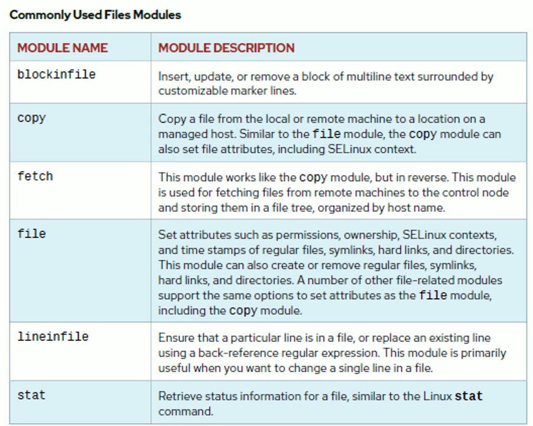

# Deploying Files on managed hosts





```yml
---
- name: Create files and set permissions
  hosts: dev        # run on all servers in the dev group
  become: true      # escalate to root
  gather_facts: yes # collect system facts (OS, memory, mounts, etc.)

  tasks:
    - name: Create files and set permissions
      ansible.builtin.file:
        path:  /home/ubuntu/f01_New_File
        owner: ubuntu
        group: ubuntu
        mode: 0640
        state: touch
```

```sh
ansible dev -m shell -a "ls -al /home/ubuntu/" -i a00_Inventory.ini
ansibleclient02 | CHANGED | rc=0 >>
total 32
drwxr-x--- 5 ubuntu ubuntu 4096 May  4 04:32 .
drwxr-xr-x 8 root   root   4096 May  2 23:32 ..
drwx------ 3 ubuntu ubuntu 4096 May  2 02:49 .ansible
-rw-r--r-- 1 ubuntu ubuntu  220 Jan  6  2022 .bash_logout
-rw-r--r-- 1 ubuntu ubuntu 3771 Jan  6  2022 .bashrc
drwx------ 2 ubuntu ubuntu 4096 May  2 02:49 .cache
-rw-r--r-- 1 ubuntu ubuntu  807 Jan  6  2022 .profile
drwx------ 2 ubuntu ubuntu 4096 May  2 02:44 .ssh
-rw-r--r-- 1 ubuntu ubuntu    0 May  2 02:53 .sudo_as_admin_successful
-rw-r----- 1 ubuntu ubuntu    0 May  4 04:32 f01_New_File
ansibleclient01 | CHANGED | rc=0 >>
total 32
drwxr-x--- 5 ubuntu ubuntu 4096 May  4 04:32 .
drwxr-xr-x 8 root   root   4096 May  2 23:32 ..
drwx------ 3 ubuntu ubuntu 4096 May  2 02:48 .ansible
-rw-r--r-- 1 ubuntu ubuntu  220 Jan  6  2022 .bash_logout
-rw-r--r-- 1 ubuntu ubuntu 3771 Jan  6  2022 .bashrc
drwx------ 2 ubuntu ubuntu 4096 May  2 02:48 .cache
-rw-r--r-- 1 ubuntu ubuntu  807 Jan  6  2022 .profile
drwx------ 2 ubuntu ubuntu 4096 May  2 02:44 .ssh
-rw-r--r-- 1 ubuntu ubuntu    0 May  2 02:53 .sudo_as_admin_successful
-rw-r----- 1 ubuntu ubuntu    0 May  4 04:32 f01_New_File
$>
```


```yml

```

```sh
ls -ltrZ f02.sh
-rw-r--r--. 1 ec2-user ec2-user unconfined_u:object_r:user_home_t:s0 430 May  5 22:15 f02.sh

ansible dev -m shell -a "ls -ltrZ /home/ec2-user" -i a00_Inventory.ini
ansibleclient02 | CHANGED | rc=0 >>
total 4
-rw-rw-r--. 1 ec2-user ec2-user unconfined_u:object_r:user_home_t:s0   0 May  5 21:37 f01.sh
-rw-r--r--. 1 root     root     unconfined_u:object_r:user_home_t:s0 430 May  5 22:22 f02.sh
ansibleclient01 | CHANGED | rc=0 >>
total 4
-rw-rw-r--. 1 ec2-user ec2-user unconfined_u:object_r:user_home_t:s0   0 May  5 21:37 f01.sh
-rw-r--r--. 1 root     root     unconfined_u:object_r:user_home_t:s0 430 May  5 22:22 f02.sh

getenforce
Enforcing
```


