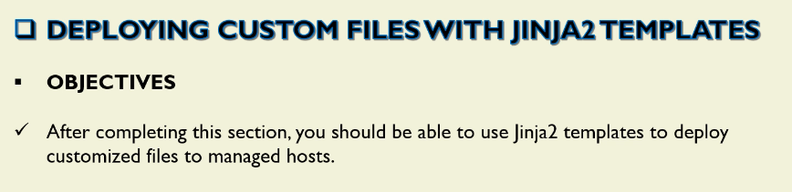
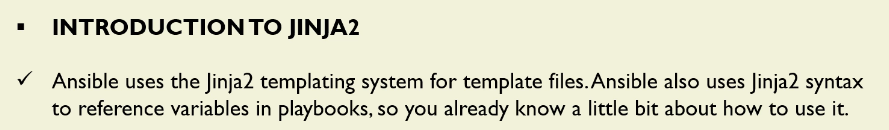
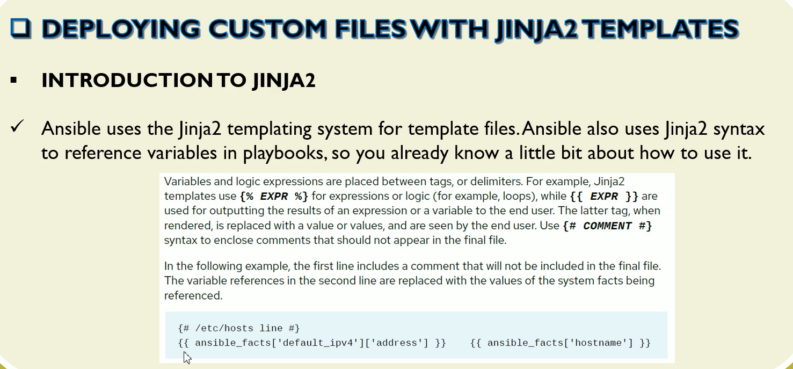
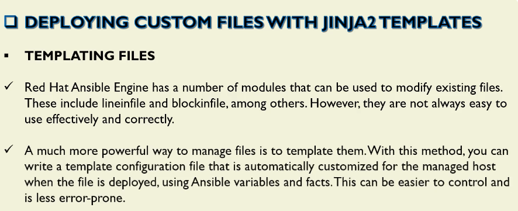
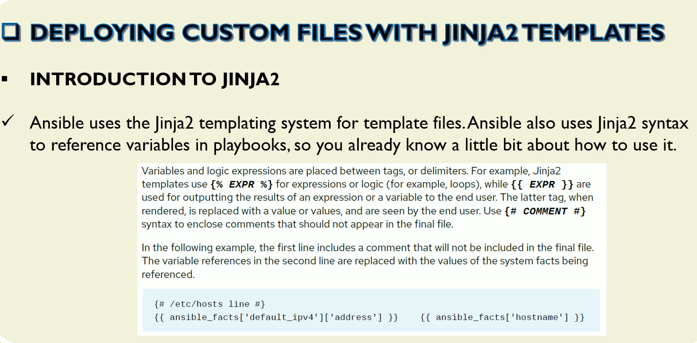
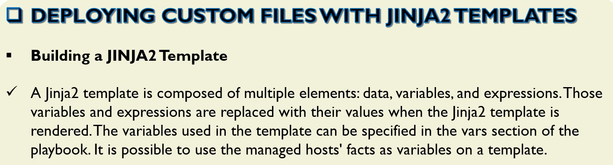
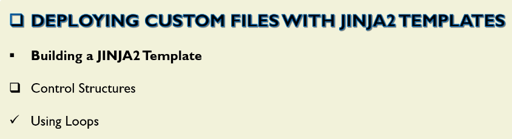
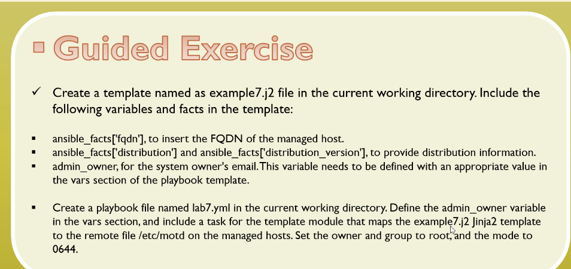
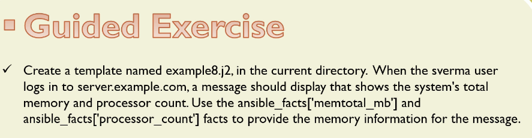

# Deploying Custom Files with Jinja2 Templates













```j2
{{ variable01 }}
Ne effects on this line
{{ variable02 }}
```

```yml
---
- name: Jinja 2
  hosts: dev
  vars:
    variable01: "Heloo...!!!"
    variable02: "My lab playbook using template"

  tasks:
    - name: Basic Template lab
      template: 
        src: a01_Variables.j2
        dest: /home/ec2-user/output/a03_output.txt
```


```sh
>ansible dev -m shell -a "cat /home/ec2-user/output/a03_output.txt" -i a00_Inventory.ini
ansibleclient02 | CHANGED | rc=0 >>
Heloo...!!!
Ne effects on this line
My lab playbook using template

ansibleclient01 | CHANGED | rc=0 >>
Heloo...!!!
Ne effects on this line
My lab playbook using template
```



```j2

{{ number }}

```

```yml
---
- name: For loop
  hosts: dev

  tasks:
    - name: Template for loop example.
      template: 
        src: a03_for_loop_template.j2
        dest: /home/ec2-user/output/a05_output.txt
```

```sh
ansible-playbook a04_Lab_021.yml -i a00_Inventory.ini

PLAY [For loop] ***********************************************************************************************

TASK [Gathering Facts] ****************************************************************************************
ok: [ansibleclient02]
ok: [ansibleclient01]

TASK [Template for loop example.] *****************************************************************************
changed: [ansibleclient02]
changed: [ansibleclient01]

PLAY RECAP ****************************************************************************************************
ansibleclient01            : ok=2    changed=1    unreachable=0    failed=0    skipped=0    rescued=0    ignored=0
ansibleclient02            : ok=2    changed=1    unreachable=0    failed=0    skipped=0    rescued=0    ignored=0

# ---------------------------------------------------------
ansible dev -m shell -a "cat /home/ec2-user/output/a05_output.txt" -i a00_Inventory.ini
ansibleclient02 | CHANGED | rc=0 >>
0
1
2
3
4
5
6
7
8
9
10
ansibleclient01 | CHANGED | rc=0 >>
0
1
2
3
4
5
6
7
8
9
10
```

##

```j2
Template module loop with a list


    {{ item }}

```

```yml
---
- name: For loop with a list
  hosts: dev
  vars: 
    a06_list_01: ['Alpha', 'Bravo', 'Charlie', 'Echo', ]

  tasks:
    - name: Template for loop example with a list.
      template: 
        src: a05_loop_with_list_template.j2
        dest: /home/ec2-user/output/a06_output.txt
```

```sh
ansible-playbook a06_Lab_03.yml -i a00_Inventory.ini

PLAY [For loop with a list] ***********************************************************************************

TASK [Gathering Facts] ****************************************************************************************
ok: [ansibleclient01]
ok: [ansibleclient02]

TASK [Template for loop example with a list.] *****************************************************************
changed: [ansibleclient01]
changed: [ansibleclient02]

PLAY RECAP ****************************************************************************************************
ansibleclient01            : ok=2    changed=1    unreachable=0    failed=0    skipped=0    rescued=0    ignored=0
ansibleclient02            : ok=2    changed=1    unreachable=0    failed=0    skipped=0    rescued=0    ignored=0

# -----------------------------------------------------------------------------------------
$>ansible dev -m shell -a "cat /home/ec2-user/output/a06_output.txt" -i a00_Inventory.ini
ansibleclient01 | CHANGED | rc=0 >>
Template module loop with a list

    Alpha
    Bravo
    Charlie
    Echo
ansibleclient02 | CHANGED | rc=0 >>
Template module loop with a list

    Alpha
    Bravo
    Charlie
    Echo
```



```j2
This is the system {{ ansible_facts['fqdn'] }}.
This is a {{ ansible_facts['distribution'] }} and version {{ ansible_facts['distribution_version'] }}.
You can use this system with admin permission.
You can request access from {{ admin_owner}}.
```

```yml
---
- name: Ansible fatcs
  hosts: dev
  become: true
  vars:
    admin_owner: "tchattua@gmail.com"

  tasks:
    - name: Template Ansible Facts
      template: 
        src: a09_working_Variables.j2
        dest: /etc/motd
        owner: root
        group: root
        mode: 0644
```

```sh
ansible dev -m shell -a "cat /etc/motd" -i a00_Inventory.ini

ansibleclient02 | CHANGED | rc=0 >>
This is the system appserver.
This is a Amazon and version 2023.
You can use this system with admin permission.
You can request access from tchattua@gmail.com.

ansibleclient01 | CHANGED | rc=0 >>
This is the system appserver.
This is a Amazon and version 2023.
You can use this system with admin permission.
You can request access from tchattua@gmail.com.
```


