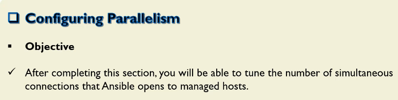
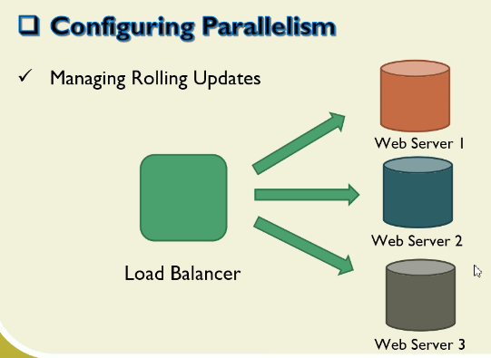
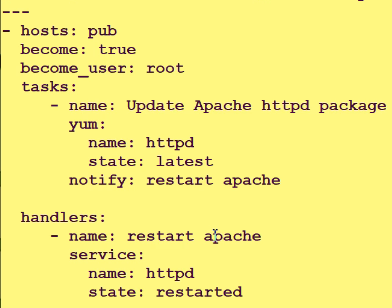
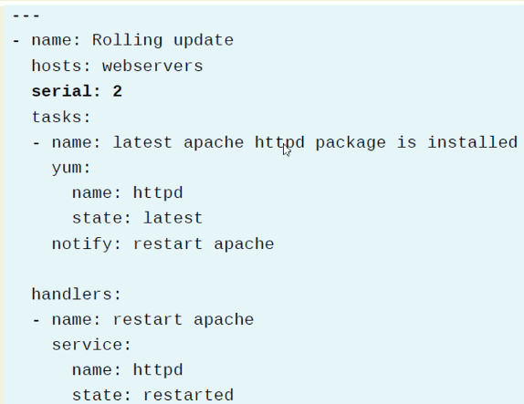
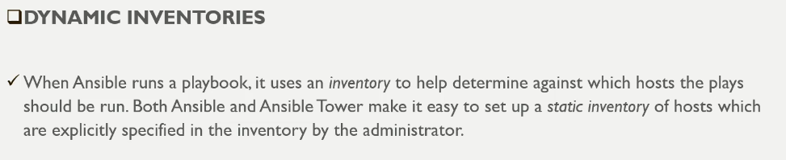
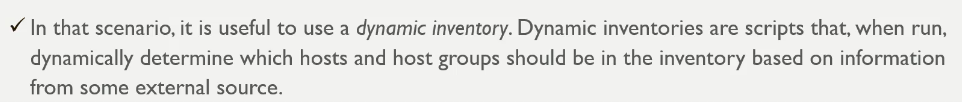
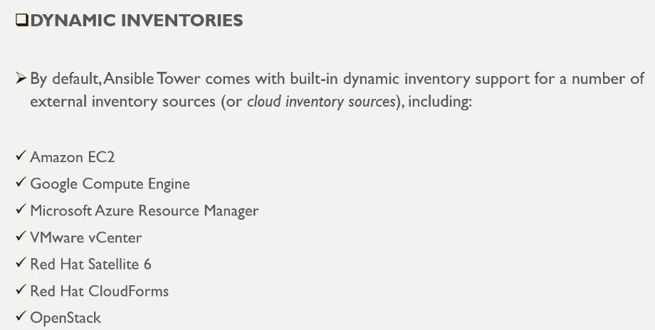

# Configuring Parallelism




```sh
ansible-config dump | grep -i forks
DEFAULT_FORKS(default) = 5


ansible-config list | grep -i forks
DEFAULT_FORKS:
  description: Maximum number of forks Ansible will use to execute tasks on target
  - name: ANSIBLE_FORKS
  - key: forks
  name: Number of task forks
```







```sh
ansible-config dump | grep -i forks
DEFAULT_FORKS(default) = 5
```

```cfg
[defaults]
log_path = /var/log/ansible.log
forks: 1

[inventory]
[privilege_escalation]
[paramiko_connection]
[connection]
[persistent_connection]
[accelerate]
[selinux]
[colors]
[diff]
```

```sh
ansible-config dump | grep -i forks
DEFAULT_FORKS(/etc/ansible/ansible.cfg) = 1

time ansible-playbook a01_Forks_Parameters_Install_vsftpd.yml -i a00_Inventory.ini

PLAY [Update vsftpd package] **********************************************************************************

TASK [Gathering Facts] ****************************************************************************************
ok: [ansibleclient01]
ok: [ansibleclient02]

TASK [Update vsftpd package] **********************************************************************************
changed: [ansibleclient01]
changed: [ansibleclient02]

RUNNING HANDLER [restart vsftpd] ******************************************************************************
changed: [ansibleclient01]
changed: [ansibleclient02]

PLAY RECAP ****************************************************************************************************
ansibleclient01            : ok=3    changed=2    unreachable=0    failed=0    skipped=0    rescued=0    ignored=0
ansibleclient02            : ok=3    changed=2    unreachable=0    failed=0    skipped=0    rescued=0    ignored=0


real    0m9.020s
user    0m1.846s
sys     0m0.416s
```

```cfg
[defaults]
log_path = /var/log/ansible.log
forks: 2

[inventory]
[privilege_escalation]
[paramiko_connection]
[connection]
[persistent_connection]
[accelerate]
[selinux]
[colors]
[diff]
```

```sh
time ansible-playbook a01_Forks_Parameters_Install_vsftpd.yml -i a00_Inventory.ini

PLAY [Update vsftpd package] **********************************************************************************

TASK [Gathering Facts] ****************************************************************************************
ok: [ansibleclient02]
ok: [ansibleclient01]

TASK [Update vsftpd package] **********************************************************************************
changed: [ansibleclient02]
changed: [ansibleclient01]

RUNNING HANDLER [restart vsftpd] ******************************************************************************
changed: [ansibleclient01]
changed: [ansibleclient02]

PLAY RECAP ****************************************************************************************************
ansibleclient01            : ok=3    changed=2    unreachable=0    failed=0    skipped=0    rescued=0    ignored=0
ansibleclient02            : ok=3    changed=2    unreachable=0    failed=0    skipped=0    rescued=0    ignored=0


real    0m4.717s
user    0m1.619s
sys     0m0.383s
```


```yml
---
- name: Update vsftpd package
  hosts: dev
  become: true
  serial: 1
  tasks:
    - name: Update vsftpd package
      yum:
        name: vsftpd
        state: present
      notify: restart vsftpd

  handlers:
    - name: restart vsftpd 
      service:
        name: vsftpd
        state: restarted    
```

```sh
time ansible-playbook a01_Forks_Parameters_Install_vsftpd.yml -i a00_Inventory.ini

PLAY [Update vsftpd package] **********************************************************************************

TASK [Gathering Facts] ****************************************************************************************
ok: [ansibleclient01]

TASK [Update vsftpd package] **********************************************************************************
changed: [ansibleclient01]

RUNNING HANDLER [restart vsftpd] ******************************************************************************
changed: [ansibleclient01]

PLAY [Update vsftpd package] **********************************************************************************

TASK [Gathering Facts] ****************************************************************************************
ok: [ansibleclient02]

TASK [Update vsftpd package] **********************************************************************************
ok: [ansibleclient02]

PLAY RECAP ****************************************************************************************************
ansibleclient01            : ok=3    changed=2    unreachable=0    failed=0    skipped=0    rescued=0    ignored=0
ansibleclient02            : ok=2    changed=0    unreachable=0    failed=0    skipped=0    rescued=0    ignored=0


real    0m6.915s
user    0m1.724s
sys     0m0.329s
```







