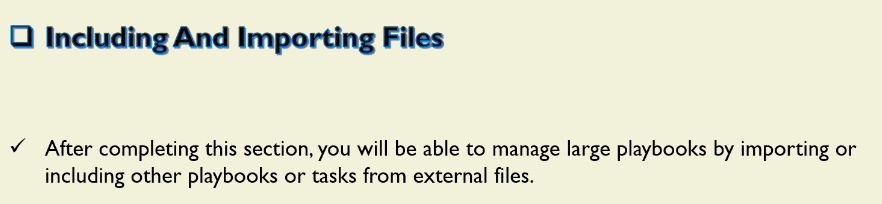
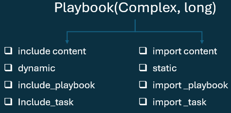
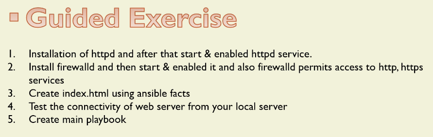

# Including & Importing Files





## import_playbook & import_playbook

```yml
---
#main.yml
- name: Install vsftpd
  import_playbook: a01_02_pkg.yml

- name: Uninstall postfix
  import_playbook: a01_03_pkgrem.yml

- name: Multiple Package Installation
  import_playbook: a01_04_multitasks.yml
```

```sh
ansible-playbook --list-tasks a01_01_main.yml
playbook: a01_01_main.yml
  play #1 (dev): Install ans restart vsftpd     TAGS: []
    tasks:
      Update vsftpd package     TAGS: []
  play #2 (dev): Uninstall postfix      TAGS: []
    tasks:
      remove postfix package    TAGS: []
  play #3 (dev): dev    TAGS: []
    tasks:
      Mount the OS Media Drive  TAGS: []
      Copy the local repo file  TAGS: []
      Install VSFTPD Package    TAGS: []
      Install HTTPD Package     TAGS: []
      Start & Enable VSFTPD Service     TAGS: []
      Start & Enable HTTPD Service      TAGS: []
```

##

```sh
# -----------------------------------------------------------
ansible-playbook a04_00_Main_Include_Tasks.yml --list-tasks

playbook: a04_00_Main_Include_Tasks.yml

  play #1 (dev): Include Task Playbook  TAGS: []
    tasks:
      include_tasks     TAGS: []
      include_tasks     TAGS: []
      include_tasks     TAGS: []


# -----------------------------------------------------------
ansible-playbook a05_00_Main_Import_Tasks.yml --list-tasks

playbook: a05_00_Main_Import_Tasks.yml

  play #1 (dev): Include Task Playbook  TAGS: []
    tasks:
      Update vsftpd package     TAGS: []
      remove vsftpd package     TAGS: []
      Mount the OS Media Drive  TAGS: []
      Copy the local repo file  TAGS: []
      Install VSFTPD Package    TAGS: []
      Install HTTPD Package     TAGS: []
      Start & Enable VSFTPD Service     TAGS: []
      Start & Enable HTTPD Service      TAGS: []
```



```sh
ansible-playbook main.yml --list-tasks
playbook: main.yml
  play #1 (dev): Main Playbook  TAGS: []
    tasks:
      Include Installation-start-enabled httpd task file        TAGS: []
      Install the firewalld     TAGS: []
      Start and enable the firewalld    TAGS: []
      Open the ports for {{ rule }}     TAGS: []
      Create index.html file    TAGS: []
  play #2 (localhost): Test the connectivity of web server from your local server       TAGS: []
    tasks:
      Test the connectivity of web server       TAGS: []
```

```sh
ansible-playbook main.yml -i a00_Inventory.ini

PLAY [Main Playbook] ******************************************************************************************

TASK [Gathering Facts] ****************************************************************************************
ok: [ansibleclient01]
ok: [ansibleclient02]

TASK [Include Installation-start-enabled httpd task file] *****************************************************
included: /home/ec2-user/a19_Importing_and_IUncluding_Files/d01_Lab1/tasks/a01_httpd.yml for ansibleclient01, ansibleclient02

TASK [Install the httpd package] ******************************************************************************
ok: [ansibleclient01]
ok: [ansibleclient02]

TASK [start and enable the httpd service] *********************************************************************
ok: [ansibleclient01]
ok: [ansibleclient02]

TASK [Install the firewalld] **********************************************************************************
ok: [ansibleclient01]
ok: [ansibleclient02]

TASK [Start and enable the firewalld] *************************************************************************
ok: [ansibleclient01]
ok: [ansibleclient02]

TASK [Open the ports for ['http', 'https']] *******************************************************************
changed: [ansibleclient01] => (item=http)
changed: [ansibleclient02] => (item=http)
changed: [ansibleclient01] => (item=https)
changed: [ansibleclient02] => (item=https)

TASK [Create index.html file] *********************************************************************************
changed: [ansibleclient01]
changed: [ansibleclient02]

PLAY [Test the connectivity of web server from your local server] *********************************************

TASK [Gathering Facts] ****************************************************************************************
ok: [localhost]

TASK [Test the connectivity of web server] ********************************************************************
ok: [localhost]

PLAY RECAP ****************************************************************************************************
ansibleclient01            : ok=8    changed=2    unreachable=0    failed=0    skipped=0    rescued=0    ignored=0
ansibleclient02            : ok=8    changed=2    unreachable=0    failed=0    skipped=0    rescued=0    ignored=0
localhost                  : ok=2    changed=0    unreachable=0    failed=0    skipped=0    rescued=0    ignored=0
```