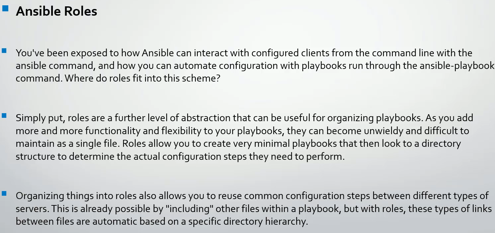
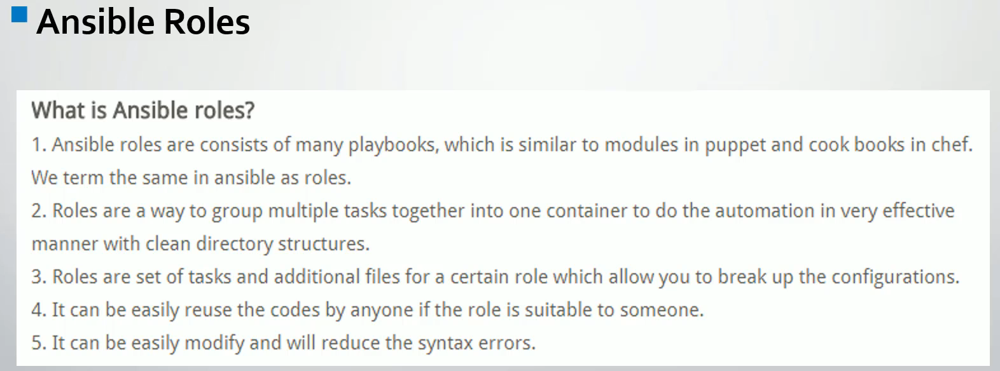
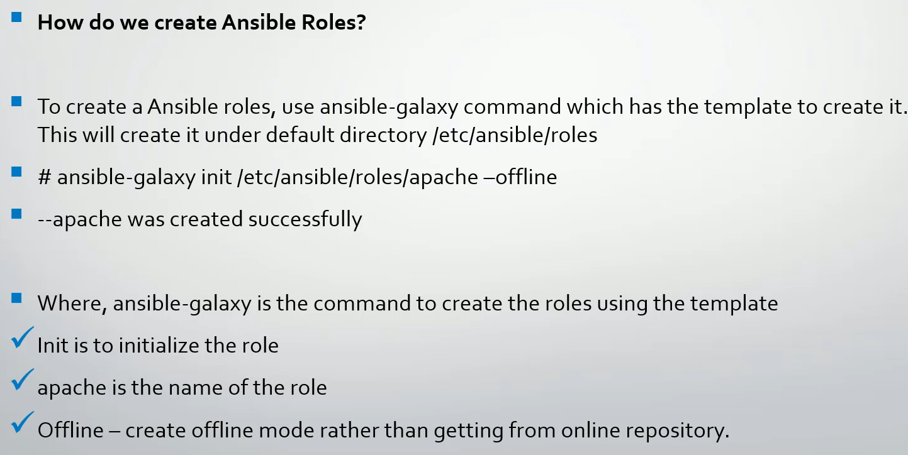
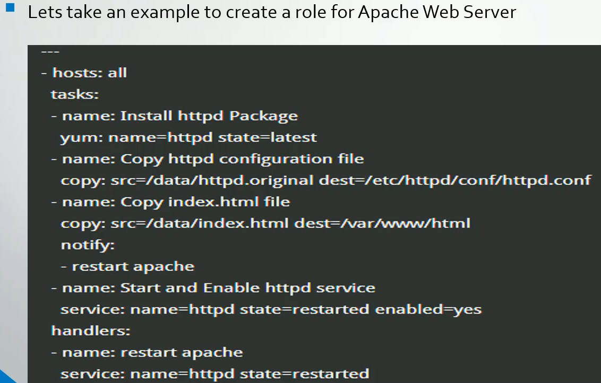

# Ansible Roles







```css
project/
│
├── roles/
│   └── apache/
│       ├── tasks/
│       ├── handlers/
│       ├── templates/
│       ├── defaults/
│       ├── vars/
│       ├── meta/
│       └── files/
└── site.yml
```

```sh
# -----------------------------------------------------------------------------
ls -al /etc/ansible/
total 20
drwxr-xr-x.  3 root root   51 May  7 00:39 .
drwxr-xr-x. 93 root root 8192 May  9 08:32 ..
-rw-r--r--.  1 root root  806 May  7 00:39 ansible.cfg
-rw-r--r--.  1 root root 1561 Apr 15 02:06 hosts
drwxr-xr-x.  2 root root    6 Jan  3  2025 roles

# -----------------------------------------------------------------------------
ls -al /etc/ansible/roles/
total 0
drwxr-xr-x. 2 root root  6 Jan  3  2025 .
drwxr-xr-x. 3 root root 51 May  7 00:39 ..

# -----------------------------------------------------------------------------
ansible-galaxy init d01_roles/apache --offline
- Role d01_roles/apache was created successfully

# -----------------------------------------------------------------------------
ls -al d01_roles/
total 0
drwxr-xr-x.  3 ec2-user ec2-user  20 May  9 09:17 .
drwxr-xr-x.  3 ec2-user ec2-user  48 May  9 09:16 ..
drwxr-xr-x. 10 ec2-user ec2-user 135 May  9 09:17 apache

# -----------------------------------------------------------------------------
ls -al d01_roles/apache/
total 4
drwxr-xr-x. 10 ec2-user ec2-user  135 May  9 09:17 .
drwxr-xr-x.  3 ec2-user ec2-user   20 May  9 09:17 ..
drwxr-xr-x.  2 ec2-user ec2-user   22 May  9 09:17 defaults
drwxr-xr-x.  2 ec2-user ec2-user    6 May  9 09:17 files
drwxr-xr-x.  2 ec2-user ec2-user   22 May  9 09:17 handlers
drwxr-xr-x.  2 ec2-user ec2-user   22 May  9 09:17 meta
-rw-r--r--.  1 ec2-user ec2-user 1328 May  9 09:17 README.md
drwxr-xr-x.  2 ec2-user ec2-user   22 May  9 09:17 tasks
drwxr-xr-x.  2 ec2-user ec2-user    6 May  9 09:17 templates
drwxr-xr-x.  2 ec2-user ec2-user   39 May  9 09:17 tests
drwxr-xr-x.  2 ec2-user ec2-user   22 May  9 09:17 vars

# -----------------------------------------------------------------------------
ls -al d01_roles/apache/defaults/
total 4
drwxr-xr-x.  2 ec2-user ec2-user  22 May  9 09:17 .
drwxr-xr-x. 10 ec2-user ec2-user 135 May  9 09:17 ..
-rw-r--r--.  1 ec2-user ec2-user  41 May  9 09:17 main.yml
# -----------------------------------------------------------------------------
$>ls -al d01_roles/apache/vars/
total 4
drwxr-xr-x.  2 ec2-user ec2-user  22 May  9 09:17 .
drwxr-xr-x. 10 ec2-user ec2-user 135 May  9 09:17 ..
-rw-r--r--.  1 ec2-user ec2-user  37 May  9 09:17 main.yml
$>

```



```sh
# -----------------------------------------------------------------------------
tree
-bash: tree: command not found

# -----------------------------------------------------------------------------
sudo yum install tree -y

# -----------------------------------------------------------------------------
tree
.
├── defaults
│   └── main.yml
├── files
├── handlers
│   └── main.yml
├── meta
│   └── main.yml
├── README.md
├── tasks
│   └── main.yml
├── templates
├── tests
│   ├── inventory
│   └── test.yml
└── vars
    └── main.yml

# -----------------------------------------------------------------------------
ansible --list-hosts dev -i a00_Inventory.ini
  hosts (2):
    ansibleclient01
    ansibleclient02

# -----------------------------------------------------------------------------
ansible dev -m shell -a "rpm -qa | grep -i httpd" -i a00_Inventory.ini
ansibleclient02 | CHANGED | rc=0 >>
httpd-tools-2.4.66-1.amzn2023.0.1.x86_64
httpd-filesystem-2.4.66-1.amzn2023.0.1.noarch
httpd-core-2.4.66-1.amzn2023.0.1.x86_64
generic-logos-httpd-18.0.0-12.amzn2023.0.3.noarch
httpd-2.4.66-1.amzn2023.0.1.x86_64
ansibleclient01 | CHANGED | rc=0 >>
httpd-tools-2.4.66-1.amzn2023.0.1.x86_64
httpd-filesystem-2.4.66-1.amzn2023.0.1.noarch
httpd-core-2.4.66-1.amzn2023.0.1.x86_64
generic-logos-httpd-18.0.0-12.amzn2023.0.3.noarch
httpd-2.4.66-1.amzn2023.0.1.x86_64

# -----------------------------------------------------------------------------
# Uninstall httpd on Amazon Linux (ad‑hoc command)
ansible dev -m yum -a "name=httpd state=absent" -i a00_Inventory.ini -b
ansibleclient02 | CHANGED => {
    "ansible_facts": {
        "pkg_mgr": "dnf"
    },
    "changed": true,
    "msg": "",
    "rc": 0,
    "results": [
        "Removed: httpd-2.4.66-1.amzn2023.0.1.x86_64"
    ]
}
ansibleclient01 | CHANGED => {
    "ansible_facts": {
        "pkg_mgr": "dnf"
    },
    "changed": true,
    "msg": "",
    "rc": 0,
    "results": [
        "Removed: httpd-2.4.66-1.amzn2023.0.1.x86_64"
    ]
}

ansible dev -m shell -a "rpm -qa | grep -i httpd" -i a00_Inventory.ini
ansibleclient02 | CHANGED | rc=0 >>
httpd-tools-2.4.66-1.amzn2023.0.1.x86_64
httpd-filesystem-2.4.66-1.amzn2023.0.1.noarch
httpd-core-2.4.66-1.amzn2023.0.1.x86_64
generic-logos-httpd-18.0.0-12.amzn2023.0.3.noarch
ansibleclient01 | CHANGED | rc=0 >>
httpd-tools-2.4.66-1.amzn2023.0.1.x86_64
httpd-filesystem-2.4.66-1.amzn2023.0.1.noarch
httpd-core-2.4.66-1.amzn2023.0.1.x86_64
generic-logos-httpd-18.0.0-12.amzn2023.0.3.noarch


ansible dev -m yum -a "name=httpd* state=absent" -i a00_Inventory.ini -b
ansibleclient01 | CHANGED => {
    "ansible_facts": {
        "pkg_mgr": "dnf"
    },
    "changed": true,
    "msg": "",
    "rc": 0,
    "results": [
        "Removed: httpd-core-2.4.66-1.amzn2023.0.1.x86_64",
        "Removed: httpd-filesystem-2.4.66-1.amzn2023.0.1.noarch",
        "Removed: httpd-tools-2.4.66-1.amzn2023.0.1.x86_64",
        "Removed: mod_http2-2.0.27-1.amzn2023.0.3.x86_64",
        "Removed: mod_lua-2.4.66-1.amzn2023.0.1.x86_64"
    ]
}
ansibleclient02 | CHANGED => {
    "ansible_facts": {
        "pkg_mgr": "dnf"
    },
    "changed": true,
    "msg": "",
    "rc": 0,
    "results": [
        "Removed: httpd-core-2.4.66-1.amzn2023.0.1.x86_64",
        "Removed: httpd-filesystem-2.4.66-1.amzn2023.0.1.noarch",
        "Removed: httpd-tools-2.4.66-1.amzn2023.0.1.x86_64",
        "Removed: mod_http2-2.0.27-1.amzn2023.0.3.x86_64",
        "Removed: mod_lua-2.4.66-1.amzn2023.0.1.x86_64"
    ]
}


ansible dev -m yum -a "name=generic-logos-httpd state=absent" -i a00_Inventory.ini -b
ansibleclient01 | CHANGED => {
    "ansible_facts": {
        "pkg_mgr": "dnf"
    },
    "changed": true,
    "msg": "",
    "rc": 0,
    "results": [
        "Removed: generic-logos-httpd-18.0.0-12.amzn2023.0.3.noarch"
    ]
}
ansibleclient02 | CHANGED => {
    "ansible_facts": {
        "pkg_mgr": "dnf"
    },
    "changed": true,
    "msg": "",
    "rc": 0,
    "results": [
        "Removed: generic-logos-httpd-18.0.0-12.amzn2023.0.3.noarch"
    ]
}

# -----------------------------------------------------------------------------
ansible dev -m shell -a "rpm -qa | grep -i httpd" -i a00_Inventory.ini
ansibleclient01 | FAILED | rc=1 >>
non-zero return code
ansibleclient02 | FAILED | rc=1 >>
non-zero return code

# -----------------------------------------------------------------------------
ansible-playbook apache.yml --syntax-check

playbook: apache.yml

# -----------------------------------------------------------------------------
ansible-playbook apache.yml -i a00_Inventory.ini

PLAY [dev] ****************************************************************************************************

TASK [Gathering Facts] ****************************************************************************************
ok: [ansibleclient02]
ok: [ansibleclient01]

TASK [apache : Installation of HTTPD package] *****************************************************************
ok: [ansibleclient01]
ok: [ansibleclient02]

TASK [apache : Copy my index.htmk file] ***********************************************************************
changed: [ansibleclient01]
changed: [ansibleclient02]

TASK [apache : Start and enable my HTTPD service] *************************************************************
changed: [ansibleclient02]
changed: [ansibleclient01]

RUNNING HANDLER [apache : restart apache] *********************************************************************
changed: [ansibleclient02]
changed: [ansibleclient01]

PLAY RECAP ****************************************************************************************************
ansibleclient01            : ok=5    changed=3    unreachable=0    failed=0    skipped=0    rescued=0    ignored=0
ansibleclient02            : ok=5    changed=3    unreachable=0    failed=0    skipped=0    rescued=0    ignored=0

# -----------------------------------------------------------------------------
ansible dev -m yum -a "name=elinks state=present" -i a00_Inventory.ini -b
ansibleclient02 | CHANGED => {
    "ansible_facts": {
        "pkg_mgr": "dnf"
    },
    "changed": true,
    "msg": "",
    "rc": 0,
    "results": [
        "Installed: elinks-0.12-0.65.pre6.amzn2023.0.2.x86_64",
        "Installed: gpm-libs-1.20.7-26.amzn2023.amzn2023.0.3.x86_64"
    ]
}
ansibleclient01 | CHANGED => {
    "ansible_facts": {
        "pkg_mgr": "dnf"
    },
    "changed": true,
    "msg": "",
    "rc": 0,
    "results": [
        "Installed: elinks-0.12-0.65.pre6.amzn2023.0.2.x86_64",
        "Installed: gpm-libs-1.20.7-26.amzn2023.amzn2023.0.3.x86_64"
    ]
}

# -----------------------------------------------------------------------------
curl http://10.0.12.183
### Website for checking roles in Ansible ###

# -----------------------------------------------------------------------------

```

