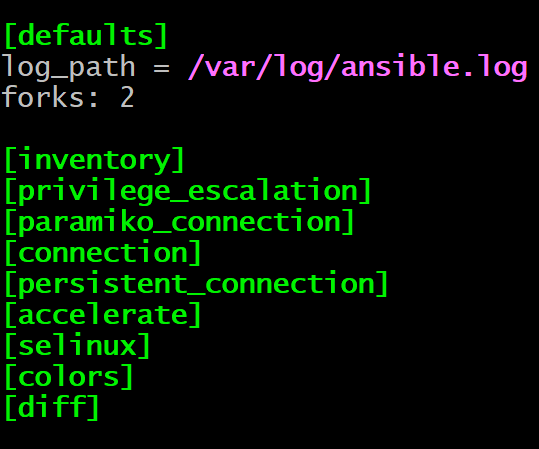
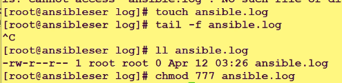
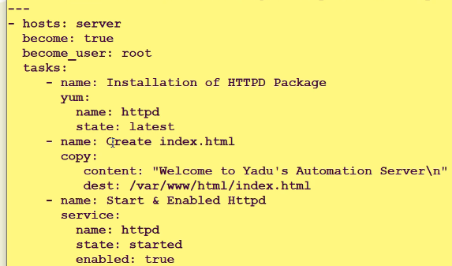
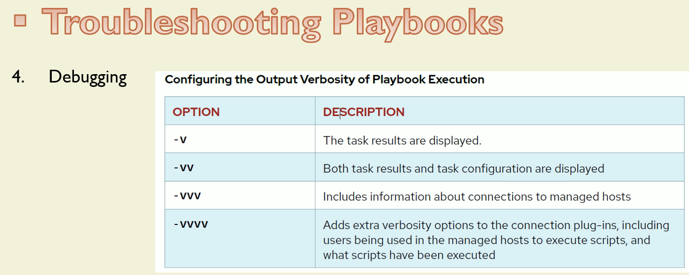
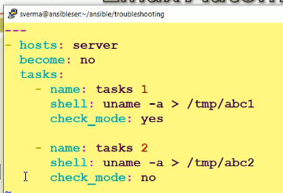

# Troubleshooting Ansible

## Log files for Ansible

```sh
ls -altr /etc/ansible/ansible.cfg
-rw-r--r--. 1 root root 806 May  7 00:39 /etc/ansible/ansible.cfg

sudo chmod 777 /etc/ansible/ansible.cfg

[ec2-user@ansiblecontroller ~]$ ls -altr /etc/ansible/ansible.cfg
-rwxrwxrwx. 1 root root 806 May  7 00:39 /etc/ansible/ansible.cfg

```





## The debug module

## Managing Errors



## Debugging



## check_mode

```sh
ansible-playbook a03_httpd_installation.yml -i a00_Inventory.ini --check
```


--------------------