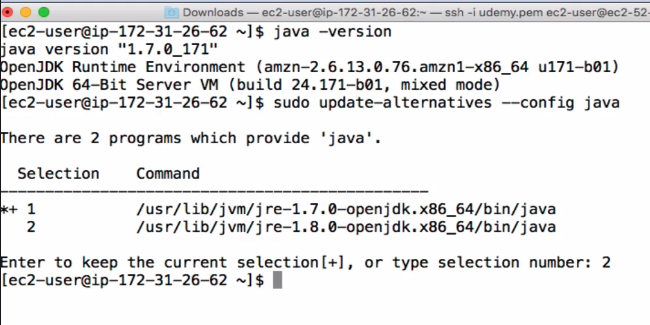
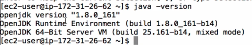
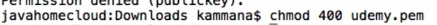
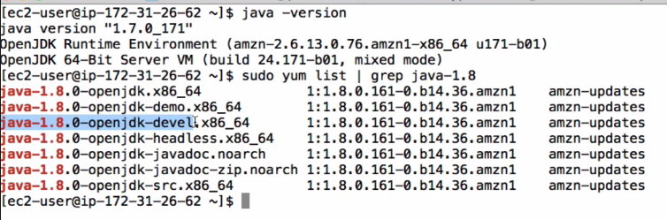
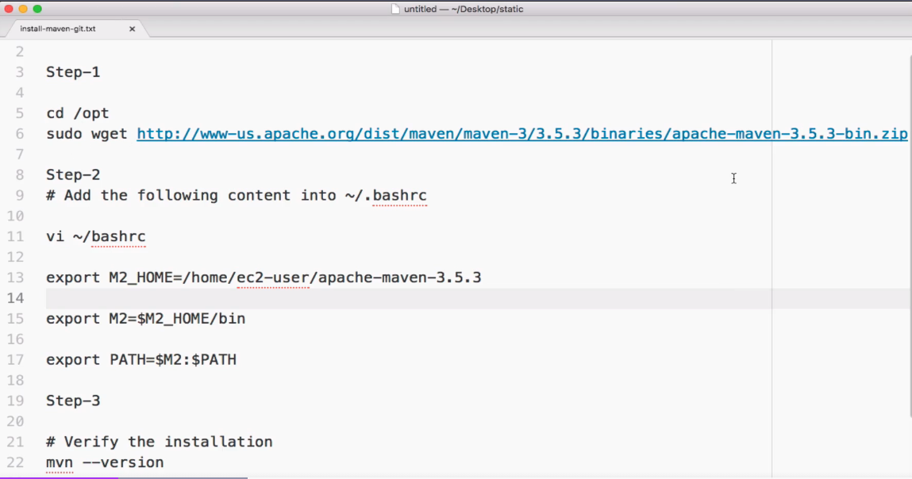

# Jenkins

## Destrroying a specoic ec2 instance

```sh
terraform state list | grep ec2_ansible

terraform state list | grep ec2_ansibleclient

erraform destroy -target=module.ec2_ansibleclient["1"].aws_instance.this[0]
# terraform destroy -target=aws_instance.ansible_controller


```

## Java 8 Installation --> Prerequisite

```SH
[ec2-user@jenkins ~]$ sudo yum list | grep java

# Jenkins Prerequisite (Java Requirement) requires Java 17 or Java 21 on Amazon Linux 2023
# Java 8 (Corretto 1.8) is NOT supported by modern Jenkins versions.
sudo dnf install java-17-amazon-corretto -y

[ec2-user@jenkins ~]$ java --version
openjdk 17.0.18 2026-01-20 LTS
OpenJDK Runtime Environment Corretto-17.0.18.9.1 (build 17.0.18+9-LTS)
OpenJDK 64-Bit Server VM Corretto-17.0.18.9.1 (build 17.0.18+9-LTS, mixed mode, sharing)


```
> Just for fun (Ignore it)





## jenkins Installation

- url: https://www.jenkins.io/doc/book/installing/linux/#red-hat-centos

```sh
[ec2-user@jenkins ~]$ sudo yum install -y wget
sudo wget -O /etc/yum.repos.d/jenkins.repo https://pkg.jenkins.io/rpm-stable/jenkins.repo

sudo yum upgrade -y

# Add required dependencies for the jenkins package
# sudo yum install fontconfig java-21-openjdk
sudo yum install jenkins -y

[ec2-user@jenkins ~]$ sudo systemctl status jenkins
○ jenkins.service - Jenkins Continuous Integration Server
     Loaded: loaded (/usr/lib/systemd/system/jenkins.service; disabled; preset: disabled)
     Active: inactive (dead)

[ec2-user@jenkins ~]$ sudo systemctl start jenkins

[ec2-user@jenkins ~]$ sudo systemctl enable jenkins
Created symlink /etc/systemd/system/multi-user.target.wants/jenkins.service → /usr/lib/systemd/system/jenkins.service.

# To retrieve the Jenkins initial admin password after installation on Red Hat 9, run this command:
[ec2-user@jenkins ~]$ sudo cat /var/lib/jenkins/secrets/initialAdminPassword
81bdec80b90d4720b1bde42b3584ebca

```

## Stop all ec2 using AWS CLI

```sh
aws ec2 describe-instances \
    --filters "Name=instance-state-name,Values=running" \
    --query "Reservations[*].Instances[*].InstanceId" \
    --output text

aws ec2 stop-instances \
    --instance-ids $(aws ec2 describe-instances --filters "Name=instance-state-name,Values=running" --query "Reservations[*].Instances[*].InstanceId" --output text)
```


## Install Apache Maven & Git

- Apache maven is a build tool for Java based applications
- Git is the tool where we maintain our project code



```sh
sudo du -
wget https://dlcdn.apache.org/maven/maven-3/3.9.12/binaries/apache-maven-3.9.12-bin.zip
sudo dnf install -y unzip
unzip apache-maven-3.9.12-bin.zip
mv apache-maven-3.9.12 apache-maven
# Configure Environment Variables
vi ~/.bashrc
# Add this
export MAVEN_HOME=/opt/maven
export PATH=$MAVEN_HOME/bin:$PATH
# Apply Changes
source ~/.bashrc
mvn -version
```

## Jenkins freestyle project

- Go tu `Create a job` > `Freestyle project` > `ok` > `Source code management`: Git > ``