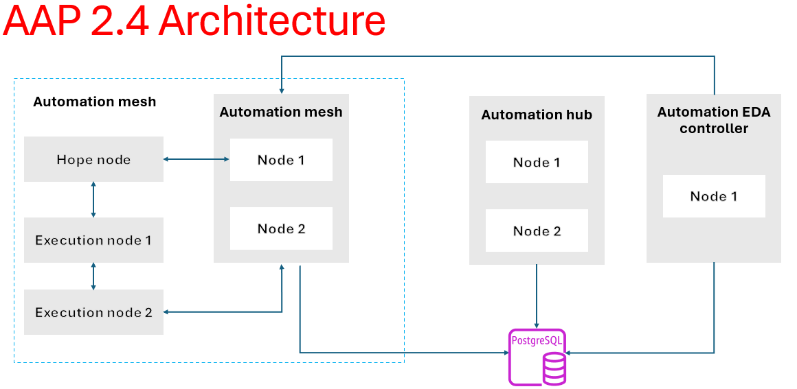

# Ansible Automation Platform

## Red Hat Ansible Automation Platform planning guide


- Red Hat Ansible Automation Platform 2.4 
- Plan for installation of Ansible Automation Platform

- Abstract
    - This guide provides requirements, options, and recommendations for installing Red Hat Ansible Automation Platform.

- **PREFACE**
```css
Thank you for your interest in Red Hat Ansible Automation Platform. 
Ansible Automation Platform is a commercial offering that helps teams manage complex multitiered deployments by adding control,
knowledge, and delegation to Ansible-powered environments. 
Use the information in this guide to plan your Red Hat Ansible Automation Platform installation.
```

## CHAPTER 1. PLANNING YOUR RED HAT ANSIBLE AUTOMATION PLATFORM INSTALLATION

```css
Red Hat Ansible Automation Platform is supported on both Red Hat Enterprise Linux and Red Hat OpenShift. 
Use this guide to plan your Red Hat Ansible Automation Platform installation on Red Hat Enterprise Linux.
```

## CHAPTER 2. RED HAT ANSIBLE AUTOMATION PLATFORM ARCHITECTURE

```css
As a modular platform, 
Ansible Automation Platform provides the flexibility to easily integrate components and customize your deployment to best meet your automation requirements. 

The following section provides a comprehensive architectural example of an Ansible Automation Platform deployment.
```

## 2.1. EXAMPLE ANSIBLE AUTOMATION PLATFORM ARCHITECTURE 

```css
The Red Hat Ansible Automation Platform 2.4 reference architecture provides an example setup of a standard deployment of Ansible Automation Platform using automation mesh on Red Hat Enterprise Linux. 
The deployment shown takes advantage of the following components to provide a simple, secure and flexible method of handling your automation workloads, a central location for content collections, and automated resolution of IT requests.
```

### Automation controller 
    
Provides the control plane for automation through its UI, Restful API, RBAC workflows and CI/CD integrations. 

### Automation mesh 

Is an overlay network that provides the ability to ease the distribution of work across a large and dispersed collection of workers through nodes that establish peer-to-peer connections with each other using existing networks. 

### Private automation hub 

Provides automation developers the ability to collaborate and publish their own automation content and streamline delivery of Ansible code within their organization. 

### Event-Driven Ansible 

Provides the event-handling capability needed to automate time-consuming tasks and respond to changing conditions in any IT domain. 

- The architecture for this example consists of the following: 
    - A two node automation controller cluster 
    - An optional hop node to connect automation controller to execution nodes 
    - A two node automation hub cluster 
    - A single node Event-Driven Ansible controller cluster 
    - A single PostgreSQL database connected to the automation controller, automation hub, and Event-Driven Ansible controller clusters
    - Two execution nodes per automation controller cluster

## Ansible Automation platform Architecture



## CHAPTER 3. RED HAT ANSIBLE AUTOMATION PLATFORM COMPONENTS 

```css
Ansible Automation Platform s composed of services that are connected together to meet your automation needs. These services provide the ability to store, make decisions for, and execute automation. All of these functions are available through a user interface (UI) and RESTful application programming interface (API). Deploy each of the following components so that all features and capabilities are available for use without the need to take further action: